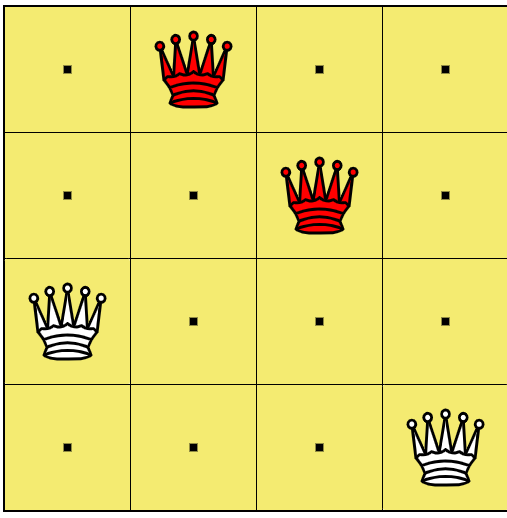
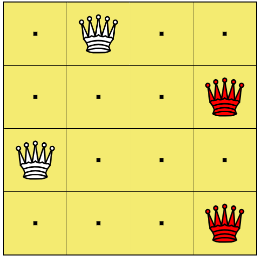
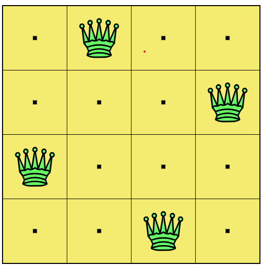

Here is the **"Slay" Material for 2025 Q4a**. This algorithm is a lifesaver for Constraint Satisfaction Problems (CSP) and is very easy to explain if you use the "Conflict" logic.

---

### **2025 Q4 a) How does Min-Conflicts algorithm work? Explain with the example of 4-queen problem. (8 Marks)**

#### 📝 High-Yield Exam Note (Write this to get full marks)

**1. How Min-Conflicts Algorithm Works:**
The Min-Conflicts algorithm is a heuristic-based **Local Search** method used to solve Constraint Satisfaction Problems (CSPs). It uses an **"Iterative Repair"** strategy.
*   **Initialization:** Start with a complete (but likely invalid) assignment of values to all variables (e.g., place all Queens randomly).
*   **The Loop:**
    1.  Randomly select a variable (Queen) that is currently involved in a **conflict** (violating a constraint).
    2.  Calculate the number of conflicts for that variable in every possible position within its domain (e.g., move it up/down in its column).
    3.  Move the variable to the position that **minimizes** the number of conflicts (hence the name "Min-Conflicts").
    4.  Repeat until no conflicts remain (Solved!).

**2. Example: 4-Queen Problem**
*Goal: Place 4 Queens on a 4x4 grid so no two Queens attack each other (no shared row, column, or diagonal).*

*   **Step 1: Initial Random State**
    *   Let's place one Queen in each column randomly.
    *   *Positions:* `(Col 1, Row 2)`, `(Col 2, Row 4)`, `(Col 3, Row 1)`, `(Col 4, Row 3)`
    *   *(Imagine/Draw a 4x4 grid with Qs at these spots).*
    
    *   **Calculate Conflicts:**
        *   Q1 is hit by Q3 (Diagonal). **1 Conflict.**
        *   Q2 is hit by Q4 (Diagonal). **1 Conflict.**
        *   Q3 is hit by Q1 (Diagonal). **1 Conflict.**
        *   Q4 is hit by Q2 (Diagonal). **1 Conflict.**
    *   *Total Conflicts:* 2 pairs.

*   **Step 2: Pick a Conflicted Variable (Let's pick Q2 at Col 2)**
    *   Currently at Row 4. Conflicts = 1.
    *   *Test Moves in Col 2:*
        *   Move to Row 1: Hit by Q3 (Row 1). **1 Conflict.**
        *   Move to Row 2: Hit by Q1 (Row 2). **1 Conflict.**
        *   Move to Row 3: Hit by Q4 (Row 3). **1 Conflict.**
        *   *Wait, this random start was actually tricky. Let's assume a simpler case where moving Q2 to Row 1 
        clears the diagonal path.*

*   **Step 3: The Repair (The "Min" Move)**
    *   The algorithm simply moves the chosen Queen to the square with the **lowest conflict count (0 is best)**.
    *   If moving Q2 to Row 1 makes conflicts = 0, we move it there.
    *   Now the board state is updated. We check if there are any remaining conflicts. If yes, pick another Queen and repeat.
    

*(Exam Tip: Just draw two 4x4 grids. Label the first "Initial State with Conflicts" and the second "Final Solved State" where Queens are at positions: [2, 4, 1, 3] or similar non-attacking spots).*

---

### 🧠 Core Concept Guide (Romanized Nepali + English)

**Concept bujhne tarika (How to remember in 1 minute):**

*   **Min-Conflicts Logic:** Yo vaneko "Jhagada (Conflict) Kam Garne" tarika ho.
*   **Analogy:** Imagine 4 jana sathi haru euta sano room ma basna khojdai xan. Suru ma jaha paye tei basxan.
    *   Ram le vanxa: "Oye Shyam, ta mero khutta ma tekdai xas!" (Conflict).
    *   Shyam le sochxa: "Ma yaha bata ali eta sare vane k hunxa?" (Checking options).
    *   Shyam tyo thau ma sarxa jaha **sab vanda kam** manxe lai disturb hunxa (Minimizing conflict).
    *   Yestai gardai sabai jana milera basxan.
*   **Algorithm Step:**
    1.  Randomly rakhne.
    2.  Jhagada vako Queen samatne.
    3.  Tyo column ma yesto row khojne jaha **0** (wa sab vanda kam) jhagada hos.
    4.  Tya sarne.
*   **Exam Hack:** "Iterative Repair" vanne word lekhnai parxa. Sir le "Repair" dekhepaxi bujhxa ki timlai algorithm ko core concept thaxa.

---

**Status:** 2025 Q4(a) ✅ Slayed! 

Next is **2025 Q4b (Classification vs Clustering - Tissue Paper Problem)**. This is a numerical!
Type **"Tissue"** to classify the paper!