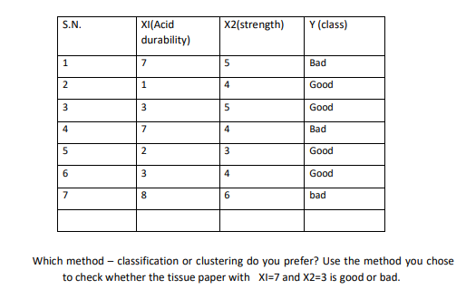

Here is the **"Slay" Material for 2025 Q4b**. This is a **Numerical** question. You get full marks if the calculation is correct.

---

### **2025 Q4 b) Which method – classification or clustering do you prefer? Use the method you chose to check whether the tissue paper with X1=7 and X2=3 is good or bad.**

#### 📝 High-Yield Exam Note (Solution)

**1. Method Selection:**
I prefer **Classification**.
*   **Reason:** The provided dataset includes the output label **Y (Class)** ("Good" or "Bad") for every training example. Since we have labeled data and are trying to predict the label for a new input, this is a **Supervised Learning** problem, specifically Classification. (Clustering is for unlabeled data).

**2. Execution (Using K-Nearest Neighbors - KNN Algorithm):**
We will use the **KNN algorithm** (with $K=3$) because it is the standard method for such distance-based classification problems.

*   **New Point (Test Data):** $P(X_1=7, X_2=3)$
*   **Formula:** Euclidean Distance $D = \sqrt{(x_2 - x_1)^2 + (y_2 - y_1)^2}$

**Step-by-Step Distance Calculation:**
Calculate the distance between the New Point $(7,3)$ and every Training Point:

| S.N. | Point ($X_1, X_2$) | Class ($Y$) | Distance Calculation $\sqrt{(X_1-7)^2 + (X_2-3)^2}$ | Distance Value |
| :--- | :--- | :--- | :--- | :--- |
| 1 | $(7, 5)$ | **Bad** | $\sqrt{(7-7)^2 + (5-3)^2} = \sqrt{0 + 4}$ | **2.00** |
| 2 | $(1, 4)$ | **Good** | $\sqrt{(1-7)^2 + (4-3)^2} = \sqrt{36 + 1}$ | $6.08$ |
| 3 | $(3, 5)$ | **Good** | $\sqrt{(3-7)^2 + (5-3)^2} = \sqrt{16 + 4}$ | $4.47$ |
| 4 | $(7, 4)$ | **Bad** | $\sqrt{(7-7)^2 + (4-3)^2} = \sqrt{0 + 1}$ | **1.00** |
| 5 | $(2, 3)$ | **Good** | $\sqrt{(2-7)^2 + (3-3)^2} = \sqrt{25 + 0}$ | $5.00$ |
| 6 | $(3, 4)$ | **Good** | $\sqrt{(3-7)^2 + (4-3)^2} = \sqrt{16 + 1}$ | $4.12$ |
| 7 | $(8, 6)$ | **Bad** | $\sqrt{(8-7)^2 + (6-3)^2} = \sqrt{1 + 9}$ | **3.16** |

**Step 3: Find Nearest Neighbors (K=3)**
Sort the distances from smallest to largest:
1.  **Dist = 1.00** (Point 4) $\rightarrow$ Class: **Bad**
2.  **Dist = 2.00** (Point 1) $\rightarrow$ Class: **Bad**
3.  **Dist = 3.16** (Point 7) $\rightarrow$ Class: **Bad**

**Step 4: Voting**
The 3 nearest neighbors are all **"Bad"**.

**Conclusion:**
The tissue paper with Acid Durability $X_1=7$ and Strength $X_2=3$ is classified as **Bad**.

---

### 🧠 Core Concept Guide (Romanized Nepali + English)

**Concept bujhne tarika (How to remember in 1 minute):**

*   **Classification vs Clustering:**
    *   Data ma "Answer" (Y class) diyeko xa? **Yes** (Good/Bad). $\rightarrow$ Tesaile **Classification** (Supervised).
    *   Yedi "Answer" column nabhako vaye **Clustering** hunthyo.
*   **KNN Logic (Sangat guna ko phal):**
    *   Naya manche (New point) kasto xa vanera thapauna, usko wari-pari ko sathi (Nearest Neighbors) herne.
    *   Yedi usko 3 jana najik ko sathi "Bad" xan vane, u pani "Bad" nai hola.
    *   **Calculation:** Geometry ko distance formula $\sqrt{(x-a)^2 + (y-b)^2}$ lagaune.
*   **Exam Hack:** Distance calculate garda sabai nikalnu pardaina, tara table ma dekhayeko ramro. Exam ma calculator use garera $\sqrt{37}$ haru ko value point ma nikalne ($6.08$), yesle answer precise dekhinxa.

---

**Status:** 2025 Q4(b) ✅ Slayed!

Now we are moving to **2025 Q5a (Perceptron Learning OR Gate)**. This is a numerical proof. You have to "teach" a neural network logically.
Type **"OR Gate"** to solve the circuit!