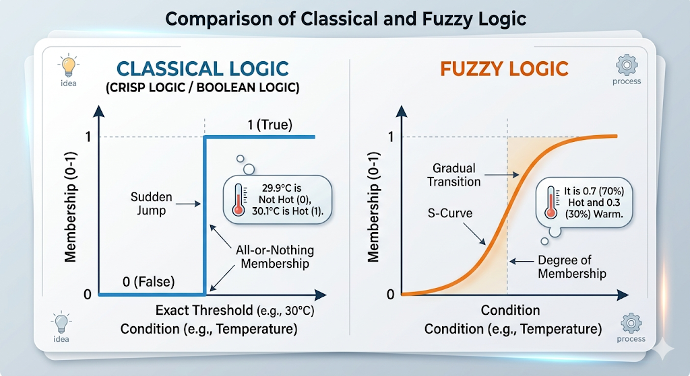
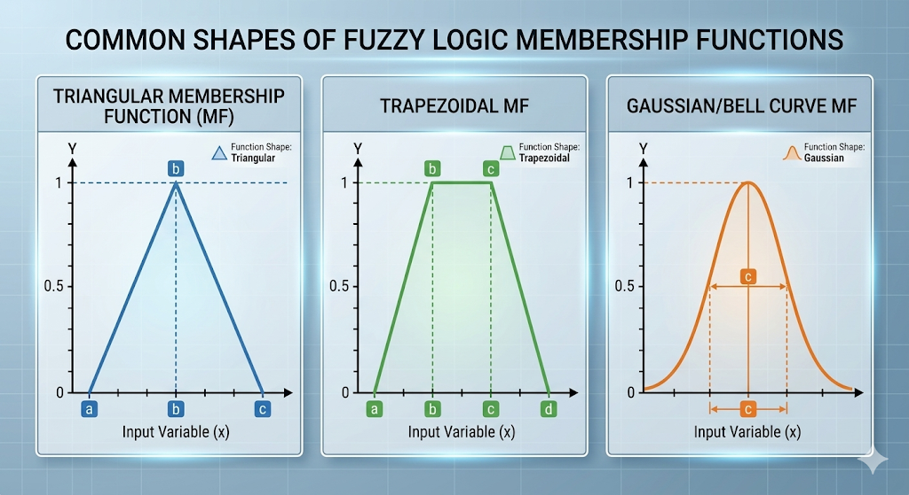

# Unit 1: Introduction to Artificial Intelligence

## 1.1. Intelligence
**Definition:** Intelligence is the computational part of the ability to achieve goals in the world. It is the capacity to acquire and apply knowledge, think and reason, solve problems, and adapt to new situations. 

### 1.1.1. Types of Intelligence
Based on human cognitive psychology (often linked to Howard Gardner's theory), intelligence is not just a single ability but divided into multiple types. In AI, we aim to replicate these:
*   **Logical-Mathematical Intelligence:** The ability to solve math problems, detect patterns, and think logically (Core of traditional AI).
*   **Linguistic Intelligence:** The ability to understand and use spoken/written language (Focus of Natural Language Processing - NLP).
*   **Spatial Intelligence:** The ability to recognize and manipulate patterns of space (Crucial for Computer Vision and Robotics).
*   **Bodily-Kinesthetic Intelligence:** The ability to coordinate body movements (Used in advanced Robotics).
*   **Interpersonal Intelligence:** The ability to understand and interact effectively with others (Key for interactive AI/Chatbots).
*   **Intrapersonal Intelligence:** Self-awareness and understanding of one's own emotions (Future goal of AI / Artificial General Intelligence).[fig: Mind map showing the different types of intelligence (Linguistic, Logical, Spatial, Kinesthetic, etc.) branching out from a central "Intelligence" node]

### 1.1.2. Components of Intelligence
To build an artificially intelligent system, it must possess certain core components that mimic human intelligence. 
*   **Learning:** The ability to acquire new knowledge or skills from experience (e.g., Machine Learning). It includes trial-and-error, rote learning, and generalization.
*   **Reasoning:** Drawing logical inferences from available knowledge. 
    *   *Deductive Reasoning:* General rules to specific conclusions (Certain).
    *   *Inductive Reasoning:* Specific observations to general rules (Probabilistic).
*   **Problem Solving:** The process in which one perceives the current state and a goal state, and discovers a sequence of actions to reach the goal.
*   **Perception:** The ability to use sensory inputs (sight, hearing) to understand the environment (e.g., self-driving cars scanning roads).
*   **Linguistic Understanding:** Comprehending syntax (grammar) and semantics (meaning) to communicate effectively.[fig: A circular flowchart showing the continuous loop of Perception -> Reasoning -> Problem Solving -> Learning -> Linguistic Understanding]

***

**Nepali Core Concept Summary:**
Intelligence (बुद्धिमत्ता) भनेको कुनै पनि नयाँ कुरा सिक्ने, सिकेको कुरालाई बुझ्ने, तर्क (Logic) लगाउने र समस्या समाधान (Problem solving) गर्ने क्षमता हो। 
*   **Types (प्रकार):** मान्छेमा भाषा बुझ्ने (Linguistic), म्याथ/लोजिक गर्ने (Logical), र स्थान/चित्र बुझ्ने (Spatial) जस्ता फरक-फरक Intelligence हुन्छन्। AI ले पनि यिनै कुराहरु कपि गर्न खोज्छ।
*   **Components (तत्वहरु):** एक्जामको लागि यो एकदम महत्वपूर्ण छ! कुनै पनि सिस्टमलाई Intelligent भन्न त्यसमा ५ वटा कुरा हुनुपर्छ: Learning (सिक्ने), Reasoning (तर्क गर्ने), Problem Solving (उपाय खोज्ने), Perception (वातावरण बुझ्ने), र Language (भाषा बुझ्ने)। 

## 1.2. Artificial Intelligence
**Definition:** Artificial Intelligence (AI) is the branch of computer science dedicated to creating systems capable of performing tasks that typically require human intelligence. This includes learning, reasoning, problem-solving, perception, and language understanding.

### 1.2.1. Approaches of AI
According to Stuart Russell and Peter Norvig, AI definitions can be categorized into four distinct approaches based on two dimensions:
1.  **Thought processes and reasoning** vs. **Behavior and action**.
2.  **Human ideal** (modeling human performance) vs. **Rational ideal** (doing the "right" thing logically).[fig: A 2x2 matrix table showing the 4 approaches of AI. Top Row: Thinking Humanly, Thinking Rationally. Bottom Row: Acting Humanly, Acting Rationally.]

#### 1.2.1.1. Acting Humanly (The Turing Test Approach)
*   **Core Idea:** The system behaves exactly like a human.
*   **Concept:** Proposed by Alan Turing (1950), the Turing Test is designed to provide a satisfactory operational definition of intelligence. If a human interrogator cannot distinguish whether the written responses are coming from a human or a computer, the computer passes the test.
*   **Requirements:** To pass the Turing test, a computer needs:
    *   *Natural Language Processing (NLP):* To communicate successfully in English.
    *   *Knowledge Representation:* To store what it knows or hears.
    *   *Automated Reasoning:* To use stored information to answer questions and draw new conclusions.
    *   *Machine Learning:* To adapt to new circumstances and detect patterns.

#### 1.2.1.2. Thinking Humanly (The Cognitive Modeling Approach)
*   **Core Idea:** The system's internal processes match human cognitive functions.
*   **Concept:** To make a program think like a human, we must first determine how humans think. This requires psychological experiments or brain mapping.
*   **Application:** Once we have a precise theory of the mind, we can express it as a computer program. Example: The General Problem Solver (GPS) by Newell and Simon aimed to trace human problem-solving steps rather than just finding the correct answer. 
*   **Field:** This approach is closely tied to **Cognitive Science**.

#### 1.2.1.3. Thinking Rationally (The "Laws of Thought" Approach)
*   **Core Idea:** The system strictly follows the rules of logic.
*   **Concept:** Based on Aristotle’s syllogisms (patterns for argument structures that always yield correct conclusions given correct premises). Example: "Socrates is a man; all men are mortal; therefore, Socrates is mortal."
*   **Focus:** Representing knowledge in formal logic and writing programs to logically deduce the answers.
*   **Limitations:** 
    1. It is hard to translate informal, uncertain real-world knowledge into formal logic notation.
    2. Solving complex logic problems is computationally expensive and can exhaust computer resources.

#### 1.2.1.4. Acting Rationally (The Rational Agent Approach)
*   **Core Idea:** The system acts to achieve the best possible expected outcome.
*   **Concept:** A rational agent is one that acts to achieve the best outcome or, when there is uncertainty, the best expected outcome. 
*   **Advantage:** This is the most widely adopted approach in modern AI. It is more general than the "laws of thought" approach because correct inference is just one of several possible mechanisms for achieving rationality. It is also more mathematically testable and scientifically rigorous than approaches based on human behavior.

***

**Nepali Core Concept Summary (Neplish):**
AI lai define garne 4 wota main tarika (Approaches) xan, jaslai Russell and Norvig le 2x2 matrix ma divide gareka xan. Exam ko lagi yo VVI question ho!
*   **Acting Humanly:** Machine le thakkai manxe le jastai behave garne. Alan Turing le banayeko 'Turing Test' yesmai based cha. Computer le manxe lai jhukkauna sakyo bhane teslai intelligent maninxa.
*   **Thinking Humanly:** Machine le manxe le jastai sochne. Manxe ko dimaag le kasari kaam garxa (Psychology/Cognitive science) vanera study garera tehi kura program ma halne.
*   **Thinking Rationally:** Machine le perfect logic (Laws of thought) lagayera sochne. Yesma kunai emotion hudaina, pure logical rules matra use hunxa. Tara real world ko sabai kura logic ma lekhna garo hunxa.
*   **Acting Rationally:** Machine le best possible result nikalne gari action line. Yeslai 'Rational Agent' pani vaninxa. Modern AI (aajakal ko AI) sabai yesmai based cha kina vane yo sabai vanda practical ra result-oriented cha.

### 1.2.2. Foundations of AI
Artificial Intelligence is a multidisciplinary field. It wasn't built in isolation but heavily relies on the foundational concepts from various other disciplines. Examiners often look for these key contributing fields:

*   **Philosophy:** Provided concepts of logic, reasoning, and the idea that the mind might be a machine (physical symbol system hypothesis). It raised questions like: *Can formal rules be used to draw valid conclusions?*
*   **Mathematics:** Provided the formal rules for logic, probability (handling uncertainty), and algorithms (computation). Key concepts include Boolean logic and calculus for optimization.
*   **Economics:** Brought in the concept of decision theory, utility, and game theory. It answers: *How should we make decisions that maximize payoff/utility?*
*   **Neuroscience:** The study of the nervous system and the brain. It inspired Artificial Neural Networks (ANNs) by comparing computers with the biological brain.
*   **Psychology / Cognitive Science:** Provided theories on human perception, motor control, and cognitive models. It helps AI mimic human thought processes.
*   **Computer Engineering:** Provided the hardware (processing power, memory) required to run complex AI algorithms efficiently. AI theory is useless without fast computers.
*   **Control Theory and Cybernetics:** Focused on designing systems that maximize an objective function over time based on feedback from the environment (crucial for modern Reinforcement Learning and Robotics).
*   **Linguistics:** Combined with AI to create Natural Language Processing (NLP). Understanding structure (syntax) and meaning (semantics) is essential for AI to understand human language.[fig: A spider web diagram or wheel chart showing "Artificial Intelligence" in the center, connected to Philosophy, Mathematics, Economics, Neuroscience, Psychology, Computer Engineering, Control Theory, and Linguistics]

### 1.2.3. History of AI
The evolution of AI can be divided into distinct eras. Writing these specific phases and keywords guarantees high marks.

*   **The Gestation of AI (1943–1955):** Warren McCulloch and Walter Pitts (1943) proposed the first model of artificial neurons. Alan Turing published "Computing Machinery and Intelligence" (1950) introducing the Turing Test.
*   **The Birth of AI (1956):** The term "Artificial Intelligence" was officially coined by **John McCarthy** at the **Dartmouth Conference**. This is widely considered the official birth of the AI field.
*   **Early Enthusiasm and Great Expectations (1952–1969):** Development of programs like the General Problem Solver (GPS) and Arthur Samuel's checkers-playing program that learned from experience. 
*   **A Dose of Reality and the First "AI Winter" (1974–1980):** Progress stalled because early systems lacked scalability and computational power to handle real-world complexities. Government funding was heavily cut (known as the AI Winter).
*   **Expert Systems Boom (1980–1987):** AI became successful commercially via Expert Systems (e.g., R1/XCON used by DEC), which simulated the decision-making ability of a human expert using rule-based reasoning.
*   **The Return of Neural Networks and Second AI Winter (1986–1993):** Backpropagation algorithm was popularized, helping train neural networks, but another funding crash occurred due to overpromising.
*   **Modern AI / Deep Learning Era (2011–Present):** Huge availability of data (Big Data) and massive computational power (GPUs) led to breakthroughs in Deep Learning. Milestones include IBM Watson, AlphaGo defeating the world Go champion, and modern LLMs like ChatGPT.[fig: A timeline graph starting from 1943 to Present, highlighting 1956 Dartmouth Conference, the AI Winters, 1980s Expert Systems, and the 2010s Deep Learning boom]

### 1.2.4. Risk and Benefits of AI
To critically evaluate AI, we must understand its dual nature.

**Benefits of AI:**
*   **Automation:** Handles repetitive, monotonous tasks, increasing productivity and freeing humans for creative work.
*   **24/7 Availability:** Unlike humans, AI doesn't need breaks or sleep, ensuring continuous service (e.g., customer support chatbots).
*   **Handling Dangerous Tasks:** AI-driven robots can be used in bomb disposal, space exploration, and deep ocean mining, minimizing human risk.
*   **Medical Advancements:** AI assists in early disease diagnosis (like detecting tumors in MRIs), drug discovery, and personalized treatment plans.
*   **Error Reduction:** Reduces "human error" in data-heavy tasks, offering higher precision and accuracy (e.g., weather forecasting, financial analysis).

**Risks of AI:**
*   **Job Displacement:** Automation of routine jobs (manufacturing, data entry, driving) threatens massive unemployment and economic inequality.
*   **Bias and Discrimination:** AI models trained on biased human data will output biased decisions (e.g., racist or sexist hiring algorithms or facial recognition).
*   **Security and Malicious Use:** AI can be used for deepfakes, sophisticated phishing attacks, cyber warfare, and autonomous lethal weapons.
*   **Loss of Privacy:** AI-powered surveillance systems can track individuals constantly, violating basic human privacy rights.
*   **Existential Risk (Singularity):** The theoretical fear that Artificial General Intelligence (AGI) or Superintelligence might surpass human control and pose a threat to human existence.

***

**Nepali Core Concept Summary (Neplish):**
*   **Foundations:** AI eklai baneko haina. Yo Philosophy (logic ra reasoning), Math (probability ra algorithm), Neuroscience (brain ko structure), ra Linguistics (language) jasta dherai subjects haru milera baneko ho.
*   **History:** Exam ma **1956 ko Dartmouth Conference** ra **John McCarthy** ko naam lekhnai parxa, yahi bata AI ko birth vako ho. Bich ma 2 choti AI ko progress ra funding rokiyeko thiyo, jaslai **"AI Winter"** vaninxa. 1980s tira 'Expert Systems' le AI lai feri uthayo ra ahile Data ra GPU ko power le garda Deep Learning ko jamana cha.
*   **Risks and Benefits:** फाइदा (Benefits) vaneko boring kaam aafai garne (automation), 24 hours chalne, danger thau ma robot pathauna milne ra medical field ma rog patta lagaune ho. तर बेफाइदा (Risks) vaneko dherai manxe ko job khosne (berojgari), data bias hune, deepfakes/cyber-attack ma use hune, ra sabai vanda thulo dar: future ma AI le manxe lai nai control garna sakne (Existential threat) ho.

## 1.3. Ethics and Societal Implications
**Definition:** As AI systems become more powerful and integrated into human lives, evaluating their ethical boundaries and societal impacts is crucial. AI is no longer just a technical problem; it is a socio-technical phenomenon.

### 1.3.1. Ethical Implications of AI
Ethics in AI deals with the moral behavior of AI systems and the humans who build them. Examiners focus on these core ethical dilemmas:

*   **Algorithmic Bias and Fairness:** AI models learn from historical human data. If the data contains prejudices (racism, sexism), the AI will replicate and even amplify them. 
    *   *Example:* An AI resume-screening tool might unfairly reject female candidates if historically only men were hired for that role.
*   **Transparency and Explainability (The "Black Box" Problem):** Many modern Deep Learning models (like neural networks) are "black boxes"—meaning even their creators cannot fully explain *how* the AI arrived at a specific decision. This is highly problematic in healthcare and criminal justice where explanations are legally and morally required.
*   **Accountability and Liability:** When an AI system makes a catastrophic error, who is legally and morally responsible? The programmer? The user? The AI itself? 
    *   *Example:* If a self-driving car hits a pedestrian, who goes to jail? 
*   **Moral Decision Making (The Trolley Problem):** How should an autonomous system be programmed to handle unavoidable accidents? Should a self-driving car swerve to save a group of pedestrians but kill its own passenger?

### 1.3.2. AI and Society: Work and Automation, Employment, Privacy and Security
AI's widespread adoption is completely reshaping the structure of modern society.

**Work, Automation, and Employment:**
*   **Job Displacement vs. Creation:** AI excels at automating routine, repetitive tasks (data entry, assembly lines, basic customer service). While these jobs will decline, new roles will emerge (AI prompt engineers, robot maintenance, data ethicists).
*   **Skill Shift and Reskilling:** The workforce must transition from manual/clerical skills to analytical, creative, and emotional-intelligence-based skills. Lifelong learning becomes mandatory.
*   **Economic Inequality:** AI might concentrate wealth into the hands of a few tech conglomerates while displacing middle-class workers. Concepts like Universal Basic Income (UBI) are being discussed as societal safety nets.[fig: A bar chart comparing the decline of routine manual jobs versus the exponential rise of AI-related cognitive and technical jobs over the next decade]

**Privacy:**
*   **Mass Surveillance:** AI-powered facial recognition and tracking systems can monitor citizens 24/7, effectively ending public anonymity.
*   **Data Exploitation:** AI algorithms analyze our digital footprints (search history, social media likes) to create highly accurate psychological profiles, which can be manipulated for targeted advertising or political campaigns (e.g., Cambridge Analytica).
*   **Deepfakes:** AI can generate hyper-realistic fake audio and video, leading to severe identity theft, misinformation, and ruined reputations.

**Security:**
*   **Cybersecurity:** AI is a double-edged sword. It can be used defensively to detect network anomalies in real-time, but hackers also use AI to launch sophisticated, automated phishing attacks and crack passwords faster.
*   **Lethal Autonomous Weapons Systems (LAWS):** The military use of AI to create "killer robots" that can select and engage targets without human intervention is a massive global security threat, sparking fears of an AI arms race.

### 1.3.3. Governance and Regulation
To maximize AI's benefits while mitigating its severe risks, strict governance and legal frameworks are required at national and international levels.

*   **Risk-Based Regulation:** The most widely accepted framework (like the European Union’s AI Act) categorizes AI by risk:
    *   *Unacceptable Risk:* Systems that manipulate human behavior or use social scoring (Banned).
    *   *High Risk:* AI in critical infrastructure, healthcare, or law enforcement (Requires strict auditing and transparency).
    *   *Low/Minimal Risk:* Spam filters, video games (Freely allowed).
*   **Algorithmic Auditing:** Independent bodies must test AI systems for bias, safety, and accuracy before they are deployed to the public, similar to how new drugs are tested by the FDA.
*   **Data Privacy Laws:** Enforcing strict rules on how AI companies collect and use training data (e.g., GDPR - General Data Protection Regulation) to protect user consent and intellectual property (copyright issues in Generative AI).
*   **International Cooperation:** Since AI operates globally via the internet, a unified global treaty is needed to regulate autonomous weapons and prevent an unchecked AI arms race between nations.

***

**Nepali Core Concept Summary (Neplish):**
*   **Ethics:** AI le manxe ko life ma direct asar garxa. Main problem haru: Bias (AI le pakshapat garne, jastai keta lai matra job dine), Black Box (AI le kasari decision liyo thahai nahune), ra Accountability (Self-driving car le accident garda dosh koslai dine?).
*   **Society & Jobs:** AI le dherai routine kaam haru automate garxa jasle garda job haru (Data entry, driving) jancha tara naya IT/AI related jobs aauxa. Manxe le naya skill siknai parxa (Reskilling). 
*   **Privacy & Security:** AI le CCTV bata mukh chinne (Facial recognition) ani hamro data track garne vayekole privacy ko thulo dar cha. Deepfake le fake video banayera fasne risk huncha. Cyber-attacks jhan fast ra dangerous huncha.
*   **Governance:** AI lai control ma rakhna kanun (Laws) chaincha. Sabai AI eutai hudaina, tei vayera 'Risk-based' niyam banaunu parxa. EU AI Act jastai niyam haru banayera high-risk AI lai strict check garne ra illegal AI lai ban garne kaam Governance le garxa. Exam ko lagi 'Risk-based categorization' point important cha!

# Unit 2: Intelligent Agents

## 2.1. Agents and Environments
**Definition:** An AI system is composed of an agent and its environment. An **Agent** is anything that can be viewed as perceiving its **environment** through **sensors** and acting upon that environment through **actuators**.
*   **Percept:** The agent's perceptual input at any given instant.
*   **Percept Sequence:** The complete history of everything the agent has ever perceived. An agent's choice of action at any given instant can depend on the entire percept sequence observed to date.
*   **Agent Function:** Mathematically, an agent's behavior is described by the agent function that maps any given percept sequence to an action ($f: P^* \rightarrow A$).

**Examples of Agents:**
1.  **Human Agent:** 
    *   *Sensors:* Eyes, ears, skin.
    *   *Actuators:* Hands, legs, vocal tract.
2.  **Robotic Agent:**
    *   *Sensors:* Cameras, infrared range finders, ultrasonic sensors.
    *   *Actuators:* Various motors, wheels, robotic arms, grippers.
3.  **Software Agent (Softbot):**
    *   *Sensors:* Keystrokes, file contents, network packets.
    *   *Actuators:* Displaying on the screen, writing files, sending packets.

(put a fig here: A basic block diagram showing an 'Agent' and an 'Environment'. An arrow points from Environment to Agent labeled 'Percepts (Sensors)', and an arrow points from Agent back to Environment labeled 'Actions (Actuators)'.)

***

**Nepali Core Concept Summary (Neplish):**
Agent vaneko j sukai huna sakxa jasle aafno woripari ko environment lai **Sensors** (jastai aankha, camera) bata herxa/bujhxa ra **Actuators** (jastai haat, chakka) bata action linxa. 
*   **Percept** vaneko ahile varkhar k dekhyo/sunyo tyo ho. 
*   **Percept Sequence** vaneko aaja samma k k dekheko cha tyo sabai history ho. Agent le paila ko history herera ahile k garne bhanne decision lina sakxa.

***

## 2.2. Concept of Rationality
A rational agent is one that does the "right" thing. The "right" thing is whatever action causes the agent to be most successful in its environment, based on the information it has.

### 2.2.1. Performance Measures
A performance measure is an objective criterion used to evaluate how successful an agent is.
*   **Design Principle (VVI):** We should design performance measures according to what we *actually want to achieve* in the environment, rather than how we think the agent should behave to achieve it.
*   **Example (Automated Vacuum-Cleaner):** 
    *   *Bad measure:* Rewarding the agent for the amount of dirt cleaned up. (The agent might dump dirt and clean it again repeatedly to get a higher score). 
    *   *Good measure:* Rewarding the agent for a clean floor over a period of time, while penalizing it for electricity consumed and noise generated.

### 2.2.2. Rationality and Rational Agent
What makes an agent rational at any given time depends on four essential factors:
1.  The **Performance Measure** that defines the criterion of success.
2.  The agent's prior **Knowledge** of the environment.
3.  The **Actions** that the agent can perform.
4.  The agent's **Percept Sequence** to date.

**Definition of an Ideal Rational Agent (Exam Focus):** 
For each possible percept sequence, a rational agent should select 

an action that is expected to maximize its performance measure, given the evidence provided by the percept sequence and whatever built-in knowledge the agent has.

*   **Omniscience vs. Rationality:** An omniscient agent knows the *actual* outcome of its actions and can act accordingly; but omniscience is impossible in reality. Rationality only maximizes the *expected* outcome based on current knowledge. Therefore, a rational agent is not necessarily perfect, but it makes the best logical choice at that moment.

***

**Nepali Core Concept Summary (Neplish):**
*   **Rational Agent:** Rational agent vaneko testo agent ho jasle aafu sanga vako jankari (knowledge) ra ahile dekheko kura (percept) ko aadhar ma sabai vanda best action linxa jasle usko performance (marks/score) maximize garos. 
*   **Omniscient vs Rational:** Omniscient vaneko vawisya (future) dekhne vayeko le mistakes gardaina, tara real world ma future dekhna possible chaina. Tei vayera Rational agent le sadhai 100% correct hudaina, tara usle available information ko aadhar ma 'best logical decision' chai linxa.

---

## 2.3. Task Environment and its Properties
**Definition:** The task environment is essentially the "problem" to which the rational agent is the "solution". Before designing an agent, we must fully specify its task environment using the **PEAS** descriptor (Performance measure, Environment, Actuators, Sensors).

**Properties of Task Environments (VVI for Exams):**
Examiners frequently ask to categorize an environment based on these 7 dimensions:

1.  **Fully Observable vs. Partially Observable:**
    *   *Fully Observable:* The agent's sensors give it access to the complete state of the environment at each point in time (e.g., Chess board).
    *   *Partially Observable:* Parts of the state are missing from sensor data due to noise or limited range (e.g., A self-driving car cannot see around a blind corner or a poker game where opponents' cards are hidden).
2.  **Single-Agent vs. Multi-Agent:**
    *   *Single-Agent:* Only one agent operates in the environment (e.g., A computer solving a crossword puzzle).
    *   *Multi-Agent:* Multiple agents exist and interact. This can be competitive (Chess) or cooperative (Autonomous taxis avoiding collisions).
3.  **Deterministic vs. Stochastic:**
    *   *Deterministic:* The next state of the environment is completely determined by the current state and the action executed by the agent (e.g., Tic-Tac-Toe).
    *   *Stochastic (Nondeterministic):* The environment has random elements; outcomes are uncertain (e.g., Real-world driving, throwing dice).
4.  **Episodic vs. Sequential:**
    *   *Episodic:* The agent's experience is divided into atomic, independent "episodes" (perceive then act). The next episode does not depend on the actions taken in previous episodes (e.g., An AI classifying images on an assembly line).
    *   *Sequential:* The current decision could affect all future decisions. The agent must think ahead (e.g., Chess, solving a maze).
5.  **Static vs. Dynamic:**
    *   *Static:* The environment does not change while the agent is "thinking" or computing its action (e.g., Crossword puzzle).
    *   *Dynamic:* The environment keeps changing while the agent is thinking (e.g., Taxi driving; the physical world moves even if the AI is calculating).
    *   *(Semi-dynamic: The environment doesn't change, but the agent's performance score decreases over time, like playing chess with a clock).*
6.  **Discrete vs. Continuous:**
    *   *Discrete:* There are a limited, distinct, and clearly defined number of states, percepts, and actions (e.g., Chess has finite moves).
    *   *Continuous:* States, time, and actions vary continuously and infinitely (e.g., Steering angle and speed of a self-driving car).
7.  **Known vs. Unknown:**
    *   *Known:* The agent knows the rules of the environment (the physics or the game rules).
    *   *Unknown:* The agent does not know the rules and must learn how the environment works through trial and error (e.g., Exploring a newly discovered planet).

(put a fig here: A table layout. On the left column list the properties (e.g., Observable, Agents, Deterministic). In the middle column put 'Chess with clock' categorizing it as Fully observable, Multi-agent, Deterministic, Sequential, Semi-dynamic, Discrete, Known. In the right column put 'Taxi driving' categorizing it as Partially observable, Multi-agent, Stochastic, Sequential, Dynamic, Continuous, Known.)

***

**Nepali Core Concept Summary (Neplish):**
Exam ma Environment ko properties chuttaune question dherai aauxa (Jastai: Ludo game kasto environment ho?). 
*   **Observable:** Sabai kura dekhinxa vane Fully (Chess), lukeko cha vane Partially (Poker cards).
*   **Agent:** Eklai khelne (Single), arko sanga khelne (Multi).
*   **Deterministic:** Action ko result fix cha vane Deterministic, tara chance/luck/randomness cha vane Stochastic (jastai dice roll garne).
*   **Episodic:** Euta kaam ko asar pachi ko kaam ma pardaina vane Episodic (Photo chine jasto). Asar parcha vane Sequential (Chess ko move jasto).
*   **Static:** Agent le sochirakheko bela environment nabadeliyne (Static). Bato ma gadi chalaye jasto, socher basda environment change vaihalne (Dynamic).
*   **Discrete:** Fix number of actions hune (Discrete). Action ko exact number nahune jastai speed badhaune/ghataune (Continuous).

---

## 2.4. Structure of Agents
**Definition:** The job of AI is to design an agent program that implements the agent function (the mapping from percepts to actions). 
The core equation to remember for the structure of an agent is:
**Agent = Architecture + Program**
*   **Architecture:** The computing device with physical sensors and actuators (the hardware).
*   **Program:** The software/algorithm that runs on the architecture and makes decisions.

### 2.4.1. Agent Programs
The agent program takes the current percept as input from the sensors and returns an action to the actuators. Note the difference between an agent function and an agent program:
*   *Agent Function:* A mathematical concept that maps the *entire percept sequence history* to an action.
*   *Agent Program:* The actual running code, which only takes the *current percept* as input (because storing the entire infinite history in memory is physically impossible).

### 2.4.2. Types of Agent Programs
Russell and Norvig classify agent programs into four basic types, increasing in complexity and power:

1.  **Simple Reflex Agents:**
    *   **Concept:** The simplest kind of agent. It selects actions based *only* on the current percept, completely ignoring the rest of the percept history.
    *   **Mechanism:** It works on **Condition-Action Rules** (IF-THEN rules). 
    *   *Example:* IF the car in front hits the brakes THEN initiate braking.
    *   **Limitation:** It only works in **fully observable** environments. If the environment is partially observable, it will fail (e.g., if the brake lights of the car in front are broken, it won't stop).

2.  **Model-Based Reflex Agents:**
    *   **Concept:** This agent can handle **partially observable** environments. It does this by keeping track of the part of the world it can't see right now.
    *   **Mechanism:** It maintains an **Internal State** (memory) which depends on the percept history. It needs two kinds of knowledge (a "Model" of the world):
        1. How the world evolves independently of the agent.
        2. How the agent's own actions affect the world.
    *   *Example:* Even if a self-driving car temporarily loses sight of a pedestrian behind a truck, its internal model "remembers" the pedestrian's trajectory and slows down.

(put a fig here: Block diagram of a Model-Based Reflex Agent. 'Sensors' point to 'State' box. The 'State' relies on 'How the world evolves' and 'What my actions do'. The 'State' then feeds into 'Condition-action rules' which determines the 'Action' sent to 'Actuators'.)

***

**Nepali Core Concept Summary (Neplish):**
*   **Agent = Architecture (Hardware) + Program (Software).**
*   **Simple Reflex Agent:** Yesle purano history kei yaad rakhdaina. Ahile k dekhyo, tehi anusaar sidhai IF-THEN rule lagayera action linxa. Yo ekdum simple cha tara environment fully dekhiena vane fail hunxa.
*   **Model-Based Reflex Agent:** Yesle purano kura yaad rakhna euta 'Internal State' (Memory) banayera rakhxa. Aafule nadekheko kura pani dimaag ma 'Model' banayera guess garxa. Tesaile partially lukeko (unobservable) environment ma pani yesle ramro kaam garxa.

3.  **Goal-Based Agents:**
    *   **Concept:** Knowing the current state of the environment is not always enough to decide what to do. The agent needs some sort of **goal information** that describes situations that are desirable.
    *   **Mechanism:** It combines the model of the world (from model-based agents) with the goal state. It asks: *"What will happen if I do action A? Will it get me closer to my goal?"*
    *   **Search and Planning:** To achieve the goal, the agent often has to consider a long sequence of actions. This requires searching and planning algorithms.
    *   **Advantage:** It is highly flexible. If a road is blocked, a simple reflex agent's rule might fail, but a goal-based agent will recalculate a new path to the destination.

    (put a fig here: Block diagram of a Goal-Based Agent. Adds a 'What it will be like if I do action A' block connected to a 'Goals' block, which then dictates the 'Action' sent to 'Actuators'.)

4.  **Utility-Based Agents:**
    *   **Concept:** Goals alone are not enough to generate high-quality behavior. A goal just provides a binary state: "achieved" or "not achieved". What if there are multiple ways to reach a goal, but one is faster, safer, or cheaper?
    *   **Mechanism:** It uses a **Utility Function**—an internalization of the performance measure. It maps a state (or a sequence of states) onto a real number, representing the "degree of happiness" or success.
    *   **Advantage:** When there are conflicting goals (e.g., reaching a destination quickly vs. safely), the utility function allows the agent to calculate the optimal trade-off to maximize overall expected utility.

    (put a fig here: Block diagram of a Utility-Based Agent. Adds a 'How happy I will be in such a state' block connected to a 'Utility' evaluation block, which then dictates the 'Action'.)

***

**Nepali Core Concept Summary (Neplish):**
*   **Goal-Based Agent:** Khali ahile k vairaxa (state) tha payera matra hudaina, agent lai aafno 'Goal' (Gantabya) pani tha huna parcha. Bato block cha vane yesle aafai naya bato sochera goal ma pugcha. Yesle future ko barema sochcha ("Maile yo gare vane k hunxa?").
*   **Utility-Based Agent:** Goal pugnu matra thulo kura haina, kati ramrari pugyo vanne kura ho. Euta bato short cha tara danger cha, arko lamo tara safe cha. Kun choose garne? Yesko lagi 'Utility Function' (fayeda/marks napne tarika) use hunxa. Yesle sabai vanda dherai fayeda (maximum expected utility) hune action linxa. 

---

## 2.5. Learning Agents
**Definition:** All the agents discussed above are designed by humans and have fixed programming. A learning agent is born with minimal knowledge and has the ability to learn from its experiences to improve its performance in unknown environments over time. (Concept originally proposed by Alan Turing).

**Core Components of a Learning Agent (VVI for Exams):**
A learning agent is divided into four conceptual components:

1.  **Learning Element:** 
    *   *Function:* This is responsible for making improvements. It uses feedback from the critic to determine how the performance element should be modified to do better in the future.
2.  **Performance Element:** 
    *   *Function:* This is what we previously considered the "entire agent". It takes in percepts and selects actions.
3.  **Critic:** 
    *   *Function:* It evaluates how well the agent is doing against a fixed, external performance standard. The critic tells the learning element whether the current state is a "success" (e.g., winning a chess game) or a "failure" (e.g., crashing a car).
4.  **Problem Generator:** 
    *   *Function:* It is responsible for suggesting actions that will lead to new and informative experiences. Without it, the agent would just keep doing the same safe actions over and over. It forces the agent to explore the unknown.

(put a fig here: A comprehensive block diagram of a Learning Agent. The 'Environment' sends 'Percepts' to the 'Critic' and the 'Performance Element'. The 'Critic' sends 'Feedback' to the 'Learning Element'. The 'Learning Element' sends 'Changes' to the 'Performance Element' and receives 'Learning Goals' from the 'Problem Generator'. The 'Performance Element' sends 'Actions' back to the 'Environment'.)

***

**Nepali Core Concept Summary (Neplish):**
*   **Learning Agent:** Manxe le sabai rule aafai lekhna possible hudaina (jastai self-driving car ko lagi). Tei vayera agent lai aafai sikne (learn garne) banaunuparcha.
*   **Exam ko lagi 4 wota components yaad garne:**
    1.  **Performance Element:** Agent ko main part jasle action linxa (gadi chalauxa).
    2.  **Critic:** Agent le kasto kaam gariraxa vanera judge garne (jastai accident huna lagyo vane warning dine).
    3.  **Learning Element:** Critic le deko warning/feedback sunera aafno galti sudharne ra naya kura sikne.
    4.  **Problem Generator:** Sikeko kura matra nagarera, naya naya experiment garna idea dine (exploration garne), jasle garda agent le jhan ramro tarika sikos.

*(Note: This completes Unit 2: Intelligent Agents. Ready for Unit 3: Problem Solving and Search Algorithms. Let me know to continue!)*

# Unit 5: Machine Learning

## 5.1. Definition and Evolution of Machine Learning
**Definition:** 
Machine Learning (ML) is a core subfield of Artificial Intelligence that provides systems the ability to automatically learn and improve from experience without being explicitly programmed. 
*   Unlike traditional programming where we input **Data + Rules** to get **Answers**, in ML we input **Data + Answers** to let the machine learn the **Rules**.
*   **Tom Mitchell's Formal Definition (VVI for exams):** A computer program is said to learn from experience *E* with respect to some class of tasks *T* and performance measure *P*, if its performance at tasks in *T*, as measured by *P*, improves with experience *E*.

**Evolution of Machine Learning:**
*   **1950s (The Dawn):** Focus on game-playing and simple mathematical models. Arthur Samuel wrote the first computer learning program (a checkers game).
*   **1960s-1970s (Symbolic AI & Pattern Recognition):** Focus shifted to logical, knowledge-based approaches and nearest-neighbor algorithms.
*   **1980s (The Neural Network Revival):** Introduction of the **Backpropagation algorithm**, allowing neural networks to learn complex patterns. 
*   **1990s (Statistical Machine Learning):** Shift from knowledge-driven to data-driven approaches. Support Vector Machines (SVMs) and Random Forests became highly popular.
*   **2010s-Present (Deep Learning Era):** The explosion of Big Data and immense processing power (GPUs) led to Deep Learning dominating the field (e.g., Image recognition, ChatGPT).

(put a fig here: A timeline flowchart showing the evolution of ML: 1950s (Samuel's Checkers) -> 1980s (Backpropagation) -> 1990s (SVMs/Statistical ML) -> 2010s (Deep Learning & GPUs).)

## 5.2. Learning by Analogy
**Definition:** Learning by analogy (often implemented as Case-Based Reasoning or CBR) involves solving new problems by identifying structural similarities to past problems and adapting their solutions. 

**Core Mechanism:** 
Instead of starting from scratch, the system uses its memory of past experiences. If a new problem resembles an old one, the solution to the old one is modified to fit the new context.

**The 4 R's of Analogical Learning (Process):**
1.  **Retrieve:** Find the most similar past case(s) from the knowledge base.
2.  **Reuse:** Map the old solution to the new target problem.
3.  **Revise:** Test the new solution in the real world and adjust if it fails.
4.  **Retain:** Store the newly solved problem as a new case in the memory for future use.

(put a fig here: A cyclic block diagram showing the 4 R's of Case-Based Reasoning: Retrieve -> Reuse -> Revise -> Retain -> back to Knowledge Base.)

## 5.3. Explanation-Based Learning (EBL)
**Definition:** EBL is a machine learning technique that extracts general rules from a **single** training example by using strong prior domain knowledge to explain *why* the example is an instance of a concept.

**Key Characteristics:**
*   **Quality over Quantity:** Unlike neural networks that need thousands of examples, EBL learns deeply from just one example.
*   **Background Knowledge:** It strictly requires a pre-existing logical rule base (domain theory). 
*   **Generalization:** It creates a "proof" or explanation of why the example belongs to a class, and then strips away the irrelevant, specific details to form a generalized rule.
*   **Example Goal:** If a system knows that "objects with handles and flat bottoms are cups" (Background Knowledge), and it is shown a specific red, ceramic cup (Training Example), it will use EBL to explain that it's a cup due to the handle and flat bottom, completely ignoring the color "red" or material "ceramic" to formulate a general rule.

***

**Nepali Core Concept Summary (Neplish):**
*   **5.1 Definition & Evolution:** Traditional coding ma haami computer lai rule dinxau, tara ML ma haami data ra answer dinxau ani computer le aafai Rule patta lagauxa. Tom Mitchell ko definition (E, T, P) exam ma fix lekhne! Suru ma checkers game bata start bhako ML, 80s ma backpropagation aayepaxi fast vayo, ra ahile data+GPU le garda Deep Learning ko jamana cha.
*   **5.2 Learning by Analogy:** Naya problem aayo bhane purano testai problem lai kasari solve gareko thiyo bhanera samjhine ra tehi idea lagaune. Yeslai Case-Based Reasoning (CBR) pani bhanchha. Yesko 4 steps yaad garne: Retrieve (khojne), Reuse (purano idea lagaune), Revise (mistake vaye milaune), Retain (bhabisya ko lagi save garne).
*   **5.3 Explanation-Based Learning (EBL):** Hazaro data hernu vanda, eutai example lai majjale 'explain' garera general rule sikne tarika. Machine sanga paile nai dherai background knowledge huna parcha yesko lagi. Faltu details (jastai color) lai hataera main logic matra sikcha.

## 5.4. Supervised Learning Algorithms
**Definition:** Supervised learning is a machine learning paradigm where the model is trained on a **labeled dataset**. This means that each training example is paired with an output label (the "ground truth" or correct answer). The algorithm learns to map the input features to the target output, allowing it to predict labels for new, unseen data.

### 5.4.1. Classification and Regression
Supervised learning problems are broadly categorized into two types based on the nature of the target variable:

*   **Classification:** 
    *   **Goal:** Predict a discrete, categorical label. 
    *   **Concept:** The model learns to draw a decision boundary that separates data into different classes.
    *   **Examples:** Email Spam Detection (Spam or Not Spam), Medical Diagnosis (Malignant or Benign tumor), Image Recognition (Cat vs. Dog).
*   **Regression:**
    *   **Goal:** Predict a continuous, numerical value.
    *   **Concept:** The model learns the underlying relationship between variables to output a real number.
    *   **Examples:** Predicting house prices based on area, forecasting tomorrow's temperature, predicting a student's final exam score based on study hours.

(put a fig here: A side-by-side comparison diagram. On the left (Classification): Data points of two different colors separated by a boundary line. On the right (Regression): Data points scattered with a single best-fit line passing through them.)

### 5.4.2. Linear Regression
**Definition:** Linear Regression is one of the simplest and most widely used algorithms for regression tasks. It models the linear relationship between a dependent variable ($y$) and one or more independent variables ($x$).

**Core Concepts for Exams:**
*   **Hypothesis Function:** The model predicts the output using the equation of a straight line: 
    $h_\theta(x) = \theta_0 + \theta_1x$
    *(Where $\theta_0$ is the y-intercept, $\theta_1$ is the slope/weight, and $x$ is the input feature).*
*   **Cost Function (Loss Function):** To measure how wrong the model's predictions are, we use the **Mean Squared Error (MSE)**. The goal of the algorithm is to find the values of $\theta_0$ and $\theta_1$ that minimize this cost function.
    $J(\theta_0, \theta_1) = \frac{1}{2m} \sum_{i=1}^{m} (h_\theta(x^{(i)}) - y^{(i)})^2$
*   **Optimization:** Algorithms like Gradient Descent are used to iteratively update the parameters ($\theta_0$, $\theta_1$) to reach the minimum point of the cost function (the global minimum).

(put a fig here: A 2D scatter plot showing data points distributed with a positive correlation. A straight 'line of best fit' is drawn through the center of the points, with small vertical lines indicating the error/residuals between the points and the line.)

### 5.4.3. K-Nearest Neighbour (K-NN)
**Definition:** K-NN is a simple, non-parametric, and "lazy learning" algorithm used for both classification and regression (mostly classification). It classifies a new data point based on its similarity to data points in the training set.

**How it Works (The Algorithm):**
1.  Choose the number of neighbors, **K** (usually an odd number to prevent ties).
2.  Calculate the distance between the new data point and all other points in the dataset. The most common distance metric is **Euclidean distance**:
    $d = \sqrt{(x_2 - x_1)^2 + (y_2 - y_1)^2}$
3.  Find the **K** nearest data points (neighbors) based on the calculated distances.
4.  **For Classification:** Assign the new data point to the class that has the majority vote among those K neighbors. (e.g., If K=5, and 3 neighbors are Class A and 2 are Class B, the new point becomes Class A).

**Key Characteristics:**
*   **Lazy Learner:** It does not learn a discriminative function or build a model during the training phase. It simply stores the training dataset and does all the computation exactly at the time of prediction.
*   **Curse of Dimensionality:** K-NN performs poorly when there are too many features (high-dimensional data) because the concept of "distance" becomes less meaningful.

(put a fig here: A scatter plot showing two classes of data (e.g., red squares and blue triangles). A new unknown data point (e.g., a green circle) is in the middle. A dotted circle is drawn around it encompassing its K nearest neighbors to show how the majority vote is decided.)

***

**Nepali Core Concept Summary (Neplish):**
*   **5.4 Supervised Learning:** Yesma machine lai data ko sath-sathai tesko correct answer (label) pani diyera train garinxa. Jastai: Kukur ko photo dida 'Yo kukur ho' vanera paile nai vandinne.
*   **5.4.1 Classification vs Regression:** Output 'Category' (Yes/No, Cat/Dog, Pass/Fail) ma aauxa vane tyo **Classification** ho. Output 'Number' (Price, Temperature, Marks) ma aauxa vane tyo **Regression** ho. Exam ko lagi VVI difference!
*   **5.4.2 Linear Regression:** Yo ekdum simple regression ho jasle data point haru ko bich bata euta straight line (Line of best fit) tancha. Equation $y = mx + c$ nai ho. Yesko main goal vaneko 'Cost Function' (Error) lai sabai vanda kam garne ho.
*   **5.4.3 K-NN:** Yo 'Lazy learner' ho kina vane yesle paile nai model train gardaina, jab prediction garna parxa tab matra calculation garxa. Naya data aayepachi, tesko sabai vanda najik ko 'K' wota chhimeki (neighbors) haru hercha. Euclidean distance napcha. Ani jasko majority cha, naya data lai tehi class ma haldincha. 'K' ko value sadhai odd (bijor) rakhnu parcha nabhaye tie huna sakcha (e.g., 3, 5, 7).

## 5.5. Unsupervised Learning Algorithms
**Definition:** Unsupervised learning is a machine learning technique where models are trained using an **unlabeled dataset**. The system is not given the "right answers" or target outputs. Instead, the algorithm must figure out the hidden structures, patterns, or relationships within the data entirely on its own.

### 5.5.1. Clustering
**Definition:** Clustering is the most common unsupervised learning task. It involves grouping a set of data points in such a way that objects in the same group (called a **cluster**) are more similar to each other than to those in other groups.

**Key Concepts for Exams:**
*   **Core Goal:** Maximize *intra-cluster similarity* (data points inside the same cluster should be very close to each other) and minimize *inter-cluster similarity* (different clusters should be far apart from each other).
*   **Applications:** 
    *   *Customer Segmentation:* Grouping customers based on purchasing behavior for targeted marketing.
    *   *Document Clustering:* Grouping news articles or web pages by topics automatically.
    *   *Anomaly Detection:* Identifying outliers (like credit card fraud) that do not fit nicely into any standard cluster.

(put a fig here: A scatter plot showing randomly distributed data points on the left, and the same data points grouped into three distinct colored circles/clusters on the right to demonstrate clustering.)

### 5.5.2. K-means Clustering
**Definition:** K-means is a popular centroid-based clustering algorithm. It partitions a dataset into *K* distinct, non-overlapping clusters, where each data point belongs to the cluster with the nearest mean (centroid).

**How it Works (The Algorithm Steps - VVI for exams):**
1.  **Initialization:** Choose the number of clusters, **K**. Randomly select *K* data points as the initial cluster centers (called centroids).
2.  **Assignment:** Calculate the distance (usually Euclidean distance) between each data point and the *K* centroids. Assign each data point to the cluster of its nearest centroid.
3.  **Update:** Once all points are assigned, recalculate the new centroid of each cluster by taking the mean (average) of all data points currently assigned to that cluster.
4.  **Repeat:** Repeat the Assignment and Update steps iteratively until the centroids no longer move (convergence is reached) or a maximum number of iterations is met.

**Pros and Cons:**
*   *Pros:* Simple to understand and implement, computationally fast and efficient for large datasets.
*   *Cons:* You must manually decide the value of *K* beforehand. It is sensitive to outliers and the initial random placement of centroids.

(put a fig here: A step-by-step 4-panel visualization of K-means: 1. Random initial centroids (stars), 2. Points assigned to nearest star, 3. Stars move to the center of their new groups, 4. Final converged clusters.)

***

## 5.6. Artificial Neural Network (ANN)
**Definition:** An Artificial Neural Network is a computational model inspired by the structure and functioning of the biological human brain. It consists of interconnected nodes (artificial neurons) that process information using a connectionist approach.

### 5.6.1. Biological Inspiration
The foundation of ANN comes directly from biological neural networks. Understanding the analogy between a biological brain cell and an artificial node is a classic exam question.
*   **Dendrites (Biological) $\rightarrow$ Inputs (Artificial):** Dendrites receive electrical signals from other neurons. In ANN, inputs receive the data features ($x_1, x_2, ... x_n$).
*   **Soma / Cell Body (Biological) $\rightarrow$ Node / Summation (Artificial):** The soma processes the incoming signals. In ANN, the node computes the weighted sum of the inputs.
*   **Synapse (Biological) $\rightarrow$ Weights (Artificial):** Synapses control the strength of the signal passing between neurons. In ANN, weights ($w_1, w_2, ...$) determine the importance of each input signal.
*   **Axon (Biological) $\rightarrow$ Output (Artificial):** The axon transmits the final fired signal to other neurons. In ANN, the output is generated after passing the summed value through an activation function.

(put a fig here: A side-by-side comparison diagram of a Biological Neuron showing Dendrites, Soma, Axon, Synapses, and an Artificial Neuron showing Inputs, Weights, Summation function, Activation function, Output.)

### 5.6.2. Basic Components of ANN
Every artificial neuron (also known as a Perceptron) operates using these fundamental mathematical components:
1.  **Inputs ($x$):** The raw features fed from the dataset into the network.
2.  **Weights ($w$):** Learnable parameters that amplify or dampen the input signal. They represent the strength of the connection between neurons.
3.  **Bias ($b$):** An extra constant added to the weighted sum. It allows the activation function to shift left or right, helping the network fit the data better (conceptually similar to the intercept 'c' in the equation $y=mx+c$).
4.  **Summation Function ($\Sigma$):** Calculates the net linear input: $z = (x_1w_1 + x_2w_2 + ... + x_nw_n) + b$.
5.  **Activation Function ($f$):** A mathematical function applied to the summed output ($z$) to introduce **non-linearity** into the network. Without activation functions, an ANN would just act like a simple linear regression model, incapable of solving complex real-world problems. Common examples include Sigmoid, ReLU, and Tanh.

(put a fig here: A detailed mathematical block diagram of a single Artificial Neuron. Arrows labeled x1, x2, x3 multiplied by weights w1, w2, w3 entering a circle labeled 'Summation (Sigma) + Bias', which then passes through a box labeled 'Activation Function (f)' to produce the final 'Output (y)'.)

***

**Nepali Core Concept Summary (Neplish):**
*   **5.5 Unsupervised Learning:** Yesma machine lai data matra dinxa, answer (label) hudaina. Machine le aafai data vitra ko pattern khojnu parxa.
*   **5.5.1 & 5.5.2 Clustering / K-means:** Clustering vaneko ustai-ustai data lai euta group ma halne process ho. **K-means** exam ko lagi VVI cha! Yesma paile 'K' wota random center (centroid) mannu parxa. Ani sabai data point lai aafno sabai vanda najik ko center ko group ma halne. Tespachi tyo group ko average nikalera naya center banaune. Yo process tabasamma garne jabasamma center move huna xoddaina.
*   **5.6 ANN & Biological Inspiration:** ANN manxe ko dimaag (Brain) bata copy gareko ho. Dimaag ko **Dendrite** le signal linxa (ANN ma **Input**), **Soma** le process garxa (ANN ma **Summation**), **Synapse** le signal ko power fix garxa (ANN ma **Weight**), ra **Axon** le output pathauxa (ANN ma **Output**).
*   **5.6.2 ANN Components:** Euta artificial neuron ma 5 wota main kura hunxa: Input ($x$), Weight ($w$ - jasko value machine le sikcha), Bias ($b$ - line lai shift garna), Summation (sabai lai jodne), ra sabai vanda important **Activation Function** (jasle network lai non-linear banauncha, natra neural network normal linear math jastai matra hunthyo).

### 5.6.3. Training Neural Networks
**Definition:** Training a neural network is the process of finding the optimal set of weights ($w$) and biases ($b$) so that the network can make accurate predictions on unseen data. It is an iterative process of trial, error measurement, and adjustment.

#### 5.6.3.1. Forward Propagation
*   **Concept:** This is the "guessing" phase. Data flows in one direction: from the input layer, through the hidden layers (if any), to the output layer.
*   **Process:** 
    1. The network receives input data.
    2. At each node, it calculates the weighted sum ($z = \Sigma wx + b$).
    3. The sum passes through an activation function to produce an output.
    4. This output becomes the input for the next layer until the final prediction ($\hat{y}$) is generated at the output layer.
*   *Note for Exam:* During forward propagation, weights are **fixed**. No learning happens here; it only computes the prediction.

#### 5.6.3.2. Loss Function
*   **Concept:** Also known as the Cost Function or Error Function. It measures how far the network's prediction ($\hat{y}$) is from the actual true label ($y$). 
*   **Goal of Training:** The entire objective of training an ANN is to **minimize this Loss Function**.
*   **Common Types:**
    *   *Mean Squared Error (MSE):* Used for regression tasks.
    *   *Cross-Entropy Loss:* Used for classification tasks.

#### 5.6.3.3. Backward Propagation (Backprop)
*   **Concept:** This is where the actual "learning" happens. After calculating the loss, the network goes backward from the output layer to the input layer to update the weights.
*   **Mechanism (VVI):** It uses an optimization algorithm called **Gradient Descent** and a mathematical concept called the **Chain Rule of Calculus**. 
*   **Process:**
    1. Calculate the gradient (derivative) of the loss function with respect to each weight in the network.
    2. The gradient tells us the direction (positive or negative) and magnitude of how much a specific weight contributed to the total error.
    3. Update the weights in the opposite direction of the gradient to reduce the error for the next forward pass.

#### 5.6.3.4. Learning Rate ($\alpha$)
*   **Concept:** A hyperparameter that determines the "step size" at each iteration while moving toward a minimum of the loss function during backpropagation.
*   **Impact on Training:**
    *   **Too Small:** The network learns very slowly and might get stuck in a "local minimum" (a sub-optimal solution).
    *   **Too Large:** The network updates weights too drastically, causing it to overshoot the optimal point and diverge (fail to learn).
    *   *Optimal:* Finds the global minimum efficiently.

(put a fig here: A graph showing a U-shaped curve (Loss function) with a ball rolling down. One arrow shows a 'Too Large Learning Rate' jumping back and forth over the valley. Another shows an 'Optimal Learning Rate' smoothly settling at the lowest point.)

### 5.6.4. Single-Layer Perceptron
**Definition:** The simplest form of a neural network, consisting of only one layer of input nodes connected directly to a single output node (no hidden layers).
*   **Characteristics:** It uses a step function (Heaviside step function) as its activation function.
*   **Limitation (Exam Focus):** A single-layer perceptron can ONLY solve **linearly separable problems** (problems where data can be separated by a single straight line, like AND or OR logic gates). 
*   **The XOR Problem:** It completely fails to solve non-linear problems like the XOR gate, which historically led to the first "AI Winter".

(put a fig here: Two graphs. Left: Linearly separable data (AND gate) with a single straight line dividing the classes. Right: Non-linearly separable data (XOR gate) where no single straight line can separate the classes.)

### 5.6.5. Multi-Layer Perceptron (MLP)
**Definition:** A class of feedforward artificial neural network that contains at least three layers of nodes: an input layer, one or more **hidden layers**, and an output layer.
*   **Characteristics:** 
    *   Unlike the single-layer perceptron, MLPs use non-linear activation functions (like Sigmoid, ReLU) in their hidden layers.
    *   They are trained using the **Backpropagation** algorithm.
*   **Advantage:** Because of the hidden layers and non-linear activation, MLPs overcome the limitations of the single-layer perceptron. They can approximate any continuous mathematical function and successfully solve non-linearly separable problems (like the XOR problem).

(put a fig here: A network diagram showing an MLP: An 'Input Layer' (e.g., 3 nodes), connected to two 'Hidden Layers' (e.g., 4 nodes each), fully connected to an 'Output Layer' (e.g., 1 node). Highlight the hidden layers clearly.)

***

**Nepali Core Concept Summary (Neplish):**
*   **5.6.3 Training (Sikne Process):** Neural Network le sikne vaneko weights ra bias ko perfect value patta lagaune ho.
    *   **Forward Propagation:** Data agadi janxa ra network le answer guess garxa ($\hat{y}$). Yesma learning hudaina.
    *   **Loss Function:** Guess gareko answer ra original answer bich kati farak (Error/Mistake) cha vanera napne kura.
    *   **Backward Propagation (Backprop):** VVI! Mistake tha payepaxi network pachadi farkinxa ra kun weight le garda mistake vayo patta lagayera tyo weight lai update/change garxa. Asal ma 'Sikne' kaam yehi ho.
    *   **Learning Rate ($\alpha$):** Weight change garda kati ko speed ma change garne (Step size). Dherai thulo vayo vane optimal point cross garxa (overshoot), dherai sano vayo vane sikna dherai time lagcha.
*   **5.6.4 Single-Layer Perceptron:** Sabai vanda simple network. Yesma hidden layer hudaina. Yesle AND/OR jasto sidha line le chuttauna milne (linearly separable) problem matra solve garcha. **XOR problem solve garna sakdaina!**
*   **5.6.5 Multi-Layer Perceptron (MLP):** Yesma bich ma 'Hidden Layers' hunxa. Non-linear activation function use garne vayekole yesle XOR jasto garho, baango-tingo (non-linear) problem haru pani majjale solve garna sakcha. Backprop bata train hunxa.

# Unit 6: Fuzzy Logic

## 6. Fuzzy Logic (Introduction)
**Definition:** Fuzzy logic is a form of many-valued logic in which the truth values of variables may be any real number between 0 and 1. Introduced by Lotfi Zadeh in 1965, it is used to handle the concept of **partial truth**, where the truth value may range between completely true and completely false. It is highly effective for dealing with uncertainty, vagueness, and imprecise information in real-world systems.

### 6.1. Classical vs Fuzzy Logic
Understanding the difference between these two is a guaranteed exam topic.

*   **Classical Logic (Crisp Logic / Boolean Logic):**
    *   **Values:** Only takes two exact values: 0 (False) or 1 (True).
    *   **Nature:** Exact, precise, and certain.
    *   **Set Membership:** An element either completely belongs to a set or does not belong at all.
    *   *Example:* Is the temperature hot? -> Yes (1) or No (0). If the threshold is 30°C, then 29.9°C is "Not Hot" and 30.1°C is "Hot". This abrupt change is unnatural.
*   **Fuzzy Logic:**
    *   **Values:** Takes any continuous value between[0, 1].
    *   **Nature:** Approximate, vague, and uncertain.
    *   **Set Membership:** An element has a "degree of membership" representing how much it belongs to the set.
    *   *Example:* Is the temperature hot? -> It is 0.7 (70%) Hot and 0.3 (30%) Warm. 

(put a fig here: Two graphs side-by-side. Left (Classical): A square wave showing a sudden jump from 0 to 1 at a specific threshold. Right (Fuzzy): A slanted, smooth line (or S-curve) showing a gradual transition from 0 to 1.)

### 6.2. Fuzzy Sets and Membership Functions
*   **Fuzzy Sets:** A fuzzy set is a set without a crisp, clearly defined boundary. It can contain elements with only a partial degree of membership. Mathematical representation: $A = \{(x, \mu_A(x)) | x \in X\}$, where $X$ is the universe of discourse.
*   **Membership Function ($\mu$):** A function that defines how each point in the input space is mapped to a membership value (or degree of truth) between 0 and 1.
    *   $\mu_A(x) = 1$: The element $x$ is completely in the fuzzy set $A$.
    *   $\mu_A(x) = 0$: The element $x$ is completely outside the fuzzy set $A$.
    *   $0 < \mu_A(x) < 1$: The element $x$ is partially in the fuzzy set $A$.
*   **Common Shapes of Membership Functions:**
    1.  **Triangular:** Formed using straight lines. Simple and computationally fast.
    2.  **Trapezoidal:** Has a flat top. Used when a range of values has a membership of exactly 1.
    3.  **Gaussian (Bell-shaped):** Smooth curves, widely used for natural phenomena.

(put a fig here: Three coordinate graphs showing the shapes of membership functions: A Triangle, a Trapezoid, and a smooth Gaussian/Bell curve. The Y-axis for all should be labeled from 0 to 1.)

### 6.3. Fuzzy Operations
Just like boolean logic has AND, OR, and NOT, fuzzy sets have operations but they operate on continuous values [0,1]. Let $\mu_A(x)$ and $\mu_B(x)$ be membership values.
*   **Union (Fuzzy OR):** Takes the maximum of the two values.
    *   $\mu_{A \cup B}(x) = \max(\mu_A(x), \mu_B(x))$
*   **Intersection (Fuzzy AND):** Takes the minimum of the two values.
    *   $\mu_{A \cap B}(x) = \min(\mu_A(x), \mu_B(x))$
*   **Complement (Fuzzy NOT):** Subtracts the value from 1.
    *   $\mu_{\neg A}(x) = 1 - \mu_A(x)$

### 6.4. Fuzzy Rule-Based Systems
**Definition:** A system that uses fuzzy logic and fuzzy rules to map inputs to outputs. Human knowledge is represented in the form of **IF-THEN rules**.
*   **Structure:** `IF (antecedent) THEN (consequent)`
*   **Example in an AC Controller:** 
    *   Rule 1: IF Temperature is *Hot* AND Humidity is *High*, THEN Fan Speed is *Fast*.
    *   Rule 2: IF Temperature is *Cold*, THEN Fan Speed is *Slow*.
*   Instead of precise numbers, variables like *Hot*, *High*, and *Fast* are used. These are called **Linguistic Variables**.

### 6.5. Fuzzification and Defuzzification
These are the two most critical boundaries of a fuzzy system linking it to the real world.
*   **Fuzzification:** The process of converting real-world crisp inputs (e.g., Temperature = 32°C) into fuzzy values (e.g., 0.8 Hot, 0.2 Warm) using membership functions.
*   **Defuzzification:** The process of converting the resulting fuzzy output set back into a single, usable crisp number (e.g., Fan Speed = 1500 RPM) so the machine/actuator can actually use it.
    *   *Methods of Defuzzification:* 
        1. **Center of Gravity (Centroid):** The most popular method. It finds the balance point (center of mass) of the aggregated fuzzy output area.
        2. **Mean of Maximum (MOM):** Takes the average of all elements that reach the maximum membership value.

### 6.6. Fuzzy Inference System: Mamdani
**Definition:** The Mamdani Fuzzy Inference System (FIS) is the most commonly used fuzzy methodology, introduced by Ebrahim Mamdani in 1975 to control a steam engine. It is highly intuitive because it uses human-like linguistic rules.

**Steps in Mamdani FIS (Must write in order for exams):**
1.  **Fuzzification:** Convert crisp inputs into fuzzy inputs using input membership functions.
2.  **Rule Evaluation (Inference):** Apply fuzzy operators (AND=min, OR=max) in the IF part of the rules to get a single truth value for each rule.
3.  **Implication:** Apply the result from the IF part to the THEN part (output membership function). Mamdani uses the *minimum* operator to truncate (chop off) the top of the output membership shape.
4.  **Aggregation:** Combine the truncated output shapes from all the triggered rules into one single, unified fuzzy output area (using the *maximum* operator).
5.  **Defuzzification:** Use the Centroid method on the aggregated area to calculate the final crisp, precise numerical output.

(put a fig here: A block diagram of the Mamdani Fuzzy Inference System showing the flow: Crisp Input -> Fuzzification -> Rule Base & Inference Engine -> Aggregation -> Defuzzification -> Crisp Output.)

***

**Nepali Core Concept Summary (Neplish):**
*   **6.1 Classical vs Fuzzy:** Classical logic ma kura either Yes (1) ki No (0) matra hunxa. Bicha ko kura hudaina (Crisp). Tara Fuzzy Logic ma [0 dekhin 1] ko bicha ma j pani value huna sakxa. Jastai 'Kati garmi cha?' vanda '70% garmi cha' (0.7) vanne kura Fuzzy ho. Real world ko uncertainty handle garna yo use hunxa.
*   **6.2 Fuzzy Sets & Membership:** Kunai pani value tyo set ma kati percent parcha vanera dekhaune function lai 'Membership Function ($\mu$)' vaninxa. Yesko shape Triangle, Trapezoid, ki Bell curve jasto huna sakxa.
*   **6.3 Operations:** Exam ko lagi formula yaad garne! OR (Union) vaneko dui wota ma MAX value line. AND (Intersection) vaneko MIN value line. NOT (Complement) vaneko 1 bata ghataune ($1 - x$).
*   **6.4 & 6.5 Fuzzification / Defuzzification:** Real dunia ko exact number (Crisp input jastai 30°C) lai membership function lagayera fuzzy value (0.8 Hot) ma laijanu **Fuzzification** ho. Ani last ma aayeko fuzzy result lai feri machine le bujhne exact number (jastai Fan speed 2000 RPM) ma change garnu lai **Defuzzification** vaninxa. Centroid method defuzzification ko sabai vanda best tarika ho.
*   **6.6 Mamdani FIS:** Yo exam ma dherai sodhne topic ho. Mamdani le human logic lai machine ma haleko thiyo (IF-THEN rule use garera). Yesko 5 wota steps cha: Fuzzification garne, rule lagayera AND/OR (min/max) check garne, Implication (output lai chop garne), Aggregation (sabai output lai jodne), ra last ma Defuzzification garera crisp output nikalne.

# Unit 6: Fuzzy Logic

**Introduction to Fuzzy Logic:**
Proposed by Lotfi A. Zadeh in 1965, Fuzzy Logic is a mathematical approach to problem-solving that deals with reasoning that is approximate rather than fixed and exact. It mimics human decision-making by handling partial truths (e.g., "slightly cold", "very fast") where truth values range anywhere between 0 (completely false) and 1 (completely true).

## 6.1. Classical vs Fuzzy Logic
This is a high-probability exam topic. The core difference lies in how they handle truth values and boundaries.

*   **Classical Logic (Crisp / Boolean Logic):**
    *   **Values:** Strictly binary. It only accepts `0` (False) or `1` (True).
    *   **Boundaries:** Sharp and exact boundaries. An item either completely belongs to a set or completely doesn't.
    *   **Example:** If the speed limit is 60 km/h, 60.0 is "Safe" (1) and 60.1 is "Speeding" (0). There is no middle ground.
*   **Fuzzy Logic:**
    *   **Values:** Continuous values between `[0, 1]`. It handles the "degree of truth".
    *   **Boundaries:** Soft and overlapping boundaries. An item can partially belong to multiple sets.
    *   **Example:** At 65 km/h, a car might be 0.6 (60%) "Fast" and 0.4 (40%) "Moderate".

(put a fig here: A side-by-side graph comparison. Left: Classical logic showing a square step function abruptly jumping from 0 to 1. Right: Fuzzy logic showing a slanted, smooth line or S-curve demonstrating a gradual transition from 0 to 1.)

***
**Nepali Core Concept Summary:**
Classical logic (Boolean) le kura lai exact 'Yes' (1) ki 'No' (0) matra manxa. Tara real world ma sabai kura exact hudaina. Fuzzy Logic le chai manxe le jastai sochcha. Jastai, wota real life example ma: 'Pani kasto cha?' vanda 'Ali ali tato cha' (e.g., 0.7 Hot, 0.3 Warm) vanera [0 dekhi 1] ko bich ma value dine kaam Fuzzy Logic ko ho. Exam ma 'Degree of Truth' vanne keyword lekhnai parcha.
***

## 6.2. Fuzzy Sets and Membership Functions
*   **Fuzzy Sets:** Unlike a crisp set where an element is either IN or OUT, a fuzzy set allows partial membership. It is defined mathematically as a set of ordered pairs: $A = \{(x, \mu_A(x)) | x \in X\}$.
*   **Membership Function ($\mu$):** A graphical representation or mathematical formula that calculates the degree of membership of an input $x$ in the fuzzy set $A$. The output is always a value between 0 and 1.
    *   $\mu_A(x) = 1$ (Fully belongs)
    *   $\mu_A(x) = 0$ (Does not belong)
    *   $0 < \mu_A(x) < 1$ (Partially belongs)
*   **Common Shapes of Membership Functions:**
    1.  **Triangular:** Simple, fast, formed by straight lines (looks like a triangle).
    2.  **Trapezoidal:** Has a flat top, used when a range of values has full membership (looks like a trapezoid).
    3.  **Gaussian:** Smooth, bell-shaped curve, best for modeling natural phenomena.

(put a fig here: Three coordinate graphs side-by-side showing the shapes of common membership functions: Triangular (a sharp peak), Trapezoidal (a flat top), and Gaussian (a smooth bell curve). The Y-axis for all graphs must be labeled from 0 to 1.)

***
**Nepali Core Concept Summary:**
Fuzzy set ma kunai pani data kati percent parcha vanera dekhaune graph/formula lai Membership Function ($\mu$) vaninxa. Yesko value sadhai 0 ra 1 ko bich ma aauxa. Exam ma yesko 3 wota main shape: Triangle, Trapezoid ra Gaussian (Bell shape) ko figure banauna aauxa.
***

## 6.3. Fuzzy Operations
Fuzzy logic uses standard logical operators, but adapted for continuous values. Let $\mu_A(x)$ and $\mu_B(x)$ be the membership values of $x$ in sets A and B.

1.  **Union (Fuzzy OR):** Takes the maximum value of the two sets.
    *   **Formula:** $\mu_{A \cup B}(x) = \max(\mu_A(x), \mu_B(x))$
    *   *Example:* max(0.4, 0.7) = 0.7
2.  **Intersection (Fuzzy AND):** Takes the minimum value of the two sets.
    *   **Formula:** $\mu_{A \cap B}(x) = \min(\mu_A(x), \mu_B(x))$
    *   *Example:* min(0.4, 0.7) = 0.4
3.  **Complement (Fuzzy NOT):** Subtracts the membership value from 1.
    *   **Formula:** $\mu_{\neg A}(x) = 1 - \mu_A(x)$
    *   *Example:* 1 - 0.4 = 0.6

***
**Nepali Core Concept Summary:**
Numerical problem aayo bhane yehi operation use hune ho. OR bhanyo bhane dubai madhye thulo value (MAX) line. AND bhanyo bhane sano value (MIN) line. NOT bhanyo bhane 1 bata ghataune. Exam ko lagi VVI formula haru!
***

## 6.4. Fuzzy Rule-Based Systems
**Definition:** A system that models human knowledge and reasoning using **IF-THEN** rules composed of linguistic variables rather than exact numerical conditions.

*   **Structure:** `IF (Antecedent) THEN (Consequent)`
*   **Linguistic Variables:** Words or sentences used in place of numbers (e.g., "Slow", "Medium", "Fast").
*   **Example Rule Base for an AC Controller:**
    *   Rule 1: IF Temperature is *Hot* AND Humidity is *High* THEN AC Speed is *Maximum*.
    *   Rule 2: IF Temperature is *Cold* THEN AC Speed is *Low*.

## 6.5. Fuzzification and Defuzzification
These are the bridging steps between the real physical world and the fuzzy system.

*   **Fuzzification:** The process of converting precise, crisp real-world input values (e.g., Sensor reads exactly 32°C) into fuzzy membership values (e.g., 0.8 Hot, 0.2 Warm) using input membership functions.
*   **Defuzzification:** The system cannot output a fuzzy answer to a hardware machine. Defuzzification is the process of converting the combined fuzzy output sets back into a single, crisp numerical value (e.g., setting the motor to exactly 1200 RPM).
    *   **Methods of Defuzzification:**
        1.  **Center of Gravity (Centroid):** The most common and accurate method. It calculates the center of mass of the combined fuzzy output area.
        2.  **Mean of Maximum (MOM):** Takes the average of all the points that have the maximum membership value.

(put a fig here: A block diagram showing 'Crisp Input' entering a 'Fuzzifier' block, which turns it into 'Fuzzy Sets'. These sets enter an 'Inference Engine' and come out as 'Fuzzy Output Sets', which then enter a 'Defuzzifier' block to finally produce a 'Crisp Output'.)

***
**Nepali Core Concept Summary:**
Machine le fuzzy kura bujhdaina, exact number matra bujhcha. Baira bata aayeko exact number (Crisp) lai Fuzzy ma laijane process lai **Fuzzification** vaninxa. Ani last ma rule lagayera aayeko Fuzzy result lai feri machine le bujhne exact number (Crisp) ma laijane process lai **Defuzzification** vaninxa. Centroid method sabai vanda best defuzzification tarika ho.
***

## 6.6. Fuzzy Inference System: Mamdani
**Definition:** The Mamdani Fuzzy Inference System (FIS), proposed by Ebrahim Mamdani (1975), is the most widely used methodology for fuzzy logic control. It uses human-like IF-THEN rules to map inputs to outputs.

**The 5 Steps of Mamdani FIS (Must list sequentially for exams):**
1.  **Fuzzification of Inputs:** Read crisp input variables and determine their fuzzy membership values using input membership functions.
2.  **Rule Evaluation (Inference):** Apply fuzzy operators (AND / OR) in the antecedent (IF part) of each rule to obtain a single truth value (firing strength) for that rule. (Usually uses the MIN operator for AND).
3.  **Implication:** Apply the truth value of the antecedent to the consequent (THEN part). Mamdani uses the MIN operator to "chop off" (truncate) the top of the output membership function graph.
4.  **Aggregation:** Combine all the truncated output fuzzy sets generated by all the fired rules into one single, unified fuzzy shape. (Uses the MAX operator to overlay the graphs).
5.  **Defuzzification:** Calculate the centroid (center of gravity) of the aggregated fuzzy shape to extract the final precise, crisp output value.

(put a fig here: A comprehensive step-by-step flowchart of the Mamdani Fuzzy Inference System: 1. Crisp Inputs -> 2. Fuzzification -> 3. Rule Evaluation (MIN) -> 4. Implication (Clipping) -> 5. Aggregation (MAX) -> 6. Defuzzification (Centroid) -> 7. Crisp Output.)

***
**Nepali Core Concept Summary:**
Mamdani FIS exam ko lagi Unit 6 ko sabai vanda important long question ho. Yesle kasari kaam garcha vanne 5 wota step sequence ma lekhnai parcha. Suruma exact input lai fuzzy banaune (Fuzzification). Tespachi Rule lagayera AND/OR check garne. Tyo rule kati strong cha tyo anusaar output graph lai katcha (Implication). Sabai kateka graph haru lai ekkai thau ma joldcha (Aggregation). Last ma tyo jodeko graph ko center of gravity nikalera exact answer nikalcha (Defuzzification).

# Unit 7: Expert System

## 7.1. Definition and History of Expert System
**Definition:** An Expert System (ES) is a specialized computer program that uses artificial intelligence technologies to simulate the judgment, decision-making, and problem-solving abilities of a human expert in a specific, narrow domain. 
*   **Core Concept:** Unlike traditional programs that follow a rigid sequence of instructions (algorithms), an expert system relies on a vast collection of specialized knowledge and heuristic rules (rules of thumb) extracted from human experts.

**History and Evolution:**
*   **The 1960s (The Genesis):** Introduced by researchers at Stanford University, led by **Edward Feigenbaum** (often called the "father of expert systems"). They shifted AI's focus from general-purpose problem solvers to domain-specific knowledge.
*   **DENDRAL (1965):** The first prominent expert system. It was designed to analyze chemical data to deduce the molecular structure of organic compounds.
*   **MYCIN (1970s):** A landmark system developed to diagnose bacterial infections in the blood and recommend antibiotics. It introduced the concept of "Certainty Factors" to handle uncertain information.
*   **The 1980s (Commercial Boom):** Expert systems became the first commercially successful AI technology. Systems like **R1/XCON** saved companies like Digital Equipment Corporation (DEC) millions of dollars by configuring computer orders automatically.

***
**Nepali Core Concept Summary:**
Expert System vaneko tyasto AI software ho jasle kunai euta specific field ko human expert (jastai Doctor, Engineer) le jastai decision garna sakcha. General kura haina, euta matra topic ma 'Expert' huncha. Exam ma **Edward Feigenbaum**, **DENDRAL** (chemistry ko lagi), ra **MYCIN** (blood infection ko lagi) ko naam history ma lekhnai parcha. 1980s tira AI lai commercial success dilaune nai Expert System thiyo.
***

## 7.2. Architecture of Expert Systems
The architecture of an expert system separates the knowledge itself from the mechanism used to process it. This is a highly critical exam topic.

**Core Components:**
1.  **Knowledge Base (KB):** The heart of the system. It contains all the domain-specific, high-quality knowledge, including factual knowledge (textbook facts) and heuristic knowledge (rules of thumb derived from experience).
2.  **Inference Engine:** The "brain" or processing unit of the ES. It is an algorithm that applies logical rules to the knowledge base to deduce new information, answer questions, or solve the user's problem. (Uses Forward or Backward chaining).
3.  **User Interface (UI):** The mechanism through which the user interacts with the system, inputs queries, and receives expert advice or solutions.

**Secondary/Supporting Components:**
4.  **Working Memory (Fact Base):** A temporary storage area that holds the specific data, facts, and parameters provided by the user for the current problem session.
5.  **Knowledge Acquisition Module:** Allows domain experts or knowledge engineers to easily input, update, or expand the rules and facts in the Knowledge Base without reprogramming the whole system.
6.  **Explanation Module:** A crucial feature that explains to the user *how* and *why* the system arrived at a particular conclusion, building trust in the system's decisions (especially in medical or financial domains).

(put a fig here: A block diagram showing the Architecture of an Expert System. A 'User' interacts with the 'User Interface'. The UI connects to the central 'Inference Engine'. The Inference Engine pulls rules from the 'Knowledge Base' and temporary data from 'Working Memory'. An 'Explanation Module' points to the UI, and a 'Knowledge Acquisition' block points into the Knowledge Base.)

***
**Nepali Core Concept Summary:**
Expert system ko architecture exam ko lagi VVI cha. Yesko 3 wota main part huncha:
1. **Knowledge Base:** Dimaag ko memory jastai, jaha sabai rules ra facts (IF-THEN) store garera rakheko huncha.
2. **Inference Engine:** Dimaag ko sochne shakti jastai. Yesle Knowledge base bata rule nikalcha ra user ko problem solve garcha.
3. **User Interface:** User le system sanga kura garne screen.
Arko important part vaneko **Explanation Module** ho, jasle user lai "Maile yo decision kasari liye" vanera step-by-step bujhaucha.
***

## 7.3. Knowledge Representation in Expert System
To make an expert system work, human knowledge must be translated into a format that a computer can store, process, and reason with. 

### 7.3.1. Logic-Based Representation
*   **Concept:** Uses formal mathematical logic to represent facts and rules. 
*   **Types:** 
    *   *Propositional Logic:* Uses simple true/false statements (e.g., P = "It is raining").
    *   *Predicate Logic (First-Order Logic):* More expressive. Uses objects, properties, and quantifiers ($\forall$ for all, $\exists$ for some). Example: `HasDisease(John, Malaria)`.
*   **Pros/Cons:** Highly rigorous and precise, but difficult to represent vague, real-world uncertainties.

### 7.3.2. Rule-Based System
*   **Concept:** The most popular method for expert systems. Knowledge is represented as a set of conditional **IF-THEN** rules.
*   **Structure:** `IF [condition/premise] THEN[action/conclusion]`.
*   **Example:** `IF (Patient has Fever) AND (Patient has Chills) THEN (Diagnosis is Malaria with 0.8 certainty)`.
*   **Advantage:** Very easy to understand, create, and modify because it closely matches how human experts explain their thought process.

### 7.3.3. Semantic Networks
*   **Concept:** A graphical representation of knowledge showing relationships between objects or concepts.
*   **Structure:** Consists of **Nodes** (representing objects, concepts, or situations) and **Directed Edges/Links** (representing the relationships between the nodes, such as "IS-A" or "HAS-A").
*   **Example:** A node `Bird` is connected to a node `Animal` with an `IS-A` link. A node `Sparrow` is connected to `Bird` with an `IS-A` link.
*   **Advantage:** Visually intuitive and naturally supports "inheritance" (e.g., if a Sparrow is a Bird, it automatically inherits the property of having wings).

(put a fig here: A simple Semantic Network diagram. Node 'Sparrow' -> (IS-A) -> Node 'Bird' -> (IS-A) -> Node 'Animal'. Node 'Bird' -> (HAS) -> Node 'Wings'.)

### 7.3.4. Ontology-Based Systems
*   **Concept:** A highly structured, standardized framework for representing knowledge. An ontology formally defines the shared vocabulary, classes, properties, and complex relationships within a specific domain.
*   **Usage:** Widely used in modern web technologies (Semantic Web), medical databases, and enterprise systems to ensure different AI systems can share and understand the same data seamlessly.
*   **Language:** Often built using languages like OWL (Web Ontology Language) or RDF.

### 7.3.5. Frame-Based Systems
*   **Concept:** Proposed by Marvin Minsky. It represents knowledge using a structure called a "Frame" (very similar to an Object in Object-Oriented Programming).
*   **Structure:** A frame represents a specific entity and contains **Slots** (attributes or properties) and **Facets** (values, default values, or attached procedures).
*   **Example Frame for "Car":**
    *   *Slot:* Wheels -> *Facet:* 4 (Default)
    *   *Slot:* Engine -> *Facet:* V6
*   **Advantage:** Excellent for representing stereotypical situations or grouped data. Easily handles missing values by using defaults.

***
**Nepali Core Concept Summary:**
Expert ko dimaag ko kura computer ma kasari rakhne? Yesko 5 wota tarika cha:
1. **Logic-based:** Mathematical logic (Predicate logic) use garera.
2. **Rule-based:** Sabai vanda dherai use hune. IF (yesto vayo) THEN (yesto garne) format ma rakhne.
3. **Semantic Networks:** Graph jasto banaune. Node le object bujhaucha ra Arrow le relationship (jastai: Apple IS-A Fruit). Yesle inheritance allow garcha.
4. **Ontology:** Euta standard dictionary/vocabulary banayera data rakhne jasle garda sabai system le eutei kura bujhos.
5. **Frame-based:** Object-oriented programming ko 'Class' ra 'Object' jastai. Euta 'Frame' vitra tesko properties haru (Slots) ra tesko value (Facets) varna milne.

## 7.4. Inference Mechanisms
**Definition:** The inference mechanism (or Inference Engine) is the core processing unit of an expert system. It acts as the "brain" by applying the logical rules from the Knowledge Base to the current facts stored in the Working Memory to deduce new information, formulate conclusions, or solve the user's problem.

There are two primary strategies for reasoning in an expert system: Forward Chaining and Backward Chaining. (This is a highly repeated exam question).

### 7.4.1. Forward Chaining
*   **Concept:** This is a **Data-Driven** approach. The system starts with the known initial facts (data) and applies all matching rules to generate new facts. This process continues iteratively until a specific goal is reached or no more rules can be fired.
*   **Mechanism:** It asks "What can I conclude from the information I have?"
*   **Process Example:** 
    *   *Fact:* The patient has a high fever.
    *   *Rule 1:* IF patient has high fever THEN patient might have an infection. (New fact generated: Infection).
    *   *Rule 2:* IF patient has an infection AND chills THEN diagnose Malaria.
*   **Use Case:** Best suited for planning, monitoring, and control systems where you have all the data upfront and want to see what outcomes are possible (e.g., Weather forecasting, System configuration like XCON).

### 7.4.2. Backward Chaining
*   **Concept:** This is a **Goal-Driven** approach. The system starts with a specific hypothesis or goal and works backward through the rules to see if there is enough data (facts) to support that goal.
*   **Mechanism:** It asks "What facts do I need to prove this goal is true?"
*   **Process Example:**
    *   *Goal/Hypothesis:* The patient has Malaria.
    *   *Rule:* IF patient has high fever AND chills THEN Malaria.
    *   *Action:* The system doesn't know if the patient has a fever or chills. So, it works backward and directly asks the user: "Do you have a high fever?" and "Do you have chills?" to prove the rule.
*   **Use Case:** Best suited for diagnostic systems, debugging, and troubleshooting where the number of possible outcomes is small and you want to confirm a specific one efficiently (e.g., Medical diagnosis like MYCIN).

(put a fig here: A side-by-side comparison diagram. On the left (Forward Chaining): Arrows point from 'Initial Facts/Data' through 'Rules' towards a 'Goal/Conclusion'. On the right (Backward Chaining): Arrows point backward from a 'Goal/Hypothesis' through 'Rules' to find required 'Facts/Evidence'.)

***
**Nepali Core Concept Summary:**
Exam ko lagi VVI difference! 
*   **Forward Chaining** bhaneko **Data-driven** ho. Aafusanga vako sabai data (symptoms) halne ani system le rule lagayera k result (disease) aauxa vanera agadi badhdai nikalcha. (e.g., Vako data bata k kura patta lagauna sakinxa?)
*   **Backward Chaining** bhaneko **Goal-driven** ho. System le paila nai euta result (hypothesis) sochcha (jastai: yeslai Malaria vako huna sakcha). Ani tyo result lai true prove garna k k data chaincha vanera pachadi farkidai user lai question sodhcha. Diagnosis garna yo sabai vanda best ho.
***

## 7.5. Knowledge Acquisition and Learning
**Definition:** Knowledge acquisition is the process of extracting, structuring, and organizing knowledge from one or more sources (usually human experts) and translating it into a computational format (like IF-THEN rules) to be stored in the Expert System's Knowledge Base.

**Key Concepts for Exams:**
*   **The Knowledge Engineer:** The crucial middleman in this process. A knowledge engineer is an AI specialist who interviews the domain expert, extracts their problem-solving strategies, and codes them into the system.
*   **The Knowledge Acquisition Bottleneck:** Extracting tacit, intuitive knowledge from human experts is notoriously difficult because experts often know *how* to solve a problem but struggle to explain *why* or the exact step-by-step logic they used. This slow and tedious process is called the "bottleneck" of building expert systems.
*   **Methods of Acquisition:**
    1.  *Interviews:* Direct Q&A sessions with the expert.
    2.  *Protocol Analysis:* Observing the expert while they solve a real problem and asking them to "think aloud".
    3.  *Machine Learning:* Modern systems can bypass human experts by automatically learning rules from large historical databases (e.g., using decision trees or rule induction algorithms).

***
**Nepali Core Concept Summary:**
Expert system banauna sabai vanda garho kaam nai expert ko dimaag bata knowledge nikalera computer ma halnu ho. Yeslai **Knowledge Acquisition** vaninxa. 'Knowledge Engineer' le expert lai interview garera rule haru banaucha. Manxe le aafno anubhav (experience) lai thakkai rule ma bujhauna nasakne vayekole yo process ekdum slow huncha, jaslai AI ko vasama **"Bottleneck"** vaninxa. Aajakal purano data bata aafai rule sikne (Machine Learning) pani use hunxa.
***

## 7.6. Applications of Expert Systems
Expert systems have been successfully deployed across various domains where human expertise is scarce, expensive, or needs to be scaled. Examiners look for specific, classic examples.

**Major Application Areas & Examples:**
1.  **Medical Diagnosis:** 
    *   Assisting doctors in diagnosing diseases based on symptoms and test results.
    *   *Classic Example:* **MYCIN** (diagnosed severe blood infections and recommended antibiotics) and **PUFF** (diagnosed lung diseases).
2.  **Engineering and Manufacturing:** 
    *   Designing complex systems, configuring hardware, and fault diagnosis.
    *   *Classic Example:* **R1 (XCON)**, used by DEC to automatically configure customer orders for VAX computer systems, saving millions of dollars annually.
3.  **Finance and Business:** 
    *   Evaluating credit/loan applications, algorithmic stock trading, and risk assessment.
    *   *Example:* Fraud detection systems that use heuristic rules to flag unusual credit card transactions in real-time.
4.  **Agriculture:** 
    *   Diagnosing crop diseases, recommending pest control, and soil analysis based on environmental data.
5.  **Customer Service and Helpdesks:** 
    *   Intelligent troubleshooting systems that guide users through a series of questions to fix computer or software issues without needing a human technician.

***
**Nepali Core Concept Summary:**
Expert system dherai thau ma use hunxa. Exam ma points ko sath-sathai software ko naam (Examples) lekhna parcha, marks ramro aauxa:
1. **Medical:** Doctor lai rog patta lagauna help garne (Example: MYCIN).
2. **Engineering/Computer:** Hardware kasari milayera rakhne vanera design garne (Example: XCON).
3. **Finance:** Bank ma loan dine ki nadine check garne, ra credit card ko fraud patta lagaune.
4. **Agriculture:** Bali ma lageko rog patta lagaune ra ausadhi recommend garne.

*(Note: This completes the final theoretical unit, Unit 7, of the syllabus! The remaining sections in the PDF are practical works, tutorials, and evaluation schemes. If you need anything else, like compilation or specific topic revisions, let me know!)*