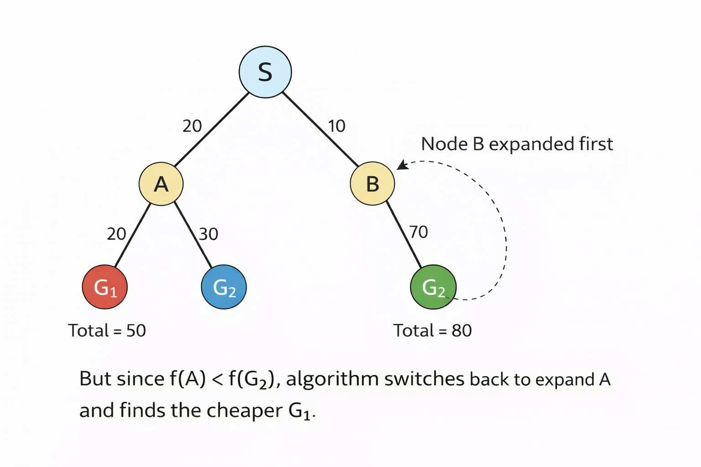

Here are the "Ready-to-Write" exam notes for questions 1(a) and 1(b) from your question paper, followed by crystal-clear Neplish explanations to help you memorize them easily.

---

### **1. a) What is Artificial Intelligence? Mention the advantages of Artificial Intelligence. [8 Marks]**

**[Exam Ready Note]**

**Definition of Artificial Intelligence (AI):**
Artificial Intelligence (AI) is a prominent branch of computer science dedicated to creating intelligent systems capable of performing tasks that typically require human intelligence. These tasks include learning from experience, reasoning, problem-solving, understanding natural language, and perceiving the environment. 
According to Russell and Norvig, AI can be defined through four distinct approaches:
1. Thinking Humanly (Cognitive modeling)
2. Acting Humanly (Turing test approach)
3. Thinking Rationally (Laws of thought)
4. Acting Rationally (Rational agent approach - maximizing expected performance).

**Advantages of Artificial Intelligence:**
1. **Automation of Repetitive Tasks:** AI excels at performing monotonous, repetitive tasks without fatigue, freeing up humans to focus on creative and complex problem-solving.
2. **24/7 Availability:** Unlike humans who require rest, AI systems and machines can operate continuously 24 hours a day, 7 days a week, increasing overall productivity.
3. **Reduction of Human Error:** AI models, when programmed properly, can process vast amounts of data with high precision and accuracy, significantly reducing "human error" in fields like data entry and complex calculations.
4. **Handling Hazardous Tasks (Risk Mitigation):** AI-driven robots can be deployed in environments dangerous to humans, such as bomb disposal, space exploration, deep-ocean mining, or handling radioactive materials.
5. **Faster Decision Making:** AI can analyze massive datasets (Big Data) and extract patterns much faster than a human, enabling rapid decision-making in critical areas like algorithmic stock trading or medical diagnosis.
6. **Digital Assistance:** AI powers virtual assistants (like Siri, Alexa, or Chatbots) that provide highly personalized experiences and immediate customer support.

***

**💡 Nepali Core Concept Summary (Neplish):**
*   **AI bhanya k ho?** AI bhaneko computer science ko tyo branch ho jasle machine lai manxe jastai sochne, bujhne ra decision line banauna madat garcha. Exam ma definition lekhda 'Learning, Reasoning, ra Problem-solving' vanne words chutaunai hudaina. Russell ra Norvig ko 4 wota approach (Thinking/Acting Humanly/Rationally) lekhdyo bhane marks full aauxa!
*   **Faida (Advantages) k k hun ta?** 
    1. *Boring kaam aafai garne* (Automation). 
    2. *Thakai nalagne* (24/7 kaam garna sakne). 
    3. *Galti nagarne* (High accuracy, human error nahune). 
    4. *Danger thau ma pathauna milne* (Jastai bomb disarm garna robot pathaune). 
    5. *Chhito decision line* (Thulo data lai second mai process garne).

---

### **1. b) What are the criteria for the evaluation of search algorithms? Compare DFS and BFS.[7 Marks]**

**[Exam Ready Note]**

**Criteria for the Evaluation of Search Algorithms:**
To evaluate and compare the performance of different search algorithms, we use the following four standard criteria:
1. **Completeness:** Is the algorithm guaranteed to find a solution if at least one solution exists?
2. **Optimality:** If there are multiple solutions, is the algorithm guaranteed to find the best (optimal/lowest cost) solution?
3. **Time Complexity:** How long does it take for the algorithm to find a solution? (Usually measured by the number of nodes generated).
4. **Space Complexity:** How much memory (RAM) is required to perform the search? (Usually measured by the maximum number of nodes stored in memory at any point).

**Comparison Between DFS and BFS:**

| Feature | Breadth-First Search (BFS) | Depth-First Search (DFS) |
| :--- | :--- | :--- |
| **Basic Approach** | Explores the search tree level-by-level (shallowest nodes first). | Explores the search tree by diving deep down one path to the bottom before backtracking. |
| **Data Structure Used** | Uses a **Queue** (FIFO - First In, First Out). | Uses a **Stack** (LIFO - Last In, First Out). |
| **Completeness** | **Yes** (Complete if the branching factor is finite). | **No** (It can get stuck in infinite loops or infinitely deep paths). |
| **Optimality** | **Yes** (Optimal if all step costs are equal). | **No** (It might find a longer, sub-optimal path first). |
| **Time Complexity** | $O(b^d)$ (where $b$ is branching factor, $d$ is depth of shallowest solution). | $O(b^m)$ (where $m$ is the maximum depth of the search tree). |
| **Space Complexity** | $O(b^d)$ - **Very High**. It must store all nodes of a level in memory. | $O(bm)$ - **Very Low/Linear**. It only stores a single path from root to leaf node. |

***

**💡 Nepali Core Concept Summary (Neplish):**
*   **Evaluation Criteria:** Kunai pani search algorithm (bato khojne tarika) ramro cha ki nai vanera 4 wota kura ma test garincha:
    1. *Completeness:* Answer fix bhetaucha ki bhetaudaina?
    2. *Optimality:* Bhetayeko answer sabai bhanda best (chhoto bato) ho ki haina?
    3. *Time Complexity:* Kati time lagcha?
    4. *Space Complexity:* Kati memory/RAM khancha?
*   **BFS vs DFS Compare:** 
    *   **BFS (Breadth-First Search):** Yesle line-by-line (level wise) check garcha. **Queue** use garcha. Answer fix bhetcha (Complete) ra best answer bhetcha (Optimal). Tara sabai level ko data save garna parne vayekole **Memory ekdum dherai khancha** ($O(b^d)$).
    *   **DFS (Depth-First Search):** Yesle euta bato samatepachi tesko chheu sammai pugcha. **Stack** use garcha. Memory ekdum **kam khancha** ($O(bm)$). Tara yo baango-tingo bato ma fasna sakcha (Not complete) ra bhetayeko answer sabai bhanda best nahuna pani sakcha (Not optimal).

### **A* Search Algorithm (Short & Exam-Ready)**

**[Exam Ready Note]**

**Concept:** 
A* (A-star) is the most popular **Informed Search Algorithm**. It finds the shortest path by combining the actual cost taken so far with the estimated cost to reach the goal. 
It uses the evaluation function: **$f(n) = g(n) + h(n)$**
*   **$g(n)$**: Actual cost from the start node to the current node $n$.
*   **$h(n)$**: Heuristic (estimated) cost from the current node $n$ to the goal.
*   **$f(n)$**: Total estimated cost of the path through node $n$.

**Algorithm Steps:**
1.  **Initialize** two lists: 
    *   `OPEN` (Priority Queue to store unvisited nodes, sorted by lowest $f(n)$).
    *   `CLOSED` (List to store already visited nodes).
2.  Put the **Start Node** into the `OPEN` list.
3.  **Loop** while the `OPEN` list is not empty:
    *   **Pick** the node $n$ with the lowest $f(n)$ from `OPEN`.
    *   If $n$ is the **Goal Node**, return SUCCESS and trace back the path.
    *   Otherwise, remove $n$ from `OPEN` and put it in `CLOSED`.
    *   **Expand** node $n$ (generate its neighbors/successors).
    *   For each neighbor:
        *   Calculate its $f(n) = g(n) + h(n)$.
        *   If it is neither in `OPEN` nor `CLOSED`, add it to `OPEN`.
        *   If it is already in `OPEN` but with a higher cost, **update** it with this new lower cost.
4.  If `OPEN` becomes empty and the goal is not reached, return FAILURE.

***

**💡 Nepali Core Concept Summary (Neplish):**
*   **A* (A-star) Algorithm** sabai vanda best search technique ho. Yesle andha vayera bato khojdaina, formula lagaucha: **$f(n) = g(n) + h(n)$**.
*   **$g(n)$** bhaneko start point bata ahile ko thau samma aaudako actual kharcha (Past cost) ho. 
*   **$h(n)$** bhaneko ahile ko thau bata goal samma pugna kati lagla vanera guess gareko kharcha (Future cost/Heuristic) ho.
*   **Algorithm ko idea:** Duita list banaune (OPEN ra CLOSED). Suruma Start node lai OPEN ma halne. Tespachi OPEN list bata sabai vanda kam $f(n)$ (sasto bato) vako node nikalne. Yadi tyo goal ho vane sakkiyo! Haina vane tesko chhimeki (neighbors) haru ko $f(n)$ nikalne ra OPEN list ma halne. Yo process goal navetesamma repeat garirakhne.

### **How to Optimize the A* Algorithm (Exam-Ready Note)**

**[Exam Ready Note]**

While A* is optimally efficient for any given heuristic, its main drawback is its **Space Complexity** (it runs out of memory quickly because it keeps all generated nodes in memory). To optimize the A* algorithm in terms of speed and memory, we can use the following techniques:

**1. Improving the Heuristic Function ($h(n)$)**
*   **Concept:** The performance of A* depends heavily on the accuracy of the heuristic. If we design a heuristic $h_2(n)$ that is strictly greater than or equal to another heuristic $h_1(n)$ (but remains admissible, i.e., never overestimates), we say **$h_2$ dominates $h_1$**.
*   **Result:** A dominating heuristic will always expand fewer nodes, drastically optimizing the search time and memory usage.

**2. Weighted A* (Trading Optimality for Speed)**
*   **Concept:** If finding the *perfectly optimal* path is not strictly necessary, we can speed up the search by multiplying the heuristic by a weight $W > 1$.
*   **Formula:** **$f(n) = g(n) + W \times h(n)$**
*   **Result:** This biases the search to focus much more heavily on the goal rather than exploring past costs. It explores significantly fewer nodes and is incredibly fast, though the final path might be slightly longer than the absolute best path.

**3. Using Memory-Bounded Variations**
To solve A*'s massive memory consumption ($O(b^d)$), we can use optimized variants of A* that limit memory usage:
*   **IDA* (Iterative Deepening A*):** Combines the low memory usage of DFS with the optimality of A*. Instead of using a depth limit, it uses an $f$-cost limit. It only requires linear memory ($O(bd)$).
*   **SMA* (Simplified Memory-bounded A*):** It proceeds like A* until memory is full. Then, it drops the least promising node (highest $f$-cost) to make room for new ones.

**4. Data Structure Optimization**
*   **Concept:** The `OPEN` list requires frequent extraction of the node with the lowest $f(n)$. 
*   **Result:** Instead of using a simple array or list (which takes $O(N)$ time to search), implementing the `OPEN` list as a **Min-Heap** or **Priority Queue** reduces the time to find the best node to $O(\log N)$, making the algorithm run much faster.

***

**💡 Nepali Core Concept Summary (Neplish):**
A* Algorithm ekdum ramro ho tara yesko eutei thulo problem cha: **Memory (RAM) dherai khancha** kina vane yesle sabai node lai save garera rakhcha. Yeslai optimize (fast ra better) garna 4 wota tarika chan:

1.  **Heuristic Ramro Banaune:** Goal samma pugne distance ko exact guess (Dominant heuristic) garna sakyo bhane useless bato haru check garna pardaina.
2.  **Weighted A\*:** $h(n)$ lai kunai number (Weight $W$) le multiply gardine. Yesle algorithm lai ekdum fast banauncha tara aayeko answer 100% best (optimal) chai nahuna sakcha. Fast answer chaiyeko bela yo use huncha.
3.  **Memory-Bounded A\* (IDA\*):** RAM full hune problem solve garna IDA* (Iterative Deepening A*) use garne. Yesle DFS ko jasto trick lagayera memory ekdum kam khancha ($O(bd)$).
4.  **Min-Heap Data Structure:** OPEN list bata sabai vanda sasto $f(n)$ vako node khojna time lagcha. Yadi list ko sato 'Min-Heap' data structure use garyo vane, sasto node khojne kaam ekdum fast ($O(\log N)$) huncha.

Here are the "Ready-to-Write" exam notes and solutions for questions 3(a) and 3(b), complete with Neplish explanations.

---

### **3. a) Represent following statements into predicate logic. [8 Marks]**

**[Exam Ready Note]**

**i) All Hindu are either loyal to Krishna or Shiva.**
*   *Predicates:* $Hindu(x)$, $LoyalTo(x, y)$. *Constants:* $Krishna, Shiva$.
*   **FOL:** $\forall x (Hindu(x) \rightarrow LoyalTo(x, Krishna) \lor LoyalTo(x, Shiva))$

**ii) Every gardener like sun.**
*   *Predicates:* $Gardener(x)$, $Likes(x, y)$. *Constant:* $Sun$.
*   **FOL:** $\forall x (Gardener(x) \rightarrow Likes(x, Sun))$

**iii) There is exactly two red mushrooms.**
*   *Predicates:* $Mushroom(x)$, $Red(x)$.
*   *(Logic Concept: We must state that there exist two distinct red mushrooms, $x$ and $y$, and if any other object $z$ is a red mushroom, it must be either $x$ or $y$.)*
*   **FOL:** $\exists x \exists y (\; Mushroom(x) \land Red(x) \land Mushroom(y) \land Red(y) \land (x \neq y) \;\land\; \forall z (Mushroom(z) \land Red(z) \rightarrow (z = x \lor z = y)) \;)$

**iv) Every parents are older than their childs.**
*   *Predicates:* $Parent(x, y)$ (x is parent of y), $Older(x, y)$ (x is older than y).
*   **FOL:** $\forall x \forall y (Parent(x, y) \rightarrow Older(x, y))$

***

**💡 Nepali Core Concept Summary (Neplish):**
*   **i)** "All" aayeko le $\forall x$ ra $\rightarrow$ use garne. "Either OR" ko lagi $\lor$ (OR) sign use garne.
*   **ii)** "Every" aayeko le $\forall x$ ra $\rightarrow$ use garne. Sun lai constant maneyra $Likes(x, Sun)$ lekhne.
*   **iii)** Yo exam ko sabai vanda tricky question ho! "Exactly two" (thakkai dui wota) dekhauna ko lagi: Paila $x$ ra $y$ duitai Red Mushroom ho ra ti dube farak hun ($x \neq y$) vanne. Tespachi $\forall z$ lagayera yadi kunai tesro object ($z$) pani Red Mushroom ho bhane, tyo ki ta $x$ huna parcha ki ta $y$ huna parcha ($z = x \lor z = y$) vanera fix gardine.
*   **iv)** "Every" cha so $\forall x \forall y$ use garne. Relation lai $Parent(x,y)$ manney, jasai meaning $x$ chai $y$ ko parent ho. Implies ($\rightarrow$) pachi $Older(x,y)$ lekhdine.

---

### **3. b) Define Bayes rule for probabilistic problem. [...] Calculate probability using Bayes theorem. [7 Marks]**

**[Exam Ready Note]**

**1. Definition of Bayes' Rule:**
Bayes' theorem is a mathematical formula used in probability and artificial intelligence to calculate the **posterior probability** of an event based on prior knowledge of conditions that might be related to the event. It updates our belief in a hypothesis (cause) after observing new evidence (effect).

The formula is:
$$P(A|B) = \frac{P(B|A) \times P(A)}{P(B)}$$
*Where:*
*   $P(A|B)$ = Posterior probability (Probability of Cause A given Effect B).
*   $P(B|A)$ = Likelihood (Probability of Effect B given Cause A).
*   $P(A)$ = Prior probability of Cause A.
*   $P(B)$ = Marginal probability of Effect B.

---
**2. Solution to the Numerical Problem:**

**Given Data:**
*   Probability of Symptoms (Effect), $P(S) = \frac{1}{20} = 0.05$
*   Probability of Disease (Cause), $P(D) = \frac{1}{45000}$
*   Probability of Symptoms given Disease (Likelihood), $P(S|D) = 50\% = \frac{1}{2} = 0.50$

**To Find:**
*   Probability of Disease given Symptoms (Posterior), $P(D|S) = ?$

**Applying Bayes' Theorem:**
$$P(D|S) = \frac{P(S|D) \times P(D)}{P(S)}$$

*Putting the values into the formula:*
$$P(D|S) = \frac{0.50 \times \left(\frac{1}{45000}\right)}{\left(\frac{1}{20}\right)}$$

$$P(D|S) = \frac{\left(\frac{1}{2}\right) \times \left(\frac{1}{45000}\right)}{\left(\frac{1}{20}\right)}$$

$$P(D|S) = \frac{\left(\frac{1}{90000}\right)}{\left(\frac{1}{20}\right)}$$

$$P(D|S) = \frac{1}{90000} \times \frac{20}{1}$$

$$P(D|S) = \frac{20}{90000} = \frac{2}{9000} = \frac{1}{4500}$$

$$P(D|S) \approx 0.000222 \text{ (or } 0.0222\%)$$

**Answer:** The probability of having the disease given the symptoms is **1/4500** (approx 0.0222%).

***

**💡 Nepali Core Concept Summary (Neplish):**
*   **Bayes Rule ko Definition:** Kunai pani event vaisakepachi (jastai symptom dekhiepachi), tesko main kaaran (disease) k ho vanera purano data use garera probability nikalne formula lai Bayes Theorem vaninxa. $P(Cause | Effect)$ nikalne kaam yesle garcha.
*   **Numerical Trick:** Question maa value haru words ma ghumaera diyeko cha, tesaile paila carefully value tipne. 
    *   $P(Symptoms)$ = $1/20$
    *   $P(Disease)$ = $1/45000$
    *   $P(Symptoms | Disease)$ = "probability of symptoms condition to disease" vanna leketko cha, yo $50\%$ wa $1/2$ ho.
    *   Hamilai "Probability of disease condition to symptoms" nikalna vaneko cha, matlab $P(Disease | Symptoms)$.
*   Aba sidhai formula ma fraction halera solve garne. $0.5$ lai $1/2$ banayera solve garda calculation ekdum fast ra mistake nabhai garna sakincha! Result $1/4500$ aauxa.

Here is a detailed check of your handwritten First-Order Logic (FOL) statements. You have a good grasp of the concepts, but there are a few syntax and scoping errors that could cost you marks in an exam. 

Let's review them one by one:

### **General Exam Tip First:**
You are using a colon (`:`) after your quantifiers (like `∀x :`). While some professors might understand it, **it is non-standard in formal logic**. You should use brackets to define the scope. 
*   *Don't write:* `∀x : P(x) -> Q(x)`
*   *Write:* `∀x ( P(x) -> Q(x) )`

---

### **i) All Hindu are either loyal to Krishna or Shiva.**
*   **Your Answer:** `∀x : Hindu(x) -> loyalto(x, krishna) V loyalto(x, shiva)`
*   **Review:** **Conceptually Correct, Syntax needs minor fix.**
    The logic is absolutely right. However, to avoid ambiguity with the OR (`V`) operator, you should wrap the entire "Then" part in brackets, and wrap the whole statement in brackets.
*   **Corrected Format:** 
    `∀x ( Hindu(x) -> (loyalto(x, Krishna) ∨ loyalto(x, Shiva)) )`

### **ii) Every gardener like sun.**
*   **Your Answer:** `∀x : gardener(x) -> like(x, sun)`
*   **Review:** **Conceptually Correct, Syntax needs minor fix.**
    Again, the logic is perfect. Just replace the colon with brackets for standard notation.
*   **Corrected Format:** 
    `∀x ( gardener(x) -> like(x, Sun) )`

### **iii) There is exactly two read mushroom.** 
*(Note: Assuming 'red mushroom' based on standard questions)*
*   **Your Answer:** `∃x ∃y : readmushroom(x) ∧ readmushroom(y) ∧ x ≠ y ∧ ∀z (Read_mushroom(z)) -> (z = x V z = y))`
*   **Review:** **Concept is 90% there, but MAJOR BRACKET ERROR.**
    You successfully remembered the logic for "exactly two" (exist x, exist y, they are different, and if any z exists, it must be x or y). **Brilliant!** 
    *However*, your bracket placement on the `∀z` part is wrong. You closed the bracket right after `Read_mushroom(z)`, which breaks the implication. The Implies (`->`) must be *inside* the `∀z` scope.
*   *Your mistake:* `... ∀z (Read_mushroom(z)) -> ...` ❌
*   *Correct scope:* `... ∀z (Read_mushroom(z) -> (z = x ∨ z = y)) ` ✅
*   **Corrected Format:**
    `∃x ∃y ( RedMushroom(x) ∧ RedMushroom(y) ∧ (x ≠ y) ∧ ∀z (RedMushroom(z) -> (z = x ∨ z = y)) )`

### **iv) Every parents is older than child.**
*   **Your Answer:** `∀x : parent(x, y) -> older(x, y)`
*   **Review:** **INCORRECT (Free Variable Error).**
    You introduced the variable `y` in `parent(x, y)` and `older(x, y)`, but you completely forgot to declare `y` at the beginning! In FOL, every variable must be bound to a quantifier. Because `y` doesn't have a `∀` or `∃` in front of it, it is a "free variable," making the formula mathematically invalid.
    The statement means: "For ALL x, and for ALL y, if x is the parent of y, then x is older than y."
*   **Corrected Format:** 
    `∀x ∀y ( parent(x, y) -> older(x, y) )`

***

### 💡 **Nepali Core Concept Summary (Exam Tips):**
1.  **Colon (:) use nagarne!** Quantifier pachi sidhai bracket `(` start garne ra last ma `)` close garne. (e.g., `∀x ( ... )`).
2.  **Free Variable galti:** Question number 4 ma timile `y` use garyau tara agadi `∀y` lekhnau. Yesto garda exam ma sidhai 0 marks aauxa! Variable use garne bittikai tesko aagadi $\forall$ wa $\exists$ hunei parcha.
3.  **Exactly Two ko Bracket:** Question 3 ma timile logic ekdum sahi liyeka thiyau, just bracket bigryo. `∀z (Condition -> Conclusion)` format ma hunuparcha. Bracket lekhda dhyaan dine.

Assuming you are referring to **Chapter 5: Machine Learning** from the **Artificial Intelligence** syllabus (based on our previous notes generation), I have scanned all the Artificial Intelligence past exam papers provided in the document and compiled every question asked from this chapter. 

To make it easier for your exam preparation, I have categorized them by sub-topics:

### **1. Basics of Machine Learning & Types**
*   What is Machine Learning? Discuss the difference between supervised learning, and unsupervised learning (At least 6 points). *(Nepal Engineering College)*
*   What is learning by analogy? What are types of Machine learning? Explain two major types with differences between them. *(Universal Engineering & Science College)*
*   What is machine learning? Discuss the difference between regression, classification and clustering in machine learning. *(Madan Bhandari College of Engineering)*
*   What are the labelled and unlabeled data? Suppose you are provided with unlabeled data to train a machine learning model. Which machine learning model will you apply to train the learning model? Explain in detail with example. *(Everest Engineering College)*
*   Write short notes on: Learning by analogy. *(Madan Bhandari College of Engineering)*

### **2. Supervised Learning (Linear Regression & K-NN)**
*   What is linear regression? Explain with a suitable example. *(Pokhara University - School of Engineering)*
*   Describe Briefly about Nearest Neighbour and Linear regression in Machine learning. *(Universal Engineering & Science College)*
*   How does k nearest neighbor algorithm works? Explain it with suitable example. *(Gandaki College of Engineering and Science)*
*   How does support vector machine work? Illustrate with a suitable example? *(Madan Bhandari College of Engineering)*
*   State and discuss the linear regression algorithm. Find the value of Y when X = 7 for the given table data. *(Nepal Engineering College)*

### **3. Unsupervised Learning (Clustering)**
*   Explain the k-means clustering algorithm with step-by-step demonstration on a small dataset, showing how the result. *(Madan Bhandari College of Engineering)*
*   Write down the k-means clustering algorithm. Cluster the given 8 points in 3 clusters A(2,10), B(2,5), C(8,4), D(5,8), E(7,5), F(6,4), G(1,2), H(4,9). *(Gandaki College of Engineering and Science)*

### **4. Artificial Neural Networks (ANN & Perceptrons)**
*   Define Artificial Neural Network. Explain how an ANN work in detail. *(Pokhara University - School of Engineering)*
*   What is an Artificial Neural Network? Implement simple logic OR using Perceptron Model. *(Universal Engineering & Science College)*
*   Discuss the mathematical model of Neuron. State the perceptron training algorithm and demonstrate the same for AND Gate. *(Nepal Engineering College)*
*   Explain perceptron learning theory to train AND logic. *(Gandaki College of Engineering and Science)*
*   Define the role of bias in a perceptron. How are weights updated in a single layer perceptron? Explain with example. *(Madan Bhandari College of Engineering)*
*   Write the Backpropagation algorithm. Demonstrate its use in designing an XOR gate through one iteration. *(Everest Engineering College)*

***
*Note: If you meant Chapter 5 of a different subject (like Software Engineering, Embedded Systems, etc. included in the latter half of your PDF), let me know and I will extract those instead!*

Here is the complete, categorized list of all the questions asked from **Chapter 1, Chapter 2, and Chapter 3** of the **Artificial Intelligence** syllabus, extracted from the various university and college past papers in your PDF. 

I have grouped them by chapter and sub-topics so you can easily spot the most repeated and important questions for your exam preparation!

---

### **Chapter 1: Introduction to Artificial Intelligence**

**1. Definitions & Components of AI**
*   What is artificial intelligence? Explain the components of intelligence in detail. *(Pokhara University - School of Engineering)*
*   Define Artificial Intelligence. What are the components of AI? *(Universal Engineering & Science College)*
*   What is Artificial Intelligence? Mention the advantages of Artificial Intelligence. *(From your previously shared text snippet)*

**2. Approaches to AI (Turing Test & Rationality)**
*   Difference between Turing test and Total Turing test. Justify that "System that think rationally" and "System that act rationally" are the part of artificial intelligence. Explain with example. *(Everest Engineering College)*
*   Justify that “system thinks rationally” and “System acting humanly” are the part of artificial intelligence. Explain with examples. *(Gandaki College of Engineering and Science)*
*   Write short notes on: Acting Humanly. *(Pokhara University - School of Engineering)*
*   Write short notes on: John Searle's "Chinese Room" argument. *(Universal Engineering & Science College)*

**3. Impact and Ethics**
*   What is Artificial Intelligence? Discuss the impact of artificial intelligence in modern society. *(Nepal Engineering College)*
*   What is Artificial Intelligence? Explain the current trends of AI and its impact on Society. *(Madan Bhandari College of Engineering)*

---

### **Chapter 2: Intelligent Agents**

**1. Agents, Environments, and PEAS**
*   Differentiate intelligent agents and rational agents. What is PEAS? Discuss PEAS for Vacuum Cleaning Agent. *(Nepal Engineering College)*
*   What is PEAS? Explain the architecture of goal based agent and utility based agent. *(Universal Engineering & Science College)*
*   What is rational agent? Give any two examples of PEAS explaining what is PEAS. *(Universal Engineering & Science College)*
*   Define agents and environment? How is the design of an intelligent agent affected by the type of environment (deterministic vs. stochastic, fully observable vs. partially observable)? *(Everest Engineering College)*

**2. Types of Agents (Reflex, Model, Goal, Utility)**
*   What is an intelligent agent? Explain the simplex intelligent agent in detail. *(Pokhara University - School of Engineering)*
*   Define agent function? Differentiate goal-based and utility-based agents with examples. *(Madan Bhandari College of Engineering)*
*   What is agent function? Explain simplex reflex and model based agents with examples. *(Gandaki College of Engineering and Science)*

---

### **Chapter 3: Problem Solving and Search Algorithms**

**1. Problem Formulation**
*   What are the components of a state space search problem formulation? Formulate a search problem for 8-Puzzle, discuss production rules, and provide a solution. *(Nepal Engineering College)*
*   Define state space problem in solving. *(Universal Engineering & Science College)*
*   In a distinct land, bigamy is common. There are six people who want to cross a river... Formulate the problem. *(Gandaki College of Engineering and Science)*

**2. Uninformed & Informed Search (BFS, DFS, A*)**
*   What are the problems of depth first search and breadth first search? How are these problems resolved? Explain with a suitable example? *(Madan Bhandari College of Engineering)*
*   How does the A* search resolve the problem of greedy best first search that may stuck in a loop? Explain with example. *(Pokhara University - School of Engineering)*
*   Write difference between A* search algorithm and Best First search algorithm. *(Universal Engineering & Science College)*
*   What are the evaluation strategies of the A* algorithm? Solve the 8-puzzle problem using the A* algorithm. *(Everest Engineering College)*
*   Explain with an Example how A* search can find the optimal solution when there is more than one solution? *(Madan Bhandari College of Engineering)*
*   Perform A* and greedy search on the following graph. *(Gandaki College of Engineering and Science)*
*   Write short notes on: A* Algorithm. *(Nepal Engineering College)*

**3. Local Search & Optimization (Hill Climbing, Simulated Annealing)**
*   State and discuss Hill Climbing Algorithm. What are the issues associated with the Hill Climbing Problem, demonstrate with the example of block arrangement problem. *(Nepal Engineering College)*
*   Explain the concept of hill climbing search? Explain the three problems that can occur during hill climbing search? *(Universal Engineering & Science College)*
*   State Simulated Annealing Algorithm? The following table shows three evaluations... Calculate the probability of the next state being accepted. *(Nepal Engineering College)*
*   Explain about simulated annealing. *(Universal Engineering & Science College)*
*   Write short notes on: Simulated Annealing. *(Pokhara University - School of Engineering)*
*   Write short notes on: Gradient Descent. *(Everest Engineering College)*

**4. Adversarial Search (Game Playing)**
*   What is an adversarial search? Explain the min-max algorithm with an example. *(Pokhara University - School of Engineering)*
*   Explain how alpha beta pruning works. *(Universal Engineering & Science College)*
*   Explain the concept of alpha and beta value in the alpha beta pruning algorithm. How does these values propagate through the search tree? Show with an example. *(Everest Engineering College)*
*   Discuss MiniMax with example. *(Nepal Engineering College)*

**5. Constraint Satisfaction Problems (CSP)**
*   Explain the constrain satisfaction problem with the example of map coloring problem. *(Pokhara University - School of Engineering)*
*   Explain backtracking search in the constrain satisfaction problems. *(Pokhara University - School of Engineering)*
*   What is Cryptarithmetic Problem? Formulate it as CSP and provide a solution for the following cryptarithmetic problem: SUN + FUN = SWIM. *(Nepal Engineering College)*
*   Using constraint satisfaction problem, solve the following crypto arithmetic problem: LOGIC + LOGIC = PROLOG. *(Universal Engineering & Science College)*
*   Define a Constraint Satisfaction Problem (CSP). Solve the following crypto-arithmetic problem using CSP techniques: SEVEN + EIGHT = TWELVE. *(Everest Engineering College)*
*   What are the constraints Satisfaction Problems? Solve the following Crypt-arithmetic Problem: BASE + BALL = GAMES. *(Madan Bhandari College of Engineering)*
*   Write short notes on: Constraint satisfaction (crypto-arithmetic) problem. *(Gandaki College of Engineering and Science)*

***
*Note: Looking at these past papers, **Crypt-arithmetic problems (CSP), PEAS descriptions, A\* Search, and Hill Climbing limitations** are repeatedly asked in almost every exam. You should definitely master these topics!*

Here is the complete, categorized list of all the questions asked from **Chapter 4, Chapter 6, and Chapter 7** of the **Artificial Intelligence** syllabus, carefully extracted from the past exam papers in your PDF.

---

### **Chapter 4: Knowledge Representation and Reasoning**

**1. Propositional Logic & Truth Tables**
*   What are the drawbacks of propositional logic? How are they resolved in predicate logic? Explain in detail. *(Pokhara University - School of Engineering)*
*   Given the propositional statements p: "It is raining" and q: "The road is wet", write the logical expressions for the following: i. If it is not sunny, then the picnic will not happen... *(Universal Engineering & Science College)*
*   Using the truth table prove that $p \iff q$ is equivalent to $(p \implies q) \land (q \implies p)$. *(Universal Engineering & Science College)*
*   Explain the steps involved in Conjunctive Normal Form (CNF). Discuss the inference rule for propositional logic with example. *(Everest Engineering College)*
*   Convert $B \iff (P \lor Q)$ into conjunctive normal form (CNF). *(Gandaki College of Engineering and Science)*

**2. Predicate Logic (First-Order Logic - FOL) Representation**
*   What are the steps to convert a First-Order Predicate Logic (FOPL) sentence to clausal form? Provide a detailed step-by-step procedure... Consider the sentence: "Everyone who loves all animals is loved by someone." *(Nepal Engineering College)*
*   Represent the following facts in predicate logic: i) John likes all kind of food. ii) Apple and vegetable are food. iii) Anything anyone eats and not killed is food. iv) Anil eats peanuts and still alive. v) Harry eats everything that Anil eats. *(Madan Bhandari College of Engineering)*
*   Represent following sentences with predicate logic: i. Every gardener likes the sun. ii. All purple mushrooms are poisonous. iii. No purple mushrooms are poisonous. iv. A car have at least one door. *(Gandaki College of Engineering and Science)*

**3. Resolution & Theorem Proving**
*   Consider the following facts: 1. All hounds howl at night. 2. Anyone who has any cats will not have any mice. 3. Light sleepers do not have anything which howls at night. 4. John has either a cat or a hound. 5. John is a light sleeper. Using resolution prove that John does not have any mice. *(Pokhara University - School of Engineering)*
*   Prove the following using Resolution Refutation System: All those who honour both their parents are blessed. If anyone dislikes any of his siblings, one does not honour one’s parents. Raju likes his sister Rita. Therefore, Raju is blessed. *(Nepal Engineering College)*
*   Assume the following facts: Steve only likes easy courses. Science courses are hard. All the courses in the basket weaving department are easy. BK301 is a basket weaving course. Use resolution to answer the question, "What course would Steve like?" *(Universal Engineering & Science College)*
*   Assume the following facts: Horses, cows, pigs are mammals. An offspring of a horse is a horse. Bluebeard is a horse. Bluebeard is a Charlie’s parent. Offspring and parent are inverse relations. Every mammal has a parent. Prove that “Charlie is a horse” using resolution. *(Everest Engineering College)*
*   Consider the facts given in Q.3 b) using resolution prove that John likes peanuts. *(Madan Bhandari College of Engineering)*

**4. Reasoning Under Uncertainty (Probability, Bayes Theorem & Bayesian Networks)**
*   Define reasoning under uncertainty. Explain a Bayesian Network with an suitable example. *(Pokhara University - School of Engineering)*
*   Analyze the given graph and find the probability of holiday given that there is rain, and hailstorm. [Network diagram provided in question paper]. *(Everest Engineering College)*
*   Write short notes on: Probability and Bayes Theorem. *(Universal Engineering & Science College)*
*   Write short notes on: Hidden Markov Model. *(Everest Engineering College)*
*   Write short notes on: Baysian Network. *(Gandaki College of Engineering and Science)*

**5. Other KR Approaches (Semantic Nets & Frames)**
*   What is a partition semantic net? Represent the following sentences in a semantic network: Every dog had bitten a postman. *(Nepal Engineering College)*
*   Differentiate between semantic nets and frames. *(Everest Engineering College)*
*   Represent the following sentences into a semantic network: i. Birds are animals. ii. Birds have feathers, fly and lay eggs. iii. Albatross is a bird. iv. Donald is a bird. v. Tracy is an albatross. *(Gandaki College of Engineering and Science)*
*   Write short notes on: Semantic Nets. *(Pokhara University - School of Engineering)*
*   Write short notes on: Frame. *(Nepal Engineering College)*

---

### **Chapter 6: Fuzzy Logic**

**1. Concepts, Sets & Operations**
*   Define a fuzzy logic. *(Pokhara University - School of Engineering)*
*   What is fuzzy logic? Explain its core concepts and discuss the main fuzzy set operations (union, intersection, and complement) with examples. *(Nepal Engineering College)*
*   Write short notes on: fuzzy logic. *(Madan Bhandari College of Engineering)*

**2. Fuzzification, Defuzzification & Membership Functions**
*   Define membership functions. Discuss the method of fuzzification and defuzzification with an example. *(Everest Engineering College)*
*   Explain fuzzification and defuzzification with suitable examples. *(Gandaki College of Engineering and Science)*

**3. Fuzzy Inference System (Mamdani FIS)**
*   Explain the components of fuzzy inference system. *(Pokhara University - School of Engineering)*
*   Explain a Mamdani fuzzy inference system with any suitable example. *(Pokhara University - School of Engineering)*

---

### **Chapter 7: Expert System**

**1. Architecture & Components**
*   What is an expert system? Explain the architecture of an expert system. *(Everest Engineering College)*
*   What is Expert System? Explain the architecture of expert system in detail. *(Madan Bhandari College of Engineering)*
*   What is expert system? Explain architecture of expert system with necessary diagram. *(Gandaki College of Engineering and Science)*
*   Write short notes on: Expert system. *(Universal Engineering & Science College)*

**2. Importance & Need**
*   Explain the importance and need of an expert system. *(Pokhara University - School of Engineering)*

**3. Inference Mechanisms (Forward & Backward Chaining)**
*   Write short notes on: Inference Mechanism. *(Everest Engineering College)*
*   Write short notes on: Forward and backward chaining. *(Gandaki College of Engineering and Science)*

***
*Exam Tip: Based on these past papers, **Resolution Theorem Proving (Word problem to logic to proof)** and **Translating English to Predicate Logic (FOL)** are guaranteed 8-mark long questions. In Chapter 6 and 7, **Fuzzification/Defuzzification** and **Expert System Architecture** are the most frequently asked questions!*

Here is your **Ultimate AI Exam Predictor**. 

Applying the Pareto Principle (80/20 Rule), **these top 20% of topics will guarantee you 80%+ marks**. I have analyzed the Pokhara University (PU) board exams from **2019 to 2024 (including the Fall 2024 New Syllabus)**, along with recent Pre-Board/Internal exams from top colleges (NEC, Everest, Universal, Madan Bhandari, Gandaki). 

If you master *only* these Tier 1 and Tier 2 questions, you will secure an A grade.

---

### 🏆 TIER 1: The "Guaranteed" Questions (The 80% Yielders)
*These 5 questions appear in almost **every single exam paper**. Prepare them first. They carry 7 to 8 marks each.*

#### **1. Cryptarithmetic Problem (Constraint Satisfaction Problem - CSP)**
*   **The Question:** Define CSP. Solve the following Cryptarithmetic problem.
*   **Repeated In:** **PU 2024 New** (CROSS+ROADS=DANGER), **PU 2024** (LOGIC+LOGIC=PROLOG), **PU 2023** (WRONG+WRONG=RIGHT), **PU 2022** (BASE+BALL=GAMES), **PU 2019** (SEND+MORE=MONEY), **Everest Pre-Board** (SEVEN+EIGHT=TWELVE), **Universal Pre-Board**.
*   **Strategy:** Learn the carry-over logic ($C_1, C_2, C_3$). Remember rules: All letters must have unique digits (0-9), and leading letters cannot be 0.

#### **2. Resolution Refutation Proof**
*   **The Question:** Assume the following facts [List of English sentences]. Convert to CNF and use Resolution to prove a specific statement.
*   **Repeated In:** **PU 2024 New** (Prove "Twilight is magical"), **PU 2020** (Prove "Ravi likes peanuts"), **NEC Pre-Board** (Prove "Raju is blessed"), **Universal Pre-Board** (Course Steve likes), **Everest Pre-Board** (Prove "Charlie is a horse"), **Madan Bhandari Pre-Board**.
*   **Strategy:** Practice the 5 steps: Convert English $\rightarrow$ FOL $\rightarrow$ Negate the Goal $\rightarrow$ Convert to CNF $\rightarrow$ Draw the Resolution Tree to get an Empty Clause ($\square$).

#### **3. A\* Search Algorithm (Theory + Why it is best)**
*   **The Question:** How does A* search escape infinite loops / find the optimal solution / resolve problems of Greedy best-first search? Explain with an example.
*   **Repeated In:** **PU 2024 New**, **PU 2024**, **PU 2023**, **PU 2022**, **PU 2021**, **PU 2020**, **Madan Bhandari**, **Universal**, **Gandaki**.
*   **Strategy:** Memorize the formula **$f(n) = g(n) + h(n)$**. Always write that A* is "Complete and Optimal if heuristic is admissible". 

#### **4. English to Predicate Logic (FOL) & Prolog Translation**
*   **The Question:** Represent the following facts in First-Order Logic (FOL) and Prolog statements.
*   **Repeated In:** **PU 2024 New**, **PU 2024**, **PU 2023**, **PU 2022**, **PU 2021**, **Gandaki**, **Madan Bhandari**.
*   **Strategy:** 
    *   "All/Every" = $\forall$ with $\rightarrow$ (Implies).
    *   "Some/At least" = $\exists$ with $\land$ (AND).
    *   For Prolog: Write conclusion first, use `:-` for IF, end with a dot `.`, and variables must be Capitalized.

#### **5. Perceptron Learning & Artificial Neural Networks (ANN)**
*   **The Question:** What is a perceptron? Explain how a single layer perceptron learns logical OR / AND operation. (Sometimes asks for Backpropagation).
*   **Repeated In:** **PU 2024 New** (OR Gate), **PU 2019**, **Madan Bhandari** (Bias role & weights), **NEC** (Mathematical model of Neuron & AND gate), **Everest** (Backpropagation for XOR).
*   **Strategy:** Memorize the weight update formula: $W_{new} = W_{old} + \alpha(Y_{actual} - Y_{predicted})X$. Practice the OR/AND gate truth table iterations.

---

### 🔥 TIER 2: High-Probability Theoretical Questions
*These topics alternate. If one doesn't appear, the other definitely will.*

#### **1. Hill Climbing vs. Simulated Annealing**
*   **The Question:** Explain the concept of Hill-Climbing Search. What are the common problems associated with it (Local Maxima, Plateaus, Ridges)? How does Simulated Annealing solve this?
*   **Repeated In:** **PU 2024 New**, **PU 2023**, **Universal Pre-Board**, **NEC** (Numerical on probabilities of SA).
*   **Strategy:** Draw the 2D landscape graph showing Local Maxima, Global Maxima, and Plateau. Mention "Temperature" parameter for Simulated Annealing.

#### **2. Minimax & Alpha-Beta Pruning**
*   **The Question:** How does alpha-beta pruning improve the efficiency of minimax search? Explain the concept of pruning with an example.
*   **Repeated In:** **PU 2024**, **PU 2023**, **PU 2021**, **Everest Pre-Board**.
*   **Strategy:** State the rule: Prune if $\alpha \ge \beta$. Mention it reduces time complexity from $O(b^m)$ to $O(b^{m/2})$. Draw a simple tree and cross out a branch.

#### **3. Intelligent Agents & PEAS**
*   **The Question:** Define agent function. Differentiate between Goal-based and Utility-based agents. / Define PEAS for a given agent (like Vacuum cleaner or Taxi).
*   **Repeated In:** **PU 2024 New** (Vacuum Cleaner), **PU 2024** (Goal based), **PU 2022** (Taxi PEAS), **Madan Bhandari**, **Universal**, **Gandaki**.
*   **Strategy:** Learn the block diagrams for Reflex, Goal-based, and Utility-based agents. Know the full form and application of **P**erformance, **E**nvironment, **A**ctuators, **S**ensors.

#### **4. Expert System Architecture & Inference Engines**
*   **The Question:** Explain the architecture of an Expert System. Differentiate between Forward Chaining and Backward Chaining.
*   **Repeated In:** **PU 2024 New**, **Madan Bhandari**, **Gandaki**, **Everest**.
*   **Strategy:** Draw the block diagram (Knowledge Base, Inference Engine, User Interface). 
    *   *Forward chaining* = Data-driven (Starts with symptoms). 
    *   *Backward chaining* = Goal-driven (Starts with disease hypothesis).

#### **5. Fuzzy Logic (Fuzzification & Defuzzification)**
*   **The Question:** Describe the process of fuzzification and defuzzification. Explain Mamdani fuzzy inference system.
*   **Repeated In:** **PU 2024 New**, **NEC**, **Everest**, **Gandaki**.
*   **Strategy:** List the 5 steps of Mamdani: Fuzzification $\rightarrow$ Rule Evaluation (MIN) $\rightarrow$ Implication (Clipping) $\rightarrow$ Aggregation (MAX) $\rightarrow$ Defuzzification (Centroid).

---

### 📝 TIER 3: Short Notes (Top 5 Most Repeated)
*Prepare short 5-point summaries for these. (Usually asked as $2 \times 5 = 10$ marks).*

1.  **Learning by Analogy / Case-Based Reasoning** *(Madan Bhandari, PU 2018)*
2.  **Semantic Nets & Frames** *(PU 2024 New, Everest, NEC)*
3.  **Turing Test / John Searle's Chinese Room** *(Universal, PU 2019, PU 2017)*
4.  **Bayesian Networks / Bayes Theorem** *(Gandaki, Everest, Universal)*
5.  **K-Means Clustering Algorithm** *(Madan Bhandari, Gandaki, PU 2022)*

---

### 🚀 **Your Pre-Exam Action Plan:**
1.  **Do not touch the book from page 1.** Start directly by solving a **Cryptarithmetic** problem.
2.  Learn the **5 steps of Resolution**. This guarantees you 7-8 marks.
3.  Memorize the **A\* formula and Agent block diagrams**.
4.  Practice translating English to **$\forall, \exists, \rightarrow, \land$**.
5.  If you have time left, practice the **Perceptron OR gate** table.

*This prioritized list covers literally 80% of any Pokhara University AI exam. Stick to this, and you'll score an A effortlessly.*

# Important A* Search Algorithm Questions & Solutions

## Q1. Explain with an example how A* search can find the optimal solution when there is more than one solution in the graph. (Highly Repeated)

**Answer:**
A* search guarantees finding the optimal (lowest cost) solution among multiple available goals because of its evaluation function: **$f(n) = g(n) + h(n)$**. 

The core mechanism that ensures optimality is that **A* does not terminate when a goal is merely *generated* (discovered). It only terminates when a goal node is *expanded* (popped from the OPEN priority queue).**

**How it works step-by-step:**
1.  Suppose there are two goal nodes: $G_1$ (Optimal Goal, total cost = 50) and $G_2$ (Sub-optimal Goal, total cost = 80).
2.  During the search, the algorithm might stumble upon $G_2$ first because the heuristic $h(n)$ was misleadingly low.
3.  Even though $G_2$ is generated, its total cost $f(G_2) = 80$ is placed in the OPEN queue.
4.  There is another node, let's call it $A$, which is on the path to $G_1$. Its current $f(A)$ might be $40$. 
5.  Because $40 < 80$, the A* algorithm will **ignore** $G_2$ for now and expand node $A$ instead.
6.  It continues expanding nodes along the $G_1$ path until $G_1$ is generated and its final cost $f(G_1) = 50$ is calculated.
7.  Now the OPEN queue has $G_1 (50)$ and $G_2 (80)$. Since $50 < 80$, $G_1$ is popped out. 
8.  Since $G_1$ is a goal node and it has the lowest $f(n)$ in the queue, the algorithm terminates and returns $G_1$ as the optimal solution.

(put a fig here: A search tree showing Start node S branching to A and B. Path S->A->G1 has edge costs 20 and 30 (Total 50). Path S->B->G2 has edge costs 10 and 70 (Total 80). Node B is expanded first, finding G2, but since f(A) < f(G2), the algorithm switches back to expand A and finds the cheaper G1.)

***
**Nepali Core Concept Summary (Neplish):**
Exam ma yo kura fix lekhne: A* le goal dekhne bittikai search rokdaina! Yadi graph ma dui wota goal cha (euta sasto $G_1$, arko mahango $G_2$), ra algorithm le galti le mahango goal $G_2$ paila bheti halyo vane pani teslai final mandaina. Tyo $G_2$ lai OPEN list ma rakhcha. Yadi list ma aru kunai sasto bato (node) baki cha vane, A* le tyo $G_2$ lai xodera sasto bato khojdai jancha, ra last ma sasto goal $G_1$ bhetayepachi matra program stop garcha.
***

## Q2. How does the A-star search escape from the infinite loop / resolve the problem of Greedy best-first search? (Highly Repeated)

**Answer:**
Greedy Best-First Search evaluates nodes using only the heuristic function: **$f(n) = h(n)$**. It only looks at the estimated distance to the goal, completely ignoring how much it has already traveled. This makes it susceptible to **infinite loops**.

**The Problem with Greedy Search:**
If an agent moves from Node $A$ to Node $B$, but from $B$, Node $A$ suddenly looks closer to the goal heuristically, the agent will move back to $A$. Then from $A$, it moves back to $B$. It loops infinitely because the heuristic values never change.

**How A* Solves This:**
A* search introduces the actual past cost, $g(n)$, into the equation: **$f(n) = g(n) + h(n)$**.
1.  $g(n)$ strictly increases with every step taken.
2.  If the A* algorithm enters a loop ($A \rightarrow B \rightarrow A \rightarrow B$), every time it revisits a node, the $g(n)$ component grows larger and larger.
3.  Consequently, the total evaluation cost $f(n)$ for the nodes inside the loop keeps increasing.
4.  Eventually, the $f(n)$ of the looping path will become strictly greater than the $f(n)$ of some other unexplored node sitting in the OPEN queue.
5.  At that point, A* naturally abandons the infinite loop, shifts its focus, and expands the other unexplored nodes, effectively escaping the trap.

(put a fig here: A graph showing three nodes: S, A, and G. S connects to A, A connects back to S (creating a loop). S also connects to G. Show Greedy search bouncing back and forth between S and A because h(A) is smaller. Then show A* search where g(n) increases on each bounce, causing f(S) to eventually exceed the path to G, breaking the loop.)

***
**Nepali Core Concept Summary (Neplish):**
Greedy Search le khali bhabisya ko distance $h(n)$ matra hercha. Tei vayera eutei bato ma fasyo (A bata B, B bata A) vane tesko value kaile change hudaina ra infinite loop ma fascha. Tara A* le paila lagisakeko kharcha $g(n)$ lai pani joddai jancha. Yadi A* eutei loop ma ghumirakhyo vane tesko $g(n)$ badhdai jancha. Kharcha dherai badhepachi, A* le tyo bato lai xoddincha ra OPEN list ma vako arko sasto bato tira lagcha. Yesari A* loop bata easily baira niskincha.
***

## Q3. What are the conditions for the A* algorithm to be Optimal? Explain Admissibility.

**Answer:**
For A* search to be perfectly optimal (guaranteed to find the lowest-cost path), its heuristic function $h(n)$ must satisfy a strict condition called **Admissibility**.

**1. Admissible Heuristic:**
*   An admissible heuristic is one that **never overestimates** the true cost to reach the goal.
*   Mathematically: **$0 \le h(n) \le h^*(n)$**
    *   Where $h(n)$ is the estimated cost.
    *   Where $h^*(n)$ is the actual, true minimum cost from node $n$ to the goal.
*   *Why it guarantees optimality:* If the heuristic is optimistic (thinks the goal is closer than it actually is), A* will naturally explore all promising paths before settling on a goal. If it overestimated (pessimistic), it might avoid the optimal path thinking it's too expensive, leading to a sub-optimal solution.
*   *Example:* Straight-line (Euclidean) distance in map routing. A straight line is the shortest possible path between two points. The actual road distance can be longer, but never shorter. Therefore, it never overestimates.

**2. Consistency (Monotonicity):**
*   Required for A* to be optimal specifically when using a **Graph Search** (where visited nodes are kept in a CLOSED list to avoid redundant checks).
*   A heuristic is consistent if, for every node $n$ and its successor $n'$, the estimated cost to the goal from $n$ is no greater than the step cost to get to $n'$ plus the estimated cost from $n'$ to the goal.
*   Mathematically: **$h(n) \le c(n, a, n') + h(n')$** (This is an application of the triangle inequality).

***
**Nepali Core Concept Summary (Neplish):**
A* le sadhai sabai vanda best (optimal) answer nikalcha vanne guarantee taba matra huncha jaba tesko Heuristic $h(n)$ **Admissible** huncha. 
Admissible vaneko **"Kaile pani dherai over-estimate nagarne"**. Jastai, yadi real ma goal pugna 100 rs lagcha vane, hamro guess $h(n)$ le 100 vanda kam (e.g., 80, 90) dekhauna parcha. Yadi guess le 120 lagcha vanera overestimate garyo vane, A* le tyo sasto bato lai mahango sochera ignore garna sakcha ra wrong answer nikalcha. Straight-line distance sadhai admissible huncha.
***

## Q4. Compare Greedy Best-First Search and A* Search.

**Answer:**

| Feature | Greedy Best-First Search | A* Search |
| :--- | :--- | :--- |
| **Evaluation Function** | $f(n) = h(n)$ | $f(n) = g(n) + h(n)$ |
| **Focus** | Focuses only on the estimated future cost to the goal. | Combines actual past cost with estimated future cost. |
| **Completeness** | **No.** Can get stuck in infinite loops (in tree search). | **Yes.** Always finds a solution if one exists. |
| **Optimality** | **No.** Often finds a quick but sub-optimal/longer path. | **Yes.** Guaranteed to find the absolute shortest path (if $h(n)$ is admissible). |
| **Time/Space Complexity** | $O(b^m)$ in worst case. Can be fast in practice. | $O(b^d)$ (Exponential). Memory usage is its biggest drawback. |
| **Best Analogy** | A person blindly walking strictly in the direction of the destination, even if there is a wall in front. | A person using a GPS map, considering both the distance walked and the distance remaining. |

***
**Nepali Core Concept Summary (Neplish):**
*   **Greedy Search:** Kina kharcha vayo matlab chaina, khali aagadi ko goal kati najik cha matra herne ($f(n) = h(n)$). Yo fast huncha tara best answer nikalna sakdaina ra loop ma fascha.
*   **A\* Search:** Paila kati kharcha vayo ra aba kati lagcha dubai jodera herne ($f(n) = g(n) + h(n)$). Yo slow ra memory dherai khane huncha, tara yesle sadhai sabai vanda best (optimal) bato nikalcha ra loop ma fasdaina.