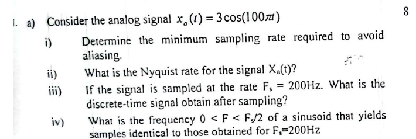

Based on your request, here is a detailed, step-by-step solution designed to secure full marks (8/8) in a university exam setting.

**Problem Statement:**
Find the Z-Transform of the given signal: $x[n] = a^n \sin(w_c n) u[n]$

---

### **Detailed Solution**

To find the Z-transform from first principles, we will use the standard definition and Euler's formula.

#### **Step 1: Write down the definition of the Z-Transform**
The two-sided Z-transform of a discrete-time signal $x[n]$ is defined as:
$$X(z) = \sum_{n=-\infty}^{\infty} x[n] z^{-n}$$

#### **Step 2: Substitute the given signal into the formula**
Given $x[n] = a^n \sin(w_c n) u[n]$
$$X(z) = \sum_{n=-\infty}^{\infty} [a^n \sin(w_c n) u[n]] z^{-n}$$

Because of the unit step function $u[n]$, which is defined as:
*   $u[n] = 1$ for $n \ge 0$
*   $u[n] = 0$ for $n < 0$

The limits of our summation change from $-\infty$ to $\infty$ to just $0$ to $\infty$:
$$X(z) = \sum_{n=0}^{\infty} a^n \sin(w_c n) z^{-n}$$

#### **Step 3: Express the sine function using Euler's Identity**
Recall Euler's identity for sine:
$$\sin(\theta) = \frac{e^{j\theta} - e^{-j\theta}}{2j}$$
Substituting $\theta = w_c n$, we get:
$$\sin(w_c n) = \frac{e^{j w_c n} - e^{-j w_c n}}{2j}$$

Now, substitute this back into our $X(z)$ equation:
$$X(z) = \sum_{n=0}^{\infty} a^n \left[ \frac{e^{j w_c n} - e^{-j w_c n}}{2j} \right] z^{-n}$$

#### **Step 4: Expand and separate into two summations**
We can pull out the constant $1/2j$ and split the sum into two separate geometric series:
$$X(z) = \frac{1}{2j} \left[ \sum_{n=0}^{\infty} a^n e^{j w_c n} z^{-n} - \sum_{n=0}^{\infty} a^n e^{-j w_c n} z^{-n} \right]$$

Group the terms with power $n$ together:
$$X(z) = \frac{1}{2j} \left[ \sum_{n=0}^{\infty} (a e^{j w_c} z^{-1})^n - \sum_{n=0}^{\infty} (a e^{-j w_c} z^{-1})^n \right]$$

#### **Step 5: Evaluate the infinite geometric series and find the ROC**
Recall the formula for the sum of an infinite geometric series:
$\sum_{n=0}^{\infty} r^n = \frac{1}{1 - r}$, provided the Region of Convergence (ROC) is $|r| < 1$.

Applying this to our two sums:
1.  **First sum:** $r_1 = a e^{j w_c} z^{-1}$
    Sum = $\frac{1}{1 - a e^{j w_c} z^{-1}}$
    Convergence condition: $|a e^{j w_c} z^{-1}| < 1 \implies |a| \cdot |e^{j w_c}| \cdot |z^{-1}| < 1 \implies |a| \cdot 1 \cdot \frac{1}{|z|} < 1 \implies |z| > |a|$

2.  **Second sum:** $r_2 = a e^{-j w_c} z^{-1}$
    Sum = $\frac{1}{1 - a e^{-j w_c} z^{-1}}$
    Convergence condition: $|a e^{-j w_c} z^{-1}| < 1 \implies |a| \cdot |e^{-j w_c}| \cdot |z^{-1}| < 1 \implies |a| \cdot 1 \cdot \frac{1}{|z|} < 1 \implies |z| > |a|$

The overall **Region of Convergence (ROC)** is the intersection of the two conditions, which is **$|z| > |a|$**.

Now, substitute the evaluated sums back into $X(z)$:
$$X(z) = \frac{1}{2j} \left[ \frac{1}{1 - a e^{j w_c} z^{-1}} - \frac{1}{1 - a e^{-j w_c} z^{-1}} \right]$$

#### **Step 6: Algebraic Simplification**
Find a common denominator to combine the terms:
$$X(z) = \frac{1}{2j} \left[ \frac{(1 - a e^{-j w_c} z^{-1}) - (1 - a e^{j w_c} z^{-1})}{(1 - a e^{j w_c} z^{-1})(1 - a e^{-j w_c} z^{-1})} \right]$$

**Simplify the numerator:**
$= 1 - a e^{-j w_c} z^{-1} - 1 + a e^{j w_c} z^{-1}$
$= a e^{j w_c} z^{-1} - a e^{-j w_c} z^{-1}$
$= a z^{-1} (e^{j w_c} - e^{-j w_c})$

**Simplify the denominator:**
$= 1 - a e^{-j w_c} z^{-1} - a e^{j w_c} z^{-1} + a^2 e^{j w_c} e^{-j w_c} z^{-2}$
$= 1 - a z^{-1} (e^{j w_c} + e^{-j w_c}) + a^2 (1) z^{-2}$

Put it all together:
$$X(z) = \frac{1}{2j} \left[ \frac{a z^{-1} (e^{j w_c} - e^{-j w_c})}{1 - a z^{-1} (e^{j w_c} + e^{-j w_c}) + a^2 z^{-2}} \right]$$

Rearrange to bring the $2j$ into the numerator expression:
$$X(z) = \frac{a z^{-1} \left[ \frac{e^{j w_c} - e^{-j w_c}}{2j} \right]}{1 - a z^{-1} (e^{j w_c} + e^{-j w_c}) + a^2 z^{-2}}$$

#### **Step 7: Final Conversion back to Trigonometric forms**
We know that:
*   $\frac{e^{j w_c} - e^{-j w_c}}{2j} = \sin(w_c)$
*   $e^{j w_c} + e^{-j w_c} = 2\cos(w_c)$

Substituting these back yields:
$$X(z) = \frac{a z^{-1} \sin(w_c)}{1 - 2 a z^{-1} \cos(w_c) + a^2 z^{-2}}$$

To express the result in positive powers of $z$, multiply the numerator and denominator by $z^2$:
$$X(z) = \frac{a z^{-1} \sin(w_c) \cdot z^2}{(1 - 2 a z^{-1} \cos(w_c) + a^2 z^{-2}) \cdot z^2}$$
$$X(z) = \frac{a z \sin(w_c)}{z^2 - 2az \cos(w_c) + a^2}$$

---

### **Final Answer**

**$X(z) = \frac{az \sin(w_c)}{z^2 - 2az \cos(w_c) + a^2}$**
**ROC: $|z| > |a|$**

*(Note: Providing the full derivation above along with the explicit ROC is what typically earns the full 8 marks in a university examination).*
Based on the text in the image, there appears to be a typo where the mathematical equation for the "input signal" has been omitted. The text reads "...representing samples of an input signal The link...", missing the signal itself. 

I will first provide the solution based strictly on the parameters given in the text. Then, I will provide a complete solution by making a likely assumption about the missing signal based on standard variations of this problem and faint handwritten marks visible in the image.

### Part 1: Solution based purely on printed text

**Given Parameters:**
*   **Bit rate ($R_b$):** $10,000 \text{ bits/sec}$ (Interpreting "10.000" as $10,000$, which is standard in such contexts).
*   **Quantization levels ($L$):** $512$

From the number of levels, we can determine the number of bits per sample ($n$):
$L = 2^n \implies 512 = 2^n \implies \mathbf{n = 9 \text{ bits/sample}}$

**i. What is the sampling frequency and folding frequency?**
*   **Sampling frequency ($f_s$):** The total bit rate is the product of the sampling frequency and the number of bits per sample ($R_b = n \cdot f_s$).
    $$f_s = \frac{R_b}{n} = \frac{10,000}{9} \approx \mathbf{1111.11 \text{ Hz}}$$
*   **Folding frequency ($f_{\text{fold}}$):** Also known as the Nyquist frequency of the sampling system, it is exactly half of the sampling frequency.
    $$f_{\text{fold}} = \frac{f_s}{2} = \frac{1111.11}{2} \approx \mathbf{555.55 \text{ Hz}}$$

**ii & iii. Nyquist rate and frequencies in $x(n)$**
These cannot be calculated without knowing the specific frequency components of the input signal $x(t)$.

**iv. What is the resolution?**
*   In terms of bits, the resolution is **$9$ bits**.
*   In terms of voltage (the step size $\Delta$), it cannot be calculated without knowing the peak-to-peak voltage range of the input signal. The formula is $\Delta = \frac{V_{\text{max}} - V_{\text{min}}}{L}$.

---

### Part 2: Complete solution with a typical assumed signal

Given faint handwritten marks pointing to an insertion, a common standard problem of this exact type uses the signal: **$x(t) = 3 \cos(600\pi t) + 2 \cos(1800\pi t)$**. Let's solve the rest of the problem assuming this is the intended signal.

**Signal Analysis:**
The signal $x(t) = 3 \cos(2\pi(300)t) + 2 \cos(2\pi(900)t)$ has two frequency components:
*   $f_1 = 300 \text{ Hz}$
*   $f_2 = 900 \text{ Hz}$
The maximum frequency component is $f_{\text{max}} = 900 \text{ Hz}$.

**i. Sampling and folding frequency**
*(Calculated in Part 1)*
*   **$f_s = 1111.11 \text{ Hz}$**
*   **$f_{\text{fold}} = 555.55 \text{ Hz}$**

**ii. What is the Nyquist rate for the signal?**
The Nyquist rate of a signal is twice its maximum frequency component.
$$\text{Nyquist rate} = 2 \cdot f_{\text{max}} = 2 \cdot 900 \text{ Hz} = \mathbf{1800 \text{ Hz}}$$
*(Notice that the actual sampling rate $1111.11 \text{ Hz}$ is less than the Nyquist rate, which means aliasing will occur.)*

**iii. What are the frequencies in resulting discrete time signal x(n)?**
To find the discrete-time frequencies, we normalize the analog frequencies by dividing by the sampling frequency ($F = \frac{f}{f_s}$).
*   For the $300 \text{ Hz}$ component:
    $$F_1 = \frac{300}{10000/9} = \frac{2700}{10000} = \mathbf{0.27 \text{ cycles/sample}}$$
    Since $0.27 \le 0.5$, this frequency is accurately represented.

*   For the $900 \text{ Hz}$ component:
    $$F_2 = \frac{900}{10000/9} = \frac{8100}{10000} = 0.81 \text{ cycles/sample}$$
    Because $0.81 > 0.5$ (the folding frequency), **aliasing occurs**. The aliased frequency appears at $1 - 0.81$:
    $$F_{\text{alias}} = \mathbf{0.19 \text{ cycles/sample}}$$
*The frequencies in $x(n)$ are $0.27$ and $0.19$ cycles/sample.*

**iv. What is the resolution?**
Resolution as a voltage step size ($\Delta$) requires the peak-to-peak voltage ($V_{pp}$).
For $x(t) = 3 \cos(600\pi t) + 2 \cos(1800\pi t)$:
*   Maximum voltage $V_{\text{max}} = 3(1) + 2(1) = 5 \text{ V}$
*   Minimum voltage $V_{\text{min}} = 3(-1) + 2(-1) = -5 \text{ V}$
*   Voltage range $V_{pp} = 5 \text{ V} - (-5 \text{ V}) = 10 \text{ V}$

$$\text{Resolution } (\Delta) = \frac{V_{pp}}{L} = \frac{10 \text{ V}}{512} \approx \mathbf{0.0195 \text{ V}} \text{ (or } 19.5 \text{ mV)}$$

    
    Here are the step-by-step solutions for each part of the problem.

First, let's analyze the given continuous-time (analog) signal:
$$x_a(t) = 3\cos(100\pi t)$$

A general sinusoidal signal is written as $x_a(t) = A\cos(\Omega t) = A\cos(2\pi F_{max} t)$, where:
*   $A$ is the amplitude.
*   $\Omega$ is the continuous-time angular frequency in radians per second.
*   $F_{max}$ is the continuous-time frequency in Hertz (Hz).

By comparing our signal to the general form, we can find its frequency:
$$\Omega = 100\pi \text{ rad/sec}$$
$$2\pi F_{max} = 100\pi$$
$$F_{max} = \frac{100\pi}{2\pi} = \mathbf{50 \text{ Hz}}$$

---

### **i) Determine the minimum sampling rate required to avoid aliasing.**

According to the Nyquist-Shannon sampling theorem, to reconstruct a continuous-time signal from its samples without aliasing, the sampling rate ($F_s$) must be strictly greater than twice its highest frequency component.
$$F_s > 2 \cdot F_{max}$$
$$F_s > 2 \cdot 50 \text{ Hz}$$
$$F_s > 100 \text{ Hz}$$

Therefore, the minimum required sampling rate to theoretically avoid aliasing is **$100 \text{ Hz}$** (this boundary value is referred to as the Nyquist rate).

---

### **ii) What is the Nyquist rate for the signal $X_a(t)$?**

The Nyquist rate is defined exactly as twice the maximum frequency component present in the signal.
$$\text{Nyquist rate} = 2 \cdot F_{max}$$
$$\text{Nyquist rate} = 2 \cdot 50 \text{ Hz} = \mathbf{100 \text{ Hz}}$$

---

### **iii) If the signal is sampled at the rate $F_s = 200\text{Hz}$. What is the discrete-time signal obtain after sampling?**

Sampling a continuous-time signal $x_a(t)$ at a rate $F_s$ means substituting continuous time $t$ with discrete time intervals $nT_s$, where $T_s = \frac{1}{F_s}$ is the sampling period and $n$ is an integer representing the sample number. So, $t = \frac{n}{F_s}$.

Given $F_s = 200 \text{ Hz}$:
$$t = \frac{n}{200}$$

Substitute this $t$ into the original analog signal equation to get the discrete-time signal $x(n)$:
$$x(n) = x_a(nT_s) = 3\cos\left(100\pi \left(\frac{n}{200}\right)\right)$$
$$x(n) = 3\cos\left(\frac{100\pi}{200} n\right)$$
**$$x(n) = 3\cos\left(\frac{\pi}{2} n\right)$$**

---

### **iv) What is the frequency $0 < F < F_s/2$ of a sinusoid that yields samples identical to those obtained for $F_s=200\text{Hz}$**

First, let's determine the specified frequency range:
$$F_s / 2 = 200 / 2 = 100 \text{ Hz}$$
So, we are looking for a frequency $F$ such that **$0 < F < 100 \text{ Hz}$**. This is known as the baseband or principal alias range.

The discrete-time signal we obtained in part (iii) is $x(n) = 3\cos\left(\frac{\pi}{2} n\right)$.
The general form of a discrete-time sinusoid is $x(n) = A\cos(2\pi f n)$, where $f$ is the discrete-time frequency in cycles/sample.
By comparing the two:
$$2\pi f = \frac{\pi}{2}$$
$$f = \frac{1}{4} \text{ cycles/sample}$$

The relationship between discrete-time frequency ($f$), continuous-time frequency ($F$), and sampling rate ($F_s$) is $f = \frac{F}{F_s}$. Let's solve for $F$:
$$\frac{1}{4} = \frac{F}{200}$$
$$F = \frac{200}{4} = \mathbf{50 \text{ Hz}}$$

Since $50 \text{ Hz}$ falls within the required range ($0 < 50 < 100$), this is the correct answer. Because the original signal was sampled at a rate ($200 \text{ Hz}$) higher than the Nyquist rate ($100 \text{ Hz}$), **no aliasing occurred**. The sinusoid in the baseband that produces these samples is simply the original signal itself.
](image-1.png)