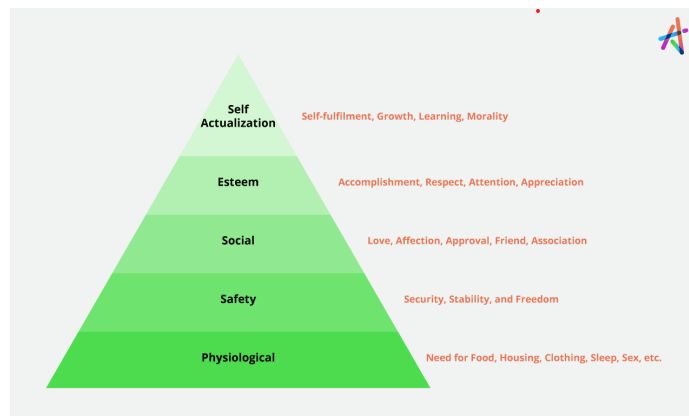

Here is the complete, easy-to-memorize solution for **Question 3.b** based exactly on the notes provided (Unit III). 

**🚨 Important Note on Diagrams:** Yes, your notes have excellent diagrams for this! 
*   **Page 69** has the **Maslow’s Pyramid Diagram** (Physiological -> Safety -> Social -> Esteem -> Self-Actualization). 
*   **Page 70** has the **Herzberg’s Two-Factor Table** (Hygiene Factors vs. Motivators). 
*Make sure to draw these in the exam! A simple pyramid and a small T-chart table will instantly guarantee you top marks.*

---

### 1. Solution to the Asked Question (For Exam)

**Q. 3. b) Compare and contrast Maslow’s Hierarchy of Needs and Herzberg’s Two-Factor Theory. How are these theories applied in organizational settings? (8 Marks)**

**Answer:**

**Introduction:**
Both Maslow’s Hierarchy of Needs and Herzberg’s Two-Factor Theory are foundational "content theories" of motivation that explain *what* drives human behavior at work. However, they structure these needs differently.

*(Tip for Exam: Draw a quick Maslow Pyramid here as seen on Page 69 of your notes).*

**1. Compare and Contrast (Differences & Similarities):**

| Feature | Maslow’s Hierarchy of Needs | Herzberg’s Two-Factor Theory |
| :--- | :--- | :--- |
| **Basic Concept** | Motivation is based on a 5-level pyramid of human needs (Physiological, Safety, Social, Esteem, Self-Actualization). | Motivation is based on two separate factors: **Hygiene** (prevents dissatisfaction) and **Motivators** (causes satisfaction). |
| **Order of Needs** | Hierarchical / Sequential: Lower-level needs must be fulfilled before moving to the next level. | Parallel: Both factors work simultaneously. Fixing hygiene doesn't motivate; it just stops complaints. |
| **Applicability** | Applies to general human life and everyday survival. | Applies strictly to the workplace and job-related attitudes. |
| **Similarities (The Link)** | Lower-level needs (Physiological, Safety, Social) map directly to Herzberg’s **Hygiene Factors**. | Higher-level needs (Esteem, Self-Actualization) map directly to Herzberg’s **Motivator Factors**. |

*(Tip for Exam: Draw a quick T-Chart here for Herzberg showing Hygiene Factors (Salary, Policies) on one side and Motivators (Achievement, Recognition) on the other, as seen on Page 70).*

**2. Application in Organizational Settings:**

**Application of Maslow’s Theory:**
Managers apply this theory by identifying which level an employee is currently on and fulfilling that specific need to push them to the next level.
*   **Physiological & Safety:** The organization provides a fair base salary, health insurance, and job security. 
*   **Social:** Managers organize team-building activities and team lunches to foster belonging.
*   **Esteem & Self-Actualization:** Managers give public awards (Esteem) and assign challenging, creative projects where employees can reach their full potential (Self-Actualization).

**Application of Herzberg’s Theory:**
Managers apply this by understanding that "not being dissatisfied" is not the same as "being motivated." They must manage in two distinct steps:
*   **Step 1 (Fix Hygiene):** Prevent job dissatisfaction by ensuring competitive salaries, safe working conditions, and fair company policies. (If you don't do this, employees will quit).
*   **Step 2 (Boost Motivators):** Once hygiene is met, actually motivate the employees by giving them responsibilities, recognizing their achievements, and offering personal growth and promotions. (This is what makes them work harder).

**Conclusion:**
In an organization, Maslow helps leaders understand the overall personal evolution of an employee, while Herzberg provides a practical checklist of what to fix (hygiene) and what to promote (motivators) to build a highly productive technical workforce.

---

### 2. Core Concept Explanation (Romanized Nepali + English)

*Bholi exam ma sajilo hos bhanera yo trick bata yaad garnus.*

**Question le k sodheko ho?**
Maslow ra Herzberg ko motivation theory ma k farak cha? Ra euta company ma boss le yo theories lai kasari use garcha? (8 Marks).

**A. Difference (Farak k cha?):**
*   **Maslow ko Theory (Bharyang / Pyramid system):** Maslow le manche ko aawashyakta (needs) lai 5 step ko bharyang banayo. Paila basic need (gans, bas, kapas/salary) pura hunu parcha, ani matra manche le safety khojcha, ani samaj/team khojcha, ani ijjat (esteem) khojcha, ra last ma aafno sapana (self-actualization) pura garna khojcha. 
*   **Herzberg ko Theory (Dui-Baato / Two-Factor):** Herzberg le bhanyo, "Paisa ra ramro environment le manche lai motivate gardaina, khali dukha (dissatisfaction) matra hataucha. Yeslai **Hygiene Factor** bhancha. Manche lai sachi nai motivate garne kura ta usko kaam ko ijjat, promotion, ra responsibility ho. Yeslai **Motivator Factor** bhancha."

*(Tala ko level ko Maslow = Hygiene. Mathi ko level ko Maslow = Motivator. Yei ho iniharu ko bich ko relation!)*

**B. Application (Company ma kasari use garne?):**

1.  **Maslow lai kasari use garne?**
    *   *Concept:* Manager le paila hercha employee kun step ma cha. 
    *   *Example:* Euta naya intern aayo bhane uslai paila 'Salary ra Job Security' (Level 1 & 2) chahinchha. Uslai tyo dine. Tara euta 10 barsa kaam gareko Senior Developer lai paisa le matlab hudaina, uslai naya challenging project wa power chahinchha (Self-actualization - Level 5). Manager le tehi anusaar treat garna parcha.
2.  **Herzberg lai kasari use garne?**
    *   *Concept:* Manager le paila tension hataune, ani matra khusi thapne.
    *   *Example:* Paila company ko AC thik garne, salary time ma dine, ra kich-kich garne rules hataune (Fixing Hygiene). Yeti garda employee le complain garna chodchan, tara danger kaam gardainan. Aba danger kaam garauna ko lagi manager le uniharu lai "Employee of the month" award dine, promotion dine, ra important decision lina dine (Adding Motivators).

**Exam ko lagi Pro-Tip:**
Yo 8 marks ko question ho. Examiner le **Diagram khojcha nai khojcha**. 
1. Maslow ko lagi triangle banayera 5 ota level (Physiological, Safety, Social, Esteem, Self-Actualization) lekhdine. 
2. Herzberg ko lagi table banayera eka tira "Hygiene Factors (Salary, conditions, policies)" ra arko tira "Motivators (Achievement, recognition, growth)" lekhdine. 
Yeti 2 ta chitro (diagram) banaye pachi theory ko comparison ra application thakka notes ko aadhar ma lekhne, marks katne thau nai hudaina!

***Are you ready for Question 3.b (OR) or Question 4.a? Let's crush this!***