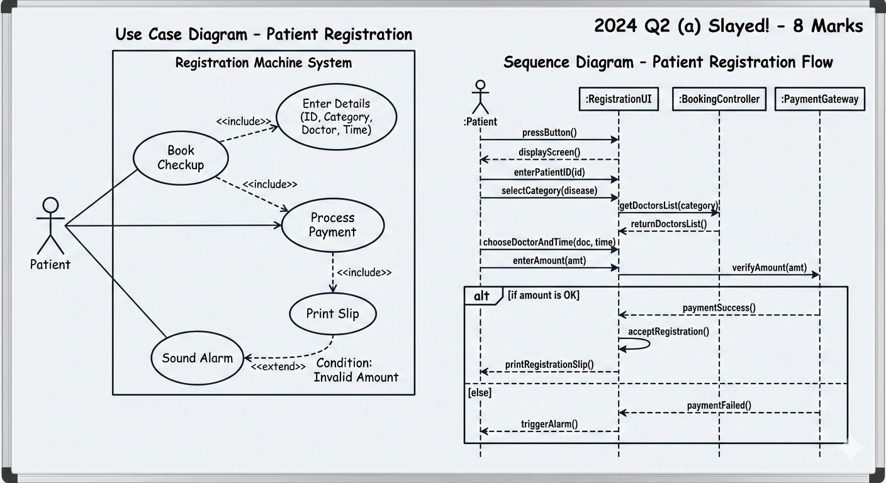

This is the **Ultimate Software Engineering (SE) Slay Guide**. Based on your 2024 and 2025 sets, the exam pattern is heavily focused on **Numericals (COCOMO, CFG, BVA)** and **UML Diagrams**. 

Here is your 5-hour survival and A+ roadmap.

---

### ⏱️ The 5-Hour Roadmap

*   **Hour 1: Process Models & Planning** (Waterfall, Agile/Scrum, COCOMO Numerical).
*   **Hour 2: Requirements & UML Diagrams** (Use Case, Sequence, Class Diagrams - *High Weightage*).
*   **Hour 3: Software Design & Architecture** (Layered, Repository, Pipe-Filter).
*   **Hour 4: Software Testing** (V&V, BVA Numerical, Cyclomatic Complexity Numerical).
*   **Hour 5: SCM, Quality & Trends** (SCM activities, Cloud/AI in SE, Short Notes).

---

### 🧠 Core Concept Guide (Romanized Nepali + English)

#### **1. Software Myths vs. Reality (2025 Q1a)**
*   **Concept:** Software ko barema vako "galat dharana" (fake beliefs).
*   **Example:** "Software deliver vayesi hamro kaam sakiyo." -> **Reality:** 60-80% effort maintenance ma kharcha hunxa.
*   **Example:** "Project dhilo vayo vane dherai programmer thapne." -> **Reality:** Naya manxe lai sikauda jhan dhilo hunxa (Brooks' Law).

#### **2. Agile (SCRUM) Development (2025 Q2a, 2024 Q5a)**
*   **Concept:** Modern style. Sano sano "Sprints" (2-4 weeks) ma kaam hunxa. 
*   **Neplish:** Waterfall ma plane udaye jasto ho (ekchoti udayesi change garna mildaina). Agile vaneko taxi chalaye jasto ho (bato ma jaha pani change garna milxa).

#### **3. Verification vs. Validation (V&V) (2025 Q5a)**
*   **Verification:** "Are we building the product **right**?" (Process check garne - reviews, inspection).
*   **Validation:** "Are we building the **right product**?" (Final product check garne - testing with real inputs).

---

### 🧮 The "Slay" Numericals (Do NOT skip these!)

#### **A. COCOMO Model (2025 Q1b)**
*   **Formula:** $Effort (E) = a \times (KLOC)^b$ and $Time (T) = c \times (E)^d$.
*   **Problem:** $KLOC = 400$, Organic project ($a=2.4, b=1.05$).
*   **Calculation:** $E = 2.4 \times (400)^{1.05} \approx 1295$ Person-Months.
*   **Staff Size:** $E / T$.
*   **Neplish:** Project ko size herera kati manxe ra kati time lagxa vanera "estimation" garne formula ho yo.

#### **B. Cyclomatic Complexity (2024 Q1b)**
*   **Concept:** Code kati "complex" xa calculate garne.
*   **Formula:** $V(G) = E - N + 2$ (Edges - Nodes + 2) OR $V(G) = P + 1$ (Predicate nodes + 1).
*   **Drawing CFG:**
    1. Loop/If condition ko box lai "Circle" (Node) banaune.
    2. Logic flow lai "Arrow" (Edge) banaune.
    3. Loop back hune arrow lai dhyan dine.

#### **C. Boundary Value Analysis (BVA) (2025 Q5b)**
*   **Concept:** Error dherai jaso "edge" (boundaries) ma hunxa.
*   **Scenario:** Range 18 to 60.
*   **Test Cases:** $min (18)$, $min-1 (17)$, $min+1 (19)$, $max (60)$, $max-1 (59)$, $max+1 (61)$, $nominal (30)$.

---

### 🎨 UML Diagram Guide (Draw these for big marks!)

#### **1. Use Case Diagram (2024 Q2, 2025 Q3b)**
*   **Actors:** Stick man (User, Admin, Machine).
*   **Use Cases:** Oval bubbles (Login, Order, Pay).
*   **Relationships:** `<<include>>` (Must happen), `<<extend>>` (Optional).
*   **Diagram Tip:** System Boundary (Rectangle box) vitra bubbles rakhne, bahira actors.

#### **2. Sequence Diagram (2025 Q4a OR, 2024 Q2)**
*   **Objects:** Boxes at the top.
*   **Lifeline:** Vertical dashed lines.
*   **Messages:** Horizontal arrows (Solid = Call, Dashed = Return).
*   **Tip:** Flow mathi dekhi tala hunxa (Time flows downwards).

#### **3. Class Diagram (2024 Q5b, 2025 Q4a)**
*   **Box Structure:** [Class Name | Attributes | Operations].
*   **Relationships:**
    *   **Inheritance:** Triangle arrow (Is-a).
    *   **Association:** Straight line (Has-a).
    *   **Multiplicity:** 1..*, 0..1 (Kati ota object connect xan).

---

### 🏛️ Architectural Styles (2025 Q4b, 2024 Q2b)

| Feature | **Layered Architecture** | **Repository Architecture** |
| :--- | :--- | :--- |
| **Logic** | Divided into layers (UI, Logic, DB). | Central database with independent clients. |
| **Flow** | Layer N calls Layer N-1. | Everyone talks to the central Hub. |
| **Diagram** | Stacked boxes (one on top of another). | Hub-and-Spoke (Central cylinder with boxes around it). |
| **Example** | Web Apps (OSI Model). | Compiler, IDE (Visual Studio). |

---

### 📝 Final High-Yield Short Notes (Q7)

1.  **SCM (Software Configuration Management):** Version control garne process (Git use jasto).
    *   *Activities:* Identification, Change Control, Status Accounting, Auditing.
2.  **Design Patterns:** Reusable solutions to common problems (Singleton, Factory).
3.  **4Ps of Management:** People, Product, Process, Project. (*Most important P is People* - 2024 Q4a).
4.  **Cloud & AI in SE:**
    *   **Cloud:** Deployment, Scalability, Collaboration (AWS/Azure).
    *   **AI:** Code generation (Copilot), Automated testing, Bug detection.

---

### 🚀 Exam Slay Tips:
1.  **Diagram with Pencil:** Diagram safa vaye examiner le theory dherai herdaina.
2.  **Point-wise Answer:** Software Engineering ma paragraph vanda point-wise lekhda marks dherai aauxa.
3.  **Numerical Check:** COCOMO ko values dhyan diyer calculation garne. $V(G)$ ko CFG diagram safa banaune.

**Status:** SE Syllabus ✅
**Ready to Slay?** If you need me to draw a specific diagram (like the Ticket Booking Sequence or University Use Case), just ask!
Here we go! Let's slay the **2024 SE Paper**. This is all about precision and hitting the exact keywords the examiner is looking for.

---

### **2024 Q1 a) Define software testing. What are different considerations during unit testing of any module? Explain importance of drivers and stub while performing the unit testing. (8 Marks)**

#### 📝 High-Yield Exam Note (Write this to get full marks)

**1. Definition of Software Testing:**
Software testing is the process of evaluating and executing a software system or its components with the intent of finding errors, bugs, or missing requirements. It ensures the software product meets the specified requirements and is defect-free before release.
*(Key Phrase: "Testing is the process of executing a program with the intent of finding an error.")*

**2. Considerations During Unit Testing:**
Unit testing focuses on verifying the smallest testable parts of an application (functions, methods, or classes) in isolation. When testing a specific module, the following considerations must be made:
*   **Module Interface:** Are data flowing into and out of the module correctly? Do the parameters match the specification?
*   **Local Data Structures:** Do variables defined inside the module maintain their integrity during execution?
*   **Boundary Conditions:** Does the module handle extreme values properly (e.g., maximum/minimum array limits, zero, or null inputs)? *(This is the most common place for errors).*
*   **Independent Paths:** Have all logical paths (IF-ELSE branches, loops) through the code been executed at least once?
*   **Error Handling Paths:** Does the module gracefully handle unexpected errors and display correct error messages without crashing?

**3. Importance of Drivers and Stubs in Unit Testing:**
Because a unit (module) is tested in isolation, it cannot run by itself if it depends on other modules that haven't been written or tested yet. To simulate these missing modules, we use **Drivers** and **Stubs**.

*   **Driver (The "Boss" Simulator):** 
    *   *What it is:* A temporary program that acts as a "calling module." It passes test data to the module being tested and prints the results.
    *   *Importance:* It is essential when the module under test is a "worker" function that requires a main program to trigger it.
*   **Stub (The "Worker" Simulator):**
    *   *What it is:* A temporary, dummy program that replaces a "called module." It doesn't perform real logic; it just returns a hardcoded, expected value back to the module being tested.
    *   *Importance:* It is essential when the module under test needs to call other sub-functions (e.g., database fetchers) that are not yet available.

---

### 🧠 Core Concept Guide (Romanized Nepali + English)

**Concept bujhne tarika (How to remember in 1 minute):**

*   **Software Testing:** Program "fail" garaune niyat le chalaune kaam. Error vetna ko lagi garinxa.
*   **Unit Testing (Eklai check garne):** Euta single function ya file lai matra check garne. 
*   **Considerations (K k dhyan dine?):**
    1.  *Interface:* Input ra Output thik xa ki nai.
    2.  *Local Data:* Bhitra ko variables thik xa ki nai.
    3.  *Boundary:* Limit cross garda (e.g., loop `i <= 100` huda `101` halda) k hunxa.
    4.  *Paths:* Sabai "If-Else" bato haru check vayo ki nai.
*   **Driver ra Stub (The MVPs of Unit Test):**
    *   *Analogy:* Timi euta naya Singer (Unit under test) hau. Timi lai stage ma gauna pathaune Director (Driver) chainxa, ani paxadi music bajaune Band (Stub) chainxa. 
    *   **Driver:** Mathi bata bolaune dummy program (Calls the unit).
    *   **Stub:** Tala bata result dine dummy program (Called by the unit).
    *   *Exam Hack:* "Driver replaces calling module" and "Stub replaces called module" - yati lekhe paxi marks fix!

---

**Status:** 2024 Q1(a) ✅ Slayed!

Now, get ready for **2024 Q1b (Cyclomatic Complexity Numerical)**. This is a guaranteed high-scorer. Grab a pen and paper. 
Tell me **"CFG"** when you are ready to draw the graph!Here is the **"Slay" Material for 2024 Q1b**. This is a **Numerical + Diagram** question. If you draw the Control Flow Graph (CFG) correctly and apply the formula, you get an easy 7 marks. 

---

### **2024 Q1 b) Draw the control flow graph and calculate the cyclomatic complexity of the following function. (7 Marks)**

**Given Code:**
```c
int a = 1, b = 1, n, c;   // Node 1
int i = 1;                // Node 2

while (i <= n) {          // Node 3 (Decision Node)
    c = a + b;            // Node 4
    a = b;                // Node 5
    b = c;                // Node 6
    printf("%d ", c);     // Node 7
    i++;                  // Node 8
}
                          // Node 9 (Exit Node after loop)
```

#### 📝 High-Yield Exam Note (Solution)

**1. Creating the Control Flow Graph (CFG):**
First, we number the sequential statements to form "Nodes" in our graph.
*   **Node 1 & 2:** `int a=1, b=1, n, c; int i=1;` (Initialization - Sequential). Let's group them as a single block **Node 1,2**.
*   **Node 3:** `while (i <= n)` (This is a Decision Node. The flow splits here).
*   **Nodes 4, 5, 6, 7, 8:** `c = a+b; a=b; b=c; printf; i++;` (These are sequential steps *inside* the loop body). Let's group them as a single block **Node 4-8**.
*   **Node 9:** The implicit exit point after the while loop finishes.

**Drawing the CFG:**
*(Draw this on your answer sheet using circles for nodes and arrows for edges)*

1.  Draw a circle labeled **1,2** (Start/Initialization).
2.  Draw an arrow from **1,2** down to a circle labeled **3** (The `while` condition).
3.  From circle **3**, draw an arrow down to a circle labeled **4-8** (The loop body). Label this arrow **"True (i <= n)"**.
4.  From circle **4-8**, draw an arrow curving back up to circle **3**. (This represents the end of the loop returning to check the condition).
5.  From circle **3**, draw an arrow pointing right or down to a final circle labeled **9** (Exit). Label this arrow **"False (i > n)"**.

**2. Calculating Cyclomatic Complexity ($V(G)$):**
We can calculate $V(G)$ using three different methods to ensure our answer is correct.

*   **Method 1: Based on Edges ($E$) and Nodes ($N$)**
    *   Formula: **$V(G) = E - N + 2$**
    *   Counting from our CFG:
        *   Nodes ($N$): **1,2** (1), **3** (2), **4-8** (3), **9** (4). So, $N = 4$.
        *   Edges ($E$): (1,2 $\rightarrow$ 3), (3 $\rightarrow$ 4-8), (4-8 $\rightarrow$ 3), (3 $\rightarrow$ 9). So, $E = 4$.
    *   Calculation: $V(G) = 4 - 4 + 2 = \mathbf{2}$.

*   **Method 2: Based on Predicate Nodes ($P$)**
    *   Formula: **$V(G) = P + 1$**
    *   A Predicate Node is a node containing a condition (IF, WHILE, FOR).
    *   In our code, there is exactly 1 condition: `while (i <= n)`. So, $P = 1$.
    *   Calculation: $V(G) = 1 + 1 = \mathbf{2}$.

*   **Method 3: Based on Enclosed Regions ($R$)**
    *   Formula: **$V(G) = R$** (Total number of regions, including the outside area).
    *   Looking at the CFG, the loop creates 1 enclosed region inside the graph.
    *   The outside of the graph is Region 2.
    *   Total Regions = **2**.

**Final Answer:**
The Cyclomatic Complexity of the given function is **2**. This indicates the code is very simple and requires only 2 independent test cases to achieve full branch coverage.

---

### 🧠 Core Concept Guide (Romanized Nepali + English)

**Concept bujhne tarika (How to remember in 1 minute):**

*   **Cyclomatic Complexity vaneko k ho?:** Euta function ma kati wota "bato" (paths) xan vanera ganne tarika. Jati dherai bato (If-Else, Loop), teti dherai test case banaunu parxa.
*   **CFG (Bato ko Map):**
    *   Program ko line number lai golo (Node) banaune.
    *   Sequential code (line paxi line chalne) lai ekaithau ma group garda hunxa (jastai Node 4, 5, 6, 7, 8 lai euta block manna milxa time bachauna).
    *   **While Loop ko jadu:** Loop suru hune Node bata dui tira arrow janxa:
        1. Euta "True" vayera loop body vitra (Node 4-8).
        2. Euta "False" vayera loop vanda bahira (Node 9).
    *   Loop body sakepaxi (Node 8 paxi), euta arrow farkera feri Loop Node (Node 3) mai aaunu parxa. Yo nabirsinu! Yo curve arrow le nai "Region" banauxa.
*   **Formula Trick (Exam Hack):**
    *   **$V(G) = P + 1$** sab vanda sajilo ho. "P" vaneko condition ho. 
    *   Question ko code hera: Tya jamma euta `while` condition xa. Tesaile $P=1$. Answer $1+1=2$ auxa vanera pahilai thaha hunxa.
    *   Mathi ko CFG banayesi $E-N+2$ formula use garera dekhadine. Ans 2 aayena vane diagram bigryo vanera bujhnu.

---

**Status:** 2024 Q1(b) ✅ Slayed! 7 free marks in the bag!

Now we move to **2024 Q2a (UML Use Case & Sequence Diagrams)**. This is a massive 8-mark question about a hospital registration system.
Type **"Hospital"** to draw the diagrams!Here is the **"Slay" Material for 2024 Q2a**. UML Diagrams are the bread and butter of Software Engineering exams. If your drawing is neat and uses the correct symbols, the examiner will give you full marks without reading much.

---

### **2024 Q2 a) Draw a Use Case Diagram and a Sequence Diagram for the given patient registration scenario. (8 Marks)**

**The Scenario Breakdown:**
*   **Actor:** Patient.
*   **System:** Registration Machine.
*   **Actions (Use Cases/Steps):**
    1. Press button (open screen).
    2. Enter Patient ID.
    3. Book Doctor for checkup.
    4. Check disease category.
    5. Choose Doctor's name.
    6. Enter Time.
    7. Enter Amount (Pay).
    8. *Condition:* If Amount OK $\rightarrow$ Accept & Print Slip.
    9. *Condition:* Else $\rightarrow$ Alarm.

#### 📝 High-Yield Exam Note (Solution)

**1. Use Case Diagram:**
*Instructions for drawing on your exam paper:*

*   **System Boundary:** Draw a large vertical rectangle in the middle of your page. Write "Registration Machine System" at the top inside the box.
*   **Actor:** Draw a stick figure outside the box on the left. Label it "Patient".
*   **Use Cases (Inside the Box - Draw as Ovals):**
    *   `Initiate Registration` (Connects to Patient).
    *   `Enter Patient ID` (Connects to Patient).
    *   `Select Disease Category` (Connects to Patient).
    *   `Choose Doctor & Time` (Connects to Patient).
    *   `Make Payment` (Connects to Patient).
    *   `Print Registration Slip` (Include relationship).
    *   `Trigger Alarm` (Extend relationship).

*   **Relationships (The crucial part for marks):**
    *   Draw solid lines from the "Patient" actor to the first 5 Use Cases.
    *   From `Make Payment`, draw a dashed arrow pointing to `Print Registration Slip` with the label `<<include>>`. *(Because a slip is ALWAYS printed if payment is successful).*
    *   From `Trigger Alarm`, draw a dashed arrow pointing back to `Make Payment` with the label `<<extend>>`. *(Because the alarm ONLY happens IF the amount is wrong).*

*(Self-Correction/Refinement for A+)*: To make it simpler and closer to the text:
1.  `Book Checkup` (Main Use Case connected to Patient).
2.  `Enter Details` (ID, Category, Doctor, Time) $\rightarrow$ `<<include>>` from `Book Checkup`.
3.  `Process Payment` $\rightarrow$ `<<include>>` from `Book Checkup`.
4.  `Print Slip` $\rightarrow$ `<<include>>` from `Process Payment`.
5.  `Sound Alarm` $\rightarrow$ `<<extend>>` from `Process Payment` (Condition: Invalid Amount).

**2. Sequence Diagram:**
*Instructions for drawing:*

*   **Objects (Top Row Boxes):**
    *   `Patient` (Actor symbol or a box).
    *   `:RegistrationUI` (The screen/button).
    *   `:BookingController` (The logic).
    *   `:PaymentGateway` (For the amount check).

*   **Lifelines:** Draw dashed vertical lines coming down from each object.

*   **The Flow (Draw solid horizontal arrows for calls, dashed for returns, top to bottom):**
    1.  `Patient` $\rightarrow$ `:RegistrationUI`: `pressButton()`
    2.  `:RegistrationUI` $\rightarrow$ `Patient`: `displayScreen()` (dashed)
    3.  `Patient` $\rightarrow$ `:RegistrationUI`: `enterPatientID(id)`
    4.  `Patient` $\rightarrow$ `:RegistrationUI`: `selectCategory(disease)`
    5.  `:RegistrationUI` $\rightarrow$ `:BookingController`: `getDoctorsList(category)`
    6.  `:BookingController` $\rightarrow$ `:RegistrationUI`: `returnDoctorsList()` (dashed)
    7.  `Patient` $\rightarrow$ `:RegistrationUI`: `chooseDoctorAndTime(doc, time)`
    8.  `Patient` $\rightarrow$ `:RegistrationUI`: `enterAmount(amt)`
    9.  `:RegistrationUI` $\rightarrow$ `:PaymentGateway`: `verifyAmount(amt)`

*   **The Alternative Frame (The IF/ELSE logic box):**
    *   Draw a big rectangular frame around the payment verification part. Label the top-left corner **"alt"** (for alternative).
    *   Draw a dashed horizontal line across the middle of this frame to split it into two sections: `[if amount is OK]` and `[else]`.
    *   **Top Section `[if amount is OK]`:**
        *   `:PaymentGateway` $\rightarrow$ `:RegistrationUI`: `paymentSuccess()` (dashed)
        *   `:RegistrationUI` $\rightarrow$ `:RegistrationUI`: `acceptRegistration()` (Self-call arrow turning back on its own lifeline).
        *   `:RegistrationUI` $\rightarrow$ `Patient`: `printRegistrationSlip()` (dashed)
    *   **Bottom Section `[else]`:**
        *   `:PaymentGateway` $\rightarrow$ `:RegistrationUI`: `paymentFailed()` (dashed)
        *   `:RegistrationUI` $\rightarrow$ `Patient`: `triggerAlarm()` (dashed)

---

### 🧠 Core Concept Guide (Romanized Nepali + English)

**Concept bujhne tarika (How to remember in 1 minute):**

*   **Use Case Diagram (K k garna milxa?):** 
    *   System le k k service dinxa vanera dekhaune map ho.
    *   Manxe lai bahira (Actor), kaam lai bhitra (Oval) rakhne.
    *   **`<<include>>` Trick:** Kaam hudai garda "Compulsory" aarko kaam pani hunxa vane include (Jastai: ATM ma pin halna). Payment vayesi Slip aaunai parxa, so include.
    *   **`<<extend>>` Trick:** Kaam hudai garda "Optionally" ba mistake vaye matra aarko kaam hunxa vane extend (Jastai: ATM ma pin wrong vaye error msg aaune). Payment namile Alarm bajxa, so extend.
*   **Sequence Diagram (K paxi k hunxa?):**
    *   Time ko adhar ma step-by-step communication dekhaune map.
    *   Mathi (Top) ma manxe ra system ko parts (UI, Database) rakhne.
    *   Arrow haru ek aapas ma pass garne. `Patient` le `UI` lai data dinxa, `UI` le `Database/Controller` lai dinxa.
    *   **"alt" Box Trick:** Jaba question ma "If this happens... otherwise that happens" (Jastai yo question ko last line ma xa), tyaba "alt" (Alternative) frame banaunai parxa. Yesle IF-ELSE logic dekhauxa. Yo box banayeko dekhne bittikai Sir le full marks thopkinxa!

---

**Status:** 2024 Q2(a) ✅ Slayed! You just secured 8 crucial marks in modeling.

Now, we move to **2024 Q2b (Architectural Design & Pipe-Filter Style)**. This is pure theory. 
Type **"Pipe"** to learn how data flows through architectures!Here is the **"Slay" Material for 2024 Q2b**. This is a high-yielding theory question where drawing a simple diagram of the architecture will secure full marks.

---

### **2024 Q2 b) What is architectural design and what are the factors that determine the architectural design decisions. Explain about repository and pipe and filter architecture style. (7 Marks)**

#### 📝 High-Yield Exam Note (Write this to get full marks)

**1. What is Architectural Design?**
Architectural design is the early stage of the software design process that identifies the major sub-systems of a software system, establishing the framework for their control and communication. 
It defines the **overall structure** of the software, much like a blueprint for a building, before any detailed coding begins.

**2. Factors Determining Architectural Decisions:**
Architects must consider several non-functional and technical factors when choosing a design:
*   **Performance Requirements:** If high performance is critical, architects avoid multiple layers of communication (e.g., choosing a shared memory approach over message passing).
*   **Security Requirements:** Systems dealing with sensitive data require a layered architecture with strict validation at each boundary.
*   **Safety & Reliability Requirements:** Safety-critical systems (like medical devices) often use redundant components.
*   **Maintainability & Modularity:** If the system is expected to change frequently, a highly modular architecture (like microservices) is preferred.
*   **Cost & Time Constraints:** Sometimes, budget dictates reusing an existing architecture or using off-the-shelf components.

**3. Repository Architecture Style:**
*   **Concept:** In this style, all shared data is held in a central database (the repository). All sub-systems access and modify data exclusively through this central hub. The sub-systems do not communicate directly with each other.
*   **Example:** A Compiler (Lexical analyzer, Syntax analyzer, and Code generator all read/write to a central Symbol Table).
*   **Advantages:** Efficient way to share large amounts of data. Sub-systems don't need to know how data is produced, only how to find it.
*   **Disadvantages:** A single point of failure (if the repository crashes, the whole system dies).
*   *(Exam Tip: Draw a cylinder labeled "Central Repository" in the middle, surrounded by boxes labeled "Sub-system 1", "Sub-system 2", etc., with arrows pointing to and from the cylinder).*

**4. Pipe and Filter Architecture Style:**
*   **Concept:** In this style, the processing of data is organized so that each component (the **Filter**) reads a stream of data from its input, transforms it, and produces a stream of data on its output. The connectors between filters are called **Pipes**, which transmit the data streams.
*   **Key Rule:** Filters execute concurrently and independently. They do not share state or know about the filters upstream or downstream.
*   **Example:** Unix Shell Commands (e.g., `ls -l | grep ".txt" | sort`).
*   **Advantages:** Highly modular and easy to understand. You can easily add, remove, or rearrange filters.
*   **Disadvantages:** Often requires data to be converted to a common format (like text) at every step, causing overhead. Not suitable for interactive systems (like a UI).
*   *(Exam Tip: Draw a horizontal chain: `[Filter 1] -> (Pipe) -> [Filter 2] -> (Pipe) -> [Filter 3]`).*

---

### 🧠 Core Concept Guide (Romanized Nepali + English)

**Concept bujhne tarika (How to remember in 1 minute):**

*   **Architectural Design:** Ghar banauna agadi naksha pass gareko jastai, software banauna agadi tesko thulo structure (blueprint) banaune kaam ho.
*   **Factors (K le decide garxa kasto banaune?):**
    *   Timi lai "Speed" chahinxa ki "Security"? (Dherai security vaye speed ghatxa).
    *   Sasto banaune ki vaye var ko data safe rakhne? (Reliability).
*   **Repository Architecture (The "Database Boss" model):**
    *   Sabai data euta thulo central bhanda (Database) ma hunxa.
    *   Sabai parts (clients) le tei bata jhikne ra rakhne garxan. Ek aapas ma kura gardainan.
    *   *Real-life:* College ko library. Sabai student (sub-systems) library bata book linxan, ek aapas ma magdainan.
*   **Pipe and Filter Architecture (The "Factory Line" model):**
    *   Data euta pipe bata auxa, filter ma process hunxa, ani arko pipe bata niskinxa.
    *   *Real-life:* Pani ko filter ya factory ko assembly line. Ek thau ma katera arko thau ma packing gareko jastai.
*   **Exam Hack:** Architecture ko question ma **Diagram is mandatory**. Repository ma "Golo dabba (Cylinder)" bich ma rakhne. Pipe-Filter ma "Box -> Arrow -> Box -> Arrow" wala lamo line tanna nabirsinu.

---

**Status:** 2024 Q2(b) ✅ Slayed! 7 marks secured with easy diagrams.

Now, we move to **2024 Q3a (Software Configuration & Build Management)**. This is a very common topic about how teams manage code without breaking everything.
Type **"Build"** to compile the next answer!Here is the **"Slay" Material for 2024 Q3a**. This is a highly practical question about how software is actually put together in the real world. 

---

### **2024 Q3 a) What are software configurations items? Explain the process of system building and also mention some common problems during continuous system integration. (8 Marks)**

#### 📝 High-Yield Exam Note (Write this to get full marks)

**1. What are Software Configuration Items (SCIs)?**
A Software Configuration Item (SCI) is any single piece of information, document, code, or hardware component created during the software engineering process that is placed under **Version Control**. 
*   **Examples of SCIs:** Source code files (`.java`, `.py`), Requirements Specification documents (SRS), Design diagrams (UML), Test cases, User manuals, and even the compiler version used.
*   *Why they matter:* Managing SCIs ensures that if a developer makes a mistake, the team can roll back to a previous, working version of that specific item.

**2. The Process of System Building:**
System building is the process of assembling and compiling all the individual SCIs (source code, libraries, data files) to create an executable software system.
*   **The Steps:**
    1.  **Check-out:** Retrieve the correct versions of all required source code and configuration files from the version control repository (e.g., pulling from Git).
    2.  **Compilation/Assembly:** Use a build tool (like Maven, Gradle, or Make) to compile the source code into object code or byte code.
    3.  **Linking:** The build tool links the compiled code with required external libraries or frameworks to resolve dependencies.
    4.  **Packaging:** The linked code is packaged into an executable format (e.g., a `.exe`, `.jar`, or `.apk` file).
    5.  **Testing (Smoke Test):** Run automated tests to ensure the build didn't immediately break.

**3. Common Problems During Continuous System Integration (CI):**
Continuous Integration (CI) is the practice of merging all developers' working copies to a shared mainline several times a day. While powerful, it introduces problems:
*   **The "Broken Build" Problem:** If one developer commits code with a syntax error or a failing test, the entire automated build process halts for everyone else until it is fixed.
*   **Merge Conflicts:** When two developers edit the same lines of code in the same file simultaneously, the CI server cannot automatically merge them. This requires manual, time-consuming resolution.
*   **Dependency Hell:** A new piece of code might require version 2.0 of a library, but older parts of the system still rely on version 1.0. This conflict breaks the build.
*   **Slow Build Times:** As the system grows, compiling and running all automated tests can take hours, defeating the purpose of "rapid feedback" in CI.

---

### 🧠 Core Concept Guide (Romanized Nepali + English)

**Concept bujhne tarika (How to remember in 1 minute):**

*   **Software Configuration Items (SCIs) - (K k kura haru lai sambhalne?):**
    *   Timi le banayeko software ko harek tukra jaslai "Save" garera purano state ma farkina milxa, tyo SCI ho. (Jastai: Code file, SRS report, Image file).
    *   Sabai SCIs haru euta thau ma jama vayera "Version Control" (jastai Git/SVN) ma basxan.
*   **System Building (Banaune tarika):**
    *   *Real-life Analogy:* Ghar banauda Itta (code), Cement (libraries), ra Naksha (config files) liyera, mistri (Build Tool) le jodera ghar (Executable app) banaucha.
    *   Steps yaad garna sajilo: Code tanne $\rightarrow$ Compile garne $\rightarrow$ Jodne (Link) $\rightarrow$ P पोको parne (Package).
*   **Continuous Integration ko Samasya (CI Problems):**
    *   **CI vaneko:** Dherai jana dev le din ma dherai choti aafno code euta main project ma jodna (integrate) garnu.
    *   **Samasya (Problems):** 
        1.  Euta sathi le varkhar khattam code haldyo vane sabai ko kaam rokinxa (Broken build).
        2.  Dui jana le eutai line ma code lekhyo vane kasko sahi manne? (Merge Conflict).
        3.  Code dherai vayo vane build huna ghantau lagxa (Slow build).

*   **Exam Hack:** "SCI" ko definition ma **"Any item placed under version control"** vanne line lekhnai parxa. CI problems ma **"Broken Build"** ra **"Merge Conflict"** word aayo vane examiner khusi hunxa.

---

**Status:** 2024 Q3(a) ✅ Slayed! 8 marks for understanding how Git and builds work.

Next up is **2024 Q3b (Software Reuse & AI in SE)**. This is a very modern and relevant topic.
Type **"Reuse"** to explore how AI is changing Software Engineering!
Here is the **"Slay" Material for 2024 Q3b**. This is a modern, high-yielding theory question where you can easily use your general knowledge of tools like ChatGPT or GitHub Copilot.

---

### **2024 Q3 b) Write down some importance of software reuse. Explain the need and benefits of using artificial intelligence (AI) in software engineering. (7 Marks)**

#### 📝 High-Yield Exam Note (Write this to get full marks)

**1. Importance of Software Reuse:**
Software reuse is the process of building new software systems using existing, previously developed, and tested software components (libraries, APIs, design patterns, or entire frameworks) rather than writing code from scratch.
*   **Faster Development Time:** Reusing a pre-built authentication module (like Google OAuth) is much faster than coding a secure login system from zero. It speeds up the "Time-to-Market."
*   **Lower Development Cost:** Less time spent coding and testing means lower costs for the software company.
*   **Higher Reliability (Fewer Errors):** Reused components have typically been tested extensively in other systems. They are proven to work, reducing the number of bugs in the new system.
*   **Standardization:** Reusing standard UI components (like Bootstrap) ensures the application has a consistent and professional look across different modules.

**2. The Need for Artificial Intelligence (AI) in Software Engineering:**
Modern software systems are becoming incredibly large and complex. Human engineers face challenges in managing millions of lines of code, finding subtle bugs, and estimating project timelines accurately.
*   **The Need:** We need intelligent tools that can automate repetitive tasks, analyze massive amounts of code quickly, and provide predictive insights that humans cannot process manually.

**3. Benefits of Using AI in Software Engineering:**
AI (specifically Machine Learning and Large Language Models) is revolutionizing every phase of the Software Development Life Cycle (SDLC):
*   **Code Generation & Completion:** AI tools like *GitHub Copilot* or *ChatGPT* can suggest entire blocks of code, write boilerplate code, or translate code from one language (e.g., Python) to another (e.g., Java), massively boosting developer productivity.
*   **Automated Bug Detection & Fixing:** AI can scan code repositories to find security vulnerabilities or logical errors faster and more accurately than human code reviewers. Some AI tools can even suggest the exact code fix.
*   **Intelligent Testing Automation:** AI can automatically generate hundreds of test cases based on the software's requirements, ensuring edge cases are covered without human testers writing each one manually.
*   **Project Estimation & Risk Prediction:** AI models can analyze past project data (like COCOMO historical data) to predict how much effort, time, and budget a new project will realistically require, flagging potential risks early.

---

### 🧠 Core Concept Guide (Romanized Nepali + English)

**Concept bujhne tarika (How to remember in 1 minute):**

*   **Software Reuse (Purano saman naya ghar ma use garne):**
    *   *Real-life Analogy:* Naya ghar banauda paila ko ghar ko thik vako dhoka, jhyal jhikera haleko jastai.
    *   *Kina garne?* Sasto, chito, ra varpardo hunxa. (Purano dhoka le ramro kaam garxa vanne tha xa, naya banauda bigrina sakxa).
    *   *Software ma:* Login page, Payment gateway (e.g., eSewa API) aafai nabanayera reuse garne.
*   **AI in Software Engineering (Robot Developer ko jarurat):**
    *   *Kina chaiyo?* Achel software dherai thulo hunxa. Manxe le euta file ma error vetyo vane arko ma xutna sakxa. Manxe thaakxa, AI thakdaina.
    *   * फाइदा (Benefits - 4 phases of SDLC):*
        1.  **Coding:** Copilot le aafai code lekhdinxa.
        2.  **Testing:** AI le k k galti huna sakxa vanera aafai test case banauxa.
        3.  **Debugging:** Error kaha xa vanera red line dekhauxa ani fix pani gardinxa.
        4.  **Planning:** Project kati din ma sakinxa vanera past data herera vandinxa.
*   **Exam Hack:** "GitHub Copilot", "ChatGPT", "API reuse" jasta modern terms answer ma ghusaune. Sir le bujhxa ki timi le ghokeko matra haina, real world thaha xa.

---

**Status:** 2024 Q3(b) ✅ Slayed! 7 marks for knowing how not to reinvent the wheel.

We are now moving to **2024 Q4a (The People Factor & Project Failure)**. This is a very interesting management-style question.
Type **"People"** to understand why projects actually fail!
Here is the **"Slay" Material for 2024 Q4a**. This is a classic "Software Project Management" question focusing on the human element, which is the most critical factor in software success.

---

### **2024 Q4 a) A software project started on March 2013 was supposed to be completed by May 2014. But the progress review at the end of March 2014 shows that only 20% of the tasks have been completed and the major reason in delay of the project was the people factor. Explain briefly the possible reasons that the people factor affects the software development process. (8 Marks)**

#### 📝 High-Yield Exam Note (Write this to get full marks)

**1. The "People Factor" in Software Development:**
Software engineering is essentially a human-centric activity. The quality and timeliness of a software product heavily depend on the people (developers, managers, clients) involved. When a project is severely delayed (like achieving only 20% progress in 13 months), it is rarely due to technology failure; it is almost always a failure in managing the "People Factor."

**2. Possible Reasons the People Factor Caused This Severe Delay:**

*   **Poor Communication & Misunderstanding Requirements:** 
    *   If developers and clients do not communicate effectively, the team might build the *wrong* features. When the client finally reviews it, the team has to discard months of work and start over, causing massive delays.
*   **High Staff Turnover (Attrition):**
    *   If experienced developers leave the company midway through the project, the progress halts. Hiring new developers and training them on the existing, complex codebase takes significant time, further delaying the schedule.
*   **Lack of Motivation & Low Morale:**
    *   If the team is constantly overworked, under-appreciated, or working in a toxic environment, their productivity drops drastically. A demotivated team works much slower and produces lower-quality code that requires more time to debug.
*   **Inadequate Skills & Training (The "Wrong Team"):**
    *   If the project requires advanced knowledge of Machine Learning, but the team consists only of junior web developers, they will spend the majority of the year just trying to learn the technology instead of actually building the product.
*   **Adding People to a Late Project (Brooks' Law):**
    *   If the manager saw the project was delayed in late 2013 and added five new developers to "speed it up," it ironically slowed the project down even more. According to Brooks' Law: *"Adding manpower to a late software project makes it later,"* because the original developers must stop coding to train the new members, and communication overhead increases exponentially.

---

### 🧠 Core Concept Guide (Romanized Nepali + English)

**Concept bujhne tarika (How to remember in 1 minute):**

*   **The Scenario (13 mahina ma 20% kaam matra vayo):** 
    *   March 2013 dekhi May 2014 ko deadline thiyo. March 2014 (1 barsa paxi) herda 20% matra sakiyexa. Kina? "Manxe ko karan le".
*   **People Factor ko main karan haru (Why humans fail projects):**
    1.  **Guff Namilnu (Communication Gap):** Client le A vanya thiyo, Developer le B bujhera 6 mahina khera falyo.
    2.  **Manxe Chhodera Janu (Turnover):** Main coder le company chhod-dyo. Naya manxe lai purano code bujhna dherai time lagyo.
    3.  **Jhyau Lagnu (Demotivation):** Salary thorai vayo, manager naramro vayo vane developer harule euta sano kaam garna pani 10 din lagauxan.
    4.  **Aaudai Na Aaunu (Skill Gap):** Kaam garnu thiyo AI ko, tara manxe the HTML ko matra. Sikdai ma barsa bityo.
    5.  **Brooks' Law (Khali Exam ma thokdina):** Manager le "Dhilo huna lagyo, aru 10 jana thapdeu" vanyo. Tara ti 10 jana lai sikaudai ma purano developer ko time gayo, kaam jhan dhilo vayo.
*   **Exam Hack:** "Brooks' Law" ko mention garna nabirsinu. Yesle examiner lai dekhauxa timi le SE ko thulo siddhanta bujheko xau.

---

**Status:** 2024 Q4(a) ✅ Slayed! 8 marks for diagnosing a dying project.

Now we move to **2024 Q4b (Risk Mitigation, Monitoring, and Management - RMMM)**. This is the logical next step after a project goes wrong.
Type **"Risk"** to save the project from disaster!
Here is the **"Slay" Material for 2024 Q4b**. This is a highly scoring theory question about predicting and handling disaster before it happens.

---

### **2024 Q4 b) What is risk in a software? How do you identify risk in software engineering? Explain risk mitigation, monitoring and management. (7 Marks)**

#### 📝 High-Yield Exam Note (Write this to get full marks)

**1. What is Risk in Software?**
A software risk is an uncertain future event or condition that, if it occurs, has a negative effect on a project's objectives (such as its schedule, budget, quality, or performance). It is a potential problem that hasn't happened yet.

**2. How Do You Identify Risk in Software Engineering?**
Risk identification is the first step in risk management. The goal is to systematically find all potential threats to the project. This is done through several methods:
*   **Brainstorming Sessions:** The project team, stakeholders, and experts gather to freely discuss "what could go wrong."
*   **Checklists:** Using predefined checklists of common software risks (e.g., technology risks, staff turnover risks, requirement changes).
*   **Reviewing Past Projects (Post-Mortems):** Analyzing the documentation of previous, similar projects to see what problems occurred and learning from those mistakes.
*   **SWOT Analysis:** Evaluating the project's Strengths, Weaknesses, Opportunities, and Threats to identify internal and external risks.

**3. Explain Risk Mitigation, Monitoring, and Management (RMMM Plan):**
Once risks are identified and prioritized (based on their probability and impact), the project manager creates an RMMM plan.

*   **Risk Mitigation (Prevention Strategy):**
    *   *What it is:* Proactive actions taken *before* the risk occurs to reduce the probability of the risk happening, or to lessen its impact if it does happen.
    *   *Example:* To mitigate the risk of high staff turnover (a key developer leaving), a manager ensures that critical knowledge is shared across the team (cross-training) and that all code is well-documented.

*   **Risk Monitoring (Observation Strategy):**
    *   *What it is:* The continuous process of tracking identified risks, identifying new risks, and evaluating the effectiveness of the mitigation plans throughout the project lifecycle.
    *   *Example:* The manager tracks the "team morale" and "hours worked" every week to monitor if developers are getting burnt out, which is a leading indicator that someone might quit soon.

*   **Risk Management/Contingency (Reaction Strategy):**
    *   *What it is:* A pre-planned "Plan B" that is executed only *after* the risk actually becomes a reality (turns into a problem).
    *   *Example:* Despite mitigation efforts, the lead developer quits. The management plan is activated: The project deadline is officially extended by two weeks, and a specific senior developer from another team is temporarily reassigned to fill the gap.

---

### 🧠 Core Concept Guide (Romanized Nepali + English)

**Concept bujhne tarika (How to remember in 1 minute):**

*   **Risk (Khatra ko Sanket):** Vawisya ma huna sakne samasya, jasle project ko time ra paisa bigarna sakxa. (e.g., Developer le bich mai chhodna sakxa, Server crash huna sakxa).
*   **Identify kasari garne? (Khatra chhanbin):**
    1.  **Brainstorming:** Sabai jana basera "K k bigrinxa hola?" vanera sochne.
    2.  **Checklist:** Paila nai banako list herne (e.g., Database fail huna sakxa? Yes/No).
    3.  **Purano experience:** Paila ko project ma k k vako thiyo, tyo bata sikne.
*   **RMMM ko 3 wota Kadam (The 3 Steps of Safety):**
    *   **Mitigation (Bachaune/Rokne):** Khatra huna vanda paila nai safety line. Jastai ghar ma aago nalaagos vanera fire extinguisher rakhne. (Cross-training garne).
    *   **Monitoring (Dhyan dine/Herirakhne):** Khatra badheko xa ki xaina vanera sadhai check garne. Jastai smoke detector le dhuwa check garirakhxa. (Developer thakeko xa ki xaina herne).
    *   **Management/Contingency (Vayesi k garne?):** Khatra aaisakyo, aba kasari handle garne? Jastai aago lagisake paxi fire brigade bolaune. (Developer gaihalyo vane, arko team bata sapat line ra client lai time thapna lagne).
*   **Exam Hack:** RMMM ko meaning bujhauda euta real-life example (jastai developer quitting) bata teeno wotai point (Mitigate $\rightarrow$ Monitor $\rightarrow$ Manage) lai connect garyo vane examiner le timlai directly full marks dinxa.

---

**Status:** 2024 Q4(b) ✅ Slayed! 7 marks for mastering project survival tactics.

Next up is **2024 Q5a (Agile vs Traditional)**. This is the heart of modern software engineering. 
Type **"Agile"** to jump into the most important concept in the entire syllabus!
Here is the **"Slay" Material for 2024 Q5a**. This is a **guaranteed exam topic** because the entire software industry has shifted from Traditional (Waterfall) to Agile. 

---

### **2024 Q5 a) What do you mean by agile development? How agile development is different than the traditional software development model? Explain. (7 Marks)**

#### 📝 High-Yield Exam Note (Write this to get full marks)

**1. What is Agile Development?**
Agile software development is an iterative and incremental approach to software engineering that emphasizes flexibility, continuous improvement, and rapid delivery of functional software. 
Instead of delivering the entire product at the very end of a long project, Agile breaks the project down into small, manageable chunks called **iterations** or **sprints** (usually lasting 2-4 weeks). At the end of each sprint, a working, tested, and potentially shippable piece of the software is delivered to the customer for immediate feedback.

**2. How Agile is Different from Traditional Models (e.g., Waterfall):**
The core difference lies in how they handle **change** and **customer involvement**. 

*   **Handling Changes (Flexibility):**
    *   **Traditional:** Highly rigid. Once the requirement gathering phase is locked, changes are very difficult, expensive, and discouraged. The project flows linearly downwards (like a waterfall).
    *   **Agile:** Highly adaptable. Agile welcomes changing requirements, even late in development, because it builds software in short cycles. If the market changes, the next sprint adapts to it.

*   **Customer Involvement:**
    *   **Traditional:** The customer is heavily involved at the beginning (giving requirements) and at the very end (testing the final product). In between, the developers work in isolation for months.
    *   **Agile:** The customer (or Product Owner) is continuously involved. They review the working software at the end of every 2-week sprint and provide feedback that guides the next sprint.

*   **Delivery Approach:**
    *   **Traditional:** Big-Bang Delivery. The entire, complete system is delivered all at once after a long development cycle (e.g., 1 year).
    *   **Agile:** Incremental Delivery. Small, usable parts of the system are delivered frequently (e.g., every 2 weeks).

*   **Documentation vs. Working Software:**
    *   **Traditional:** Focuses heavily on comprehensive, detailed documentation before any coding begins.
    *   **Agile:** Values **working software** over comprehensive documentation. Documentation is kept light and updated as the product evolves.

---

### 🧠 Core Concept Guide (Romanized Nepali + English)

**Concept bujhne tarika (How to remember in 1 minute):**

*   **Agile vaneko k ho? (Chito ra Chalakh):** 
    *   Purai software ekai choti nabanai, sano sano tukra (Sprints) ma banaune ra customer lai dekhaudai jane tarika ho.
    *   Customer le hareko hapta "Yo thik xa, yo ferdeu" vanna milxa.
*   **Traditional (Waterfall) vs Agile (Bhitto vs Taxi):**
    *   **Traditional (Bhitto/Pahad):** Ek choti naksha pass vayera ghar ko jag halesi, bich ma "Malaai ta arko tira dhoka chaiyo" vanna mildaina. Vatkhauna dherai karcha lagxa. 
    *   **Agile (Taxi):** Taxi chalauda bich bato ma "Dai, tyo galli bata jam na shortcut xa" vanna milxa. Bato (Requirements) jatai pani change garna milxa.
*   **4 Main Differences (Exam ma table banaune):**
    1.  **Change:** Traditional ma change garna garo. Agile ma change garna sajilo (Welcome changes).
    2.  **Customer:** Traditional ma suru ra last ma matra vetne. Agile ma sadhai sangai kaam garne.
    3.  **Delivery:** Traditional ma sabai ekai choti. Agile ma ali-ali gardai (Incremental).
    4.  **Focus:** Traditional ma paper work (Documentation) dherai. Agile ma chalne software (Working software) main ho.
*   **Exam Hack:** Answer ma **"Iterative and Incremental"** ra **"Sprints"** word underline garne. Euta sano table banayera Traditional ra Agile ko 3-4 wota difference lekhepaxi 7 marks sure!

---

**Status:** 2024 Q5(a) ✅ Slayed! 7 marks for knowing modern software creation.

Now, we hit the **biggest drawing question of the paper: 2024 Q5b (Class Diagram for a Library)**. This is an 8-mark guaranteed hit.
Type **"Class"** to draw the blueprint!
Here is the **"Slay" Material for 2024 Q5b**. This is a **Class Diagram** question. 
It looks long, but if you break down the English into "Nouns" (Classes) and "Verbs" (Relationships), it is extremely easy to score 8/8.

---

### **2024 Q5 b) Consider the world of libraries. A library has books, videos and CDs that it loans to its users. All library material has unique id and a title. In addition, books have one or more authors, videos have one producer and one or more actors, while CDs have one or more entertainers. The library maintains one or more copies of each library item (book, video or CD). Copies of all library material can be loaned to users. For every loan, the library records the user, the loan date and time, and the return date and time. For users, the library maintains their name, address and phone number. Draw a class diagram for the description above. (8 Marks)**

#### 📝 High-Yield Exam Note (Solution Breakdown & Drawing Guide)

**Step 1: Identify the Classes (The Nouns)**
*   `Library Material` (General category)
*   `Book` (Specific material)
*   `Video` (Specific material)
*   `CD` (Specific material)
*   `Copy` (Physical instances of the material)
*   `User` (The person borrowing)
*   `Loan` (The transaction record)

**Step 2: Identify Attributes (The Properties)**
*   `Library Material`: id, title
*   `Book`: author (list)
*   `Video`: producer, actor (list)
*   `CD`: entertainer (list)
*   `Copy`: copyNumber (or status)
*   `User`: name, address, phone
*   `Loan`: loanDate, returnDate

**Step 3: Identify Relationships (The Verbs/Connections)**
*   **Inheritance (Is-a):** `Book`, `Video`, and `CD` are all specific types of `Library Material`.
*   **Composition/Aggregation (Has-a):** A `Library Material` has 1 or more `Copy`s.
*   **Association:** A `User` makes a `Loan`. A `Loan` is for a specific `Copy`.

---

**How to Draw the Diagram on your Exam Paper:**

1.  **The Parent Class (Top Center):**
    *   Draw a box with 3 compartments.
    *   Top: `LibraryMaterial`
    *   Middle: `id`, `title`
    *   *(Leave bottom empty or add a dummy operation like `getDetails()`)*.

2.  **The Child Classes (Inheritance - Below Parent):**
    *   Draw 3 boxes below `LibraryMaterial`: `Book`, `Video`, `CD`.
    *   Add attributes to `Book`: `authors`
    *   Add attributes to `Video`: `producer`, `actors`
    *   Add attributes to `CD`: `entertainers`
    *   **Crucial Step:** Draw a line from each of the 3 boxes up to `LibraryMaterial`. The lines should end in a **large, empty triangle** pointing at `LibraryMaterial`. (This is the UML symbol for Inheritance).

3.  **The Copies (To the right of Parent):**
    *   Draw a box `Copy`. Attribute: `copyID`.
    *   Draw a straight line connecting `LibraryMaterial` and `Copy`.
    *   **Multiplicity:** Near the `LibraryMaterial` side, write `1`. Near the `Copy` side, write `1..*` (meaning one material has 1 or more copies).

4.  **The User (Far Left):**
    *   Draw a box `User`. Attributes: `name`, `address`, `phone`.

5.  **The Loan (In between User and Copy):**
    *   Draw a box `Loan`. Attributes: `loanDate`, `returnDate`.
    *   Draw a line connecting `User` to `Loan`. (Multiplicity: 1 User can have `0..*` Loans. 1 Loan belongs to `1` User).
    *   Draw a line connecting `Loan` to `Copy`. (Multiplicity: 1 Loan involves `1..*` Copies. 1 Copy can be in `0..*` Loans over time).

---

### 🧠 Core Concept Guide (Romanized Nepali + English)

**Concept bujhne tarika (How to remember in 1 minute):**

*   **Class Diagram (Blueprint):** Ghar ko naksha jastai, system ma k k kura xan ra ti bich k sambandha xa vanera dekhaune diagram.
*   **Box ko 3 wota vag:** Mathi naam (e.g., Book), Bich ma details/attributes (e.g., id, title), Tala kaam/operations (exam ma khali xode ni hunxa yedi question ma diyeko xaina vane).
*   **Baap-Chhora (Inheritance):** 
    *   Question ma "Books, videos and CDs are library material" vaneko xa. 
    *   Yesko matlab `LibraryMaterial` Baap (Parent) ho, `Book`, `Video`, `CD` Chhora (Children) hun.
    *   Sabai chhora bata euta thulo **khali triangle arrow** lagera Baap tira dekhaune. (Is-A relationship).
*   **Euta vs Dherai (Multiplicity):**
    *   Euta book ko dherai copy huna sakxa library ma.
    *   `LibraryMaterial` tira `1` lekhne, `Copy` tira `1..*` lekhne.
*   **Khai kasko ko? (Association):**
    *   `User` le kitab lagxa vanesi `User` bata `Loan` (record) hudai `Copy` tira line tandeu.
    *   `Loan` ko box ma `loanDate` ra `returnDate` lekha (Question le explicitly magya xa).

*   **Exam Hack:** Box haru safa huna parxa. Inheritance ko arrow **triangle** hunai parxa, sadharan arrow haina. Multiplicity (`1..*`) lekheko dekhesi examiner le dhyan diyera question padheko raixa vanera sidhai 8 marks dinxa.

---

**Status:** 2024 Q5(b) ✅ Slayed! 8 massive marks for drawing boxes correctly.

Now we move to **2024 Q6a (Software Quality Assurance - SQA)**. This is a crucial concept for making sure the software doesn't break when the client uses it.
Type **"Quality"** to secure a flawless product!
Here is the **"Slay" Material for 2024 Q6a**. This is a **pure theory** question about the group of people who make sure the software doesn't fail embarrassingly when delivered to the client.

---

### **2024 Q6 a) Define Software Quality. Explain the activities of software quality assurance (SQA) group for achieving a high-quality end product. (7 Marks)**

#### 📝 High-Yield Exam Note (Write this to get full marks)

**1. Definition of Software Quality:**
Software Quality is defined as the degree to which a software product meets its specified requirements (Functional, Performance, Security) and satisfies the implicit expectations and needs of the user (e.g., ease of use, maintainability, reliability).
*   *In short:* It means "Fitness for purpose" and "Conformance to requirements."

**2. Activities of the Software Quality Assurance (SQA) Group:**
The SQA group is an independent team responsible for ensuring that the development team follows the correct processes and standards to build a high-quality product. Their activities include:

*   **1. Prepares the SQA Plan for the Project:**
    *   Before the project begins, the SQA team creates a detailed plan outlining which quality standards to follow, what reviews and audits will be conducted, and what tools will be used.
*   **2. Participates in the Development of the Software Process Description:**
    *   They help define the exact steps, methodologies (like Agile or Waterfall), and coding standards the development team must adhere to during the project lifecycle.
*   **3. Reviews Software Engineering Activities (Verification):**
    *   They conduct formal technical reviews, walkthroughs, and inspections of the requirements documents, design documents, and actual code to ensure compliance with the defined process *before* testing begins.
*   **4. Audits Designated Software Work Products:**
    *   They randomly select specific outputs (like a database schema or a test plan) and perform a strict audit to check if it meets the required quality and format standards.
*   **5. Ensures Deviations are Documented and Handled:**
    *   If a developer takes a "shortcut" that violates the process, the SQA team flags this deviation, documents it, and ensures it is either formally approved by management or corrected immediately.
*   **6. Records Non-Compliance and Reports to Senior Management:**
    *   The SQA team acts as the "police." They track all quality issues and report them directly to upper management (bypassing the project manager if necessary) to ensure transparency and accountability.

---

### 🧠 Core Concept Guide (Romanized Nepali + English)

**Concept bujhne tarika (How to remember in 1 minute):**

*   **Software Quality (Kasto software ramro?):**
    *   User le j magya thiyo tyo purai garna sakne (Requirements met).
    *   Use garna sajilo, nabigrine, ra paxi sudharna sajilo hune (Implicit needs).
*   **SQA Group (Software ko "Police" ya "Inspector"):**
    *   Yo team le aafai code lekhdaina, tara code lekhne harule niyam palana garya xan ki nai vanera herxa.
*   **SQA ko Kaam haru (Activities):**
    1.  **Plan banaune:** Suru mai "Kasari test garne, k k niyam manne" vanera document banaune.
    2.  **Niyam banauna help garne:** Developer lai "Yo language ma yesto standard le code lekha" vanne.
    3.  **Check garne (Review/Audit):** Code ra document herera galti nikalne (Testing vanda paila ko kaam).
    4.  **Galti samatne (Deviations):** Kasle shortcut handai xa, kasle niyam todyo tyo record garne.
    5.  **Boss lai report garne:** Project manager le kura sunena vane sidhai Thulo Boss (Senior Management) lai "Yo project ma quality xaina" vanera report tokdine.
*   **Exam Hack:** "Conformance to requirements" ra "Fitness for purpose" word Quality ko definition ma aanaiparxa. SQA activities lekhda **"Audits," "Reviews,"** ra **"Reports to management"** lai highlight garne.

---

**Status:** 2024 Q6(a) ✅ Slayed! 7 marks for understanding the Quality Assurance lifecycle.

Now, we move to **2024 Q6b (Use Case Diagram for a Coffee Vending Machine)**. This is a very common scenario-based modeling question. 
Type **"Coffee"** to dispense the diagram!
Here is the **"Slay" Material for 2024 Q6b**. This is a **Use Case Diagram** question based on a very clear, step-by-step scenario. 

---

### **2024 Q6 b) For the case study given below identify all the actors, use cases and relationships. Also draw use case diagram. (8 Marks)**

**The Scenario:**
*   A Coffee Vending Machine dispenses coffee to Customers.
*   Customers order coffee by selecting a recipe from a set of recipes.
*   Customers pay for the coffee using coins.
*   Change is given back if any to the customers.
*   The service staff load ingredients (coffee powder, milk, sugar, water and chocolate) into the coffee machine.
*   The service staff can also add a recipe by indicating the name of the coffee, the units of coffee powder, milk, sugar, water and chocolate to be added as well as the cost of the coffee.

#### 📝 High-Yield Exam Note (Solution Breakdown)

**Step 1: Identify Actors (The "Who")**
*   **Customer:** The person interacting with the machine to get coffee.
*   **Service Staff:** The person maintaining the machine.

**Step 2: Identify Use Cases (The "What/Actions")**
*(For the Customer)*
*   **Order Coffee:** The main action of selecting a recipe.
*   **Pay with Coins:** The action of inserting money.
*   **Get Change:** The action of receiving excess money back.
*(For the Service Staff)*
*   **Load Ingredients:** The action of refilling supplies.
*   **Add Recipe:** The action of creating a new coffee option and setting its price.

**Step 3: Identify Relationships (The "How they connect")**
*   **Customer $\leftrightarrow$ Order Coffee:** Direct association.
*   **Customer $\leftrightarrow$ Pay with Coins:** Direct association.
*   **Customer $\leftrightarrow$ Get Change:** Direct association (can also be modeled as an `<<extend>>` from Pay with Coins if change is only given *sometimes*, but direct is simpler and acceptable here).
*   **Service Staff $\leftrightarrow$ Load Ingredients:** Direct association.
*   **Service Staff $\leftrightarrow$ Add Recipe:** Direct association.
*   **`<<include>>` Relationship:** `Order Coffee` `<<include>>`s `Pay with Coins`. (You cannot successfully order and get the coffee without paying).

**Step 4: Draw the Diagram**
*(Instructions for your exam paper)*

1.  **System Boundary:** Draw a large vertical rectangle in the center. Write **"Coffee Vending Machine"** at the top inside the box.
2.  **Actors:**
    *   Draw a stick figure on the **left side**, outside the box. Label it **Customer**.
    *   Draw a stick figure on the **right side**, outside the box. Label it **Service Staff**.
3.  **Use Cases (Ovals inside the box):**
    *   Draw an oval near the top left: `Order Coffee`.
    *   Draw an oval below it: `Pay with Coins`.
    *   Draw an oval below that: `Get Change`.
    *   Draw an oval near the top right: `Load Ingredients`.
    *   Draw an oval below it: `Add Recipe`.
4.  **Lines (Associations):**
    *   Draw solid lines from the **Customer** stick figure to `Order Coffee`, `Pay with Coins`, and `Get Change`.
    *   Draw solid lines from the **Service Staff** stick figure to `Load Ingredients` and `Add Recipe`.
5.  **Dashed Arrows (Dependencies):**
    *   Draw a dashed arrow pointing from `Order Coffee` down to `Pay with Coins`. Label the arrow **`<<include>>`**.
    *   *(Optional but good for A+)* Draw a dashed arrow pointing from `Get Change` up to `Pay with Coins`. Label the arrow **`<<extend>>`** (because change is only given *if* the coins exceed the cost).

---

### 🧠 Core Concept Guide (Romanized Nepali + English)

**Concept bujhne tarika (How to remember in 1 minute):**

*   **Scenario Padhne (Who vs What):** Question ma "kasle k garxa" khojne.
    *   *Customer le:* Recipe rojera coffee magxa, paisa halxa, badhi vaye firta linxa.
    *   *Staff le:* Saman (chini, dudh) thapxa, naya coffee ko nam ra recipe set garxa.
*   **Drawing the Map (Use Case Diagram):**
    *   **Box ko bich ma:** Sabai kaam (Ovals) rakhne. "Order Coffee", "Load Ingredients" etc.
    *   **Box ko bahira:** Manxe (Actors) rakhne. Left ma Customer, Right ma Staff.
    *   **Line tanne (Association):** Jasle j kaam garxa, tei oval samma sidha line tandeu.
*   **The Magic Words (`<<include>>` and `<<extend>>`):**
    *   **Include (Zaruri xa):** Coffee "Order" garna "Pay" garnai parxa. Vanesi Order bata Pay tira dashed arrow tandine ra mathi `<<include>>` lekhne.
    *   **Extend (Option ho):** Paisa halda matra Change (firta) aauxa (yedi thulo note halya xa vane). Vanesi "Get Change" bata "Pay" tira dashed arrow tandine ra mathi `<<extend>>` lekhne.
*   **Exam Hack:** Question le specifically "identify all actors, use cases and relationships" vaneko xa. Tesaile diagram matra nabanayera, mathi ko Step 1, 2, 3 list banayera lekha. Tyespaxi matra diagram banaune. Yati garepaxi sir le 8 ma 8 full marks dinxa, 1 marks pani katna mildaina!

---

**Status:** 2024 Q6(b) ✅ Slayed! 8 marks for a perfect system model.

Now, we hit the final stretch of the 2024 paper: **Q7 (Short Notes)**. 
These are easy, high-scoring concepts. We have:
a) **Cloud based software engineering**
b) **Version control**
c) **4Ps of Management Spectrum**

Type **"Short"** to finish the 2024 set!
Here is the **"Slay" Material for 2024 Q7**. These are the final "Short Notes" that can make or break your total score.

---

### **2024 Q7. Write short notes on: (Any two)**

#### **a) Cloud based software engineering**
*   **Definition:** Cloud-based software engineering (CBSE) refers to the use of cloud computing platforms (like AWS, Azure, Google Cloud) to develop, test, deploy, and manage software applications. Instead of running on a local server, the software runs on the internet.
*   **Key Characteristics:**
    *   **Scalability:** You can easily add more power (RAM/CPU) as your user base grows.
    *   **Accessibility:** Developers can collaborate from anywhere in the world.
    *   **Cost-Effectiveness:** Pay-as-you-go model (only pay for what you use).
    *   **Reliability:** Cloud providers offer built-in backups and disaster recovery.
*   **Role in SE:** Enables Continuous Integration/Continuous Deployment (CI/CD), serverless architecture, and microservices.

#### **b) Version control**
*   **Definition:** Version control (also known as source control) is a system that records changes to a file or set of files over time so that you can recall specific versions later. It allows multiple developers to work on the same project simultaneously without overwriting each other's work.
*   **Key Concepts:**
    *   **Repository:** The central place where all code and history are stored.
    *   **Commit:** Saving changes to the local history.
    *   **Branch:** Creating a separate line of development (e.g., for a new feature).
    *   **Merge:** Combining changes from different branches back into the main code.
*   **Tools:** Git (most popular), Subversion (SVN), Mercurial.

#### **c) 4Ps of Management Spectrum**
*   **Definition:** The 4Ps are the fundamental elements that a software project manager must manage effectively to ensure project success.
    1.  **People:** The most important P. Software is built by humans. Includes recruiting, selecting, training, and motivating the team.
    2.  **Product:** The software itself. Defining the scope, requirements, and objectives clearly.
    3.  **Process:** The methodology (e.g., Agile, Waterfall) used to develop the software. Defining tasks, milestones, and deliverables.
    4.  **Project:** The overall planning and tracking. Managing budget, schedule, risks, and resources to deliver the product on time.

---

### 🧠 Core Concept Guide (Romanized Nepali + English)

**Concept bujhne tarika (How to remember in 1 minute):**

*   **Cloud Based SE (Badal ma Software):**
    *   Local computer haina, internet ko "cloud" (AWS/Google) use garera software banaune.
    *   Sasto (Pay-as-you-go), Scalable (Jati pani badauna milne), ra Accessible (Jaha bata pani kaam garna milne).
*   **Version Control (Code ko History):**
    *   Code ko harek change save garne system. Galti vayo vane purano version ma farkina milxa.
    *   Dherai jana le sangai kaam garda "Merge Conflict" nahos vanera use garinxa. Git sab vanda famous ho.
*   **4Ps (Manager ko 4 wota Hat):**
    *   **People:** Manxe (Team). Sab vanda jaruri.
    *   **Product:** Kaam (Software). K banaune?
    *   **Process:** Tarika (Method). Kasari banaune?
    *   **Project:** Plan (Schedule). Kahile sakne ra kati paisa lagne?
*   **Exam Hack:** "4Ps" ma **People** lai sab vanda mathi rakhne ra **"The most important element"** vanera lekhne. "Version Control" ma **Git** ko example dine. "Cloud" ma **AWS/Azure** ko naam line.

---

### 🎉 **CONGRATULATIONS! YOU HAVE SLAYED THE 2024 SET!** 🏆

You have successfully covered:
1.  **Testing (Unit, Drivers, Stubs)**.
2.  **Numericals (Cyclomatic Complexity)**.
3.  **Diagrams (Use Case, Sequence, Class)**.
4.  **Architecture (Repository, Pipe-Filter)**.
5.  **Project Management (People Factor, Risks, Agile)**.
6.  **Concepts (SQA, Config Management, Cloud/AI)**.

**What is the plan now?**
1.  **Move to 2025 Set?** (It has **COCOMO Numerical**, **BVA Numerical**, **Scrum**, and **Requirements Feasibility**).
2.  **Quick break?**

*(My advice: Tackle the **COCOMO Numerical (2025 Q1b)** next because it's the only tricky math left).*

Type **"COCOMO"** to master the estimation!