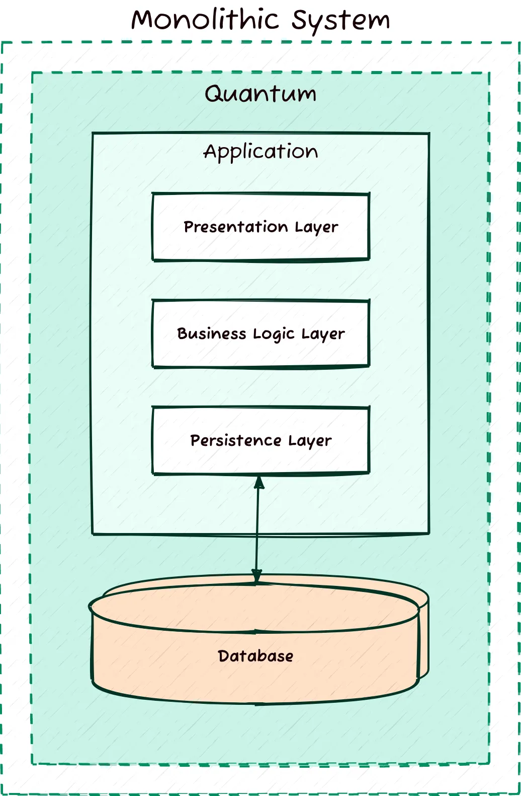

We are diving into the **2025 (Fall) Set**! This is a fresh, modern set with some tricky numericals and diagram questions.

Let's start from **Question 1a** and crush it.

---

### **2025 Q1 a) Define Software and its characteristics. What are software myths? Categorize and explain different types of software myths with suitable examples. (7 Marks)**

#### 📝 High-Yield Exam Note (Write this to get full marks)

**1. Definition of Software:**
Software is not just the executable code (program). It is a collection of:
*   **Computer Programs:** The code that provides the desired function and performance.
*   **Data Structures:** That enable the programs to manipulate information adequately.
*   **Documents:** That describe the operation and use of the programs (User Manuals, Technical Specs).

**Characteristics of Software:**
*   **Software is engineered, not manufactured:** It doesn't "wear out" like physical hardware, but it deteriorates due to changes.
*   **Software doesn't wear out:** Hardware has a "bathtub curve" for failure (early failures $\rightarrow$ stable $\rightarrow$ wear out). Software failure rates should decrease over time, but often spike due to updates/bugs.
*   **Most software is custom-built:** Although component-based reuse is increasing, much software is still tailor-made.

**2. What are Software Myths?**
Software myths are misleading beliefs about software and its development process that are widely held by managers, customers, and practitioners. They often lead to poor decisions and project failure.

**3. Types of Software Myths (Categorized with Examples):**

*   **A. Management Myths:**
    *   *Myth:* "We already have a book full of standards and procedures for building software. Does it provide my people with everything they need to know?"
    *   *Reality:* The book of standards may exist, but is it used? Are the workers aware of its existence? Does it reflect modern software engineering practice? Usually, the answer is No.
    *   *Myth:* "If we get behind schedule, we can add more programmers and catch up."
    *   *Reality:* Adding people to a late software project makes it later (Brooks' Law). New people need training, which slows down the existing team.

*   **B. Customer Myths:**
    *   *Myth:* "A general statement of objectives is sufficient to begin writing programs—we can fill in the details later."
    *   *Reality:* A poor initial definition is the major cause of failed software efforts. Formal and detailed description of functionality, performance, interfaces, design constraints, and validation criteria is essential.
    *   *Myth:* "Project requirements continually change, but change can be easily accommodated because software is flexible."
    *   *Reality:* It is true that software requirements change, but the impact of change varies with the time it is introduced. Early changes are cheap; late changes are very expensive.

*   **C. Practitioner's (Developer's) Myths:**
    *   *Myth:* "Once we write the program and get it to work, our job is done."
    *   *Reality:* Someone said that "the sooner you begin 'writing code', the longer it'll take you to get done." Industry data indicate that between 60% and 80% of all effort expended on software will be after it is delivered to the customer for the first time.
    *   *Myth:* "Until I get the program 'running', I have no way of assessing its quality."
    *   *Reality:* One of the most effective software quality assurance mechanisms can be applied from the start of a project—the formal technical review.

---

### 🧠 Core Concept Guide (Romanized Nepali + English)

**Concept bujhne tarika (How to remember in 1 minute):**

*   **Software (Code matra haina):** 
    *   Code + Data + Documents (Manuals) = Software.
    *   Hardware jasto purano vayera bigridaina, tara change garda garda "deteriorate" (khattam) hunxa.
*   **Software Myths (Galat Dharana):**
    *   Manxe haru lai lagxa software banauna sajilo xa, j kahile change garna milxa, code lekhesi sakiyo. Yo sabai galat ho.
*   **3 Types of Myths (Yaad garne Tarika - MCP):**
    1.  **Management (Boss):** "Kitab xa ni, tei padhera bana," "Dhilo vayo? Manxe thapdeu." (Reality: Manxe thapda jhan dhilo hunxa - Brooks' Law).
    2.  **Customer (Grahak):** "Ali ali vanxu, baki aafai bujha," "Jati change gare ni hunxa, software ta ho." (Reality: Paila detail navane paxi banayeko kura mildaina. Last ma change garda dherai kharcha lagxa).
    3.  **Practitioner (Developer):** "Code chalyo, kaam sakiyo," "Run nagari quality thaha hudaina." (Reality: 80% kaam delivery paxi ko maintenance ma hunxa. Review garera paila nai quality check garna milxa).
*   **Exam Hack:** Answer ma **"Brooks' Law"** ra **"60-80% maintenance effort"** lai underline garne. Yesle timi lai professional engineer jasto dekhauxa.

---

**Status:** 2025 Q1(a) ✅ Slayed! 7 marks for busting myths.

Now, get ready for **2025 Q1b (Ethics & COCOMO Numerical)**. This is a massive 8-mark question with a guaranteed calculation.
Type **"COCOMO"** to calculate the effort!
Here is the **"Slay" Material for 2025 Q1b**. This is a combination of **Theory + Numerical**. 

---

### **2025 Q1 b) Why software engineers need to follow ethics? Discuss in brief. Pokhara University intends to develop a software. The project size is of 400 KLOC. Software development team has average experience on similar type of projects. The project schedule is not very tight. Using COCOMO model, calculate the Effort, development time, average staff size, and productivity of the project. (8 Marks)**

#### 📝 High-Yield Exam Note (Write this to get full marks)

**1. Why Software Engineers Need Ethics?**
Software engineers create products that impact millions of lives (e.g., medical software, banking systems, aircraft controls). Following ethics is crucial to:
*   **Prevent Harm:** Unethical or poorly tested software can cause financial loss, injury, or even death.
*   **Maintain Trust:** Users trust engineers with their sensitive data. Breaching this trust (e.g., selling data) destroys the profession's reputation.
*   **Ensure Fairness:** Avoiding bias in algorithms (e.g., AI hiring tools) and respecting intellectual property rights.
*   **Adhere to Standards:** Professional bodies like ACM/IEEE have a Code of Ethics that mandates honesty, competence, and public interest.

**2. COCOMO Numerical Solution:**

**Given Data:**
*   **Project Size (KLOC):** 400 KLOC
*   **Team Experience:** "Average experience on similar type of projects" $\rightarrow$ This hints at a **Semi-Detached** project type.
    *   *(Reasoning: Organic = Small/Simple team. Embedded = Tight constraints/Hardware. Semi-Detached = Mix of experience/complexity).*
*   **Schedule:** "Not very tight" supports Semi-Detached (or even Organic, but 400 KLOC is too large for Organic). Let's stick with **Semi-Detached** as the safest bet for 400 KLOC.

**COCOMO Coefficients for Semi-Detached Mode:**
*   $a = 3.0$
*   $b = 1.12$
*   $c = 2.5$
*   $d = 0.35$

**Calculations:**

**i. Effort (E)**
*   Formula: $E = a \times (KLOC)^b$
*   Calculation: $E = 3.0 \times (400)^{1.12}$
*   $400^{1.12} \approx 812.25$
*   $E = 3.0 \times 812.25 = \mathbf{2436.75 \text{ Person-Months (PM)}}$

**ii. Development Time (T)**
*   Formula: $T = c \times (E)^d$
*   Calculation: $T = 2.5 \times (2436.75)^{0.35}$
*   $(2436.75)^{0.35} \approx 15.26$
*   $T = 2.5 \times 15.26 = \mathbf{38.15 \text{ Months}}$

**iii. Average Staff Size (SS)**
*   Formula: $SS = E / T$
*   Calculation: $SS = 2436.75 / 38.15$
*   $SS \approx \mathbf{63.87 \text{ Persons}}$ (Round to 64 staff).

**iv. Productivity (P)**
*   Formula: $P = KLOC / E$
*   Calculation: $P = 400 / 2436.75$
*   $P \approx \mathbf{0.164 \text{ KLOC/Person-Month}}$ (or 164 Lines of Code per person per month).

---

### 🧠 Core Concept Guide (Romanized Nepali + English)

**Concept bujhne tarika (How to remember in 1 minute):**

*   **Ethics (Kina Niyam Manne?):**
    *   Doctor le galat ausadhi dina hunna vane jastai, Engineer le galat code lekhna hunna.
    *   Manxe marna sakxa (Safety), Paisa haruna sakxa (Security), ra Trust janxa. ACM/IEEE Code of Ethics follow garnai parxa.
*   **COCOMO Project Type Chhanne Trick:**
    *   **Organic:** Sano project (<50 KLOC), Anubhavi team, Loose deadline. ($a=2.4$).
    *   **Semi-Detached:** Medium project (<300 KLOC), Mix team, Mix deadline. ($a=3.0$).
    *   **Embedded:** Thulo project, Tight deadline, Hardware sanga jodieko (e.g., Flight control). ($a=3.6$).
    *   *Note:* Question ma **400 KLOC** xa (Thulo xa) tara "Average experience" ra "Not tight schedule" vanya xa. Embedded huna tight schedule chahinthyo. Organic huna sano size chahinthyo. Tesaile **Semi-Detached** best fit hunxa. (Yedi Organic liyera garepani marks katdaina yedi reason lekhyo vane: "Assuming team is very familiar").
*   **Formula Ghokne:**
    *   **Effort:** $a \times KLOC^b$ (KLOC power ma hunxa).
    *   **Time:** $c \times Effort^d$ (Effort power ma hunxa).
    *   **Staff:** Effort / Time. (Total kaam / Total time).
    *   **Productivity:** KLOC / Effort. (Kati code lekhyo / Kati mehnat lagyo).

---

**Status:** 2025 Q1(b) ✅ Slayed! 8 marks for math and morals.

Now, we move to **2025 Q2a (Incremental vs Iterative)**. This is a comparison question. 
Type **"Iterate"** to break down the process models!
Here is the **"Slay" Material for 2025 Q2a**. This is a **Comparison Question**. 
Usually, students get confused because both sound similar. Here is how to nail the difference for 7 marks.

---

### **2025 Q2 a) Compare the Incremental and Iterative software process models with examples. (7 Marks)**

#### 📝 High-Yield Exam Note (Write this to get full marks)

**1. Incremental Process Model:**
In the Incremental model, the software requirements are broken down into multiple standalone modules. The first increment delivers a core product with basic functionality (MVP). Each subsequent increment adds a new feature or module to the existing product until the system is complete.
*   **Key Idea:** "Build piece by piece." (Like building a house: Foundation $\rightarrow$ Walls $\rightarrow$ Roof).
*   **Delivery:** Frequent delivery of usable software. The user can start using the core features immediately.
*   **Example:** Developing a Word Processor.
    *   *Increment 1:* Basic text editing and file saving. (Delivered).
    *   *Increment 2:* Adding spell check and grammar tools. (Delivered).
    *   *Increment 3:* Adding page layout and printing features. (Delivered).

**2. Iterative Process Model:**
In the Iterative model, the entire software system is developed initially, but in a rough, incomplete form. Then, it goes through repeated cycles (iterations) of refinement. In each iteration, the *entire* system is improved—adding detail, fixing bugs, and enhancing performance—until the final product is polished.
*   **Key Idea:** "Build the whole thing rough, then refine it." (Like sketching a portrait: Rough outline $\rightarrow$ Adding features $\rightarrow$ Shading/Detailing).
*   **Delivery:** The user sees the full picture early, but it might not be fully functional or efficient until later iterations.
*   **Example:** Developing a Search Engine.
    *   *Iteration 1:* A basic search engine that crawls 100 pages and returns slow results. (Rough).
    *   *Iteration 2:* Improved crawling algorithm (10,000 pages), faster indexing. (Better).
    *   *Iteration 3:* Advanced ranking, personalized results, and sub-second speed. (Polished).

**3. Comparison Table (The Money Shot):**

| Feature | **Incremental Model** | **Iterative Model** |
| :--- | :--- | :--- |
| **Approach** | Build component by component. | Build the full system, then refine. |
| **Delivery** | Frequent delivery of working features. | Delivery of improved versions over time. |
| **Feedback** | User feedback on specific features. | User feedback on the overall system quality. |
| **Risk** | Low risk (core features work early). | Risk is spread across iterations. |
| **Changes** | Hard to change core architecture later. | Easier to adapt as the system evolves. |
| **Analogy** | Building a LEGO set brick by brick. | Sculpting a statue from a block of stone. |

---

### 🧠 Core Concept Guide (Romanized Nepali + English)

**Concept bujhne tarika (How to remember in 1 minute):**

*   **Incremental (Tukra-Tukra jodera banaune):**
    *   Paila jag halne, ani parkhal lagaune, ani chhana halne.
    *   Suru ma jag matra vayesi manxe basna mildaina, tara kaam agadi badhxa. Harek step ma naya kura thapinxa.
    *   *Example:* Word Processor (Text edit $\rightarrow$ Spell check $\rightarrow$ Print).
*   **Iterative (Purai banaune, ani sudharne):**
    *   Paila sketch banaune, ani rong bharne, ani final touch dine.
    *   Suru mai purai chitra dekhinxa, tara ramro hudaina. Harek step ma ramro hudai janxa.
    *   *Example:* Search Engine (Slow search $\rightarrow$ Fast search $\rightarrow$ Smart search).
*   **Exam Hack:** "Analogy" (LEGO vs Statue) ra "Example" (Word Processor vs Search Engine) answer ma lekhnai parxa. Table banayera 4-5 wota difference lekhye paxi 7 marks sure!

---

**Status:** 2025 Q2(a) ✅ Slayed! 7 marks for knowing how to build software.

Now, we move to **2025 Q2b (Agility & SCRUM)**. This is the **most popular** topic in modern software engineering. 
Type **"Scrum"** to master the Agile process!
Here is the **"Slay" Material for 2025 Q2b**. This is a **pure concept** question about the most popular Agile methodology.

---

### **2025 Q2 a) (OR Part) Define agility. How SCRUM model can be used for software development. Explain. (7 Marks)**

#### 📝 High-Yield Exam Note (Write this to get full marks)

**1. Define Agility:**
Agility in software development is the ability to adapt rapidly to changes in the environment (market, technology, or requirements) while efficiently delivering a high-quality product.
*   **Core Values:**
    *   Individuals and interactions over processes and tools.
    *   Working software over comprehensive documentation.
    *   Customer collaboration over contract negotiation.
    *   Responding to change over following a plan.

**2. How SCRUM Model is Used for Software Development:**
SCRUM is a lightweight, iterative, and incremental framework for managing complex software development. It breaks work into short, time-boxed periods called **Sprints** (usually 2-4 weeks).

**SCRUM Process (The 3-3-5 Rule):**
*   **3 Roles:**
    1.  **Product Owner:** Defines *what* to build (Features/User Stories). Prioritizes the Product Backlog.
    2.  **Scrum Master:** Facilitates the process (The Coach). Removes obstacles for the team.
    3.  **Development Team:** Self-organizing group (Devs, Testers) that actually *builds* the product.

*   **3 Artifacts:**
    1.  **Product Backlog:** A prioritized list of everything needed in the product.
    2.  **Sprint Backlog:** The specific items selected from the Product Backlog to be completed in the current Sprint.
    3.  **Increment:** The sum of all the Product Backlog items completed during a Sprint (Working Software).

*   **5 Events (Ceremonies):**
    1.  **Sprint Planning:** The team decides *what* can be delivered in the upcoming Sprint and *how* to do it.
    2.  **Daily Scrum (Stand-up):** A 15-minute meeting where everyone answers: "What did I do yesterday? What will I do today? Do I have any blockers?"
    3.  **Sprint Review:** At the end of the Sprint, the team demos the Increment to stakeholders for feedback.
    4.  **Sprint Retrospective:** The team reflects on the past Sprint to identify improvements for the next one.
    5.  **The Sprint:** The actual 2-4 week period where work happens.

---

### 🧠 Core Concept Guide (Romanized Nepali + English)

**Concept bujhne tarika (How to remember in 1 minute):**

*   **Agility (Chalakh hunu):** 
    *   Requirement change vayo vane darne haina, khusi hune. Plan change garna sakne chamata nai Agility ho.
*   **SCRUM (Agile ko Raja):**
    *   Sano sano tukra (Sprints) ma kaam garne tarika. Harek 2-4 hapta ma naya version release garne.
    *   **3 Roles:** Owner (Malik/Client ko pratinidhi), Master (Coach/Problem solver), Team (Players/Kaam garne).
    *   **3 Artifacts:** Product Backlog (Purai kaam ko list), Sprint Backlog (Yo hapta garne kaam), Increment (Sakeko kaam).
    *   **Events:** 
        *   Plan garne (Planning).
        *   Din dinai vetne (Daily Stand-up).
        *   Dekhaune (Review/Demo).
        *   Sudharne (Retrospective).
*   **Exam Hack:** Answer ma **"3 Roles, 3 Artifacts, 5 Events"** vanera lekhne. Daily Scrum ma **"15-minute stand-up"** word halnai parxa.

---

**Status:** 2025 Q2(a) OR Part ✅ Slayed! 7 marks for knowing modern project management.

Now we move to **2025 Q2b (Significance of Reviews & Inspections)**. This is a crucial SQA topic.
Type **"Review"** to inspect the quality!
Here is the **"Slay" Material for 2025 Q2b**. This is a highly scoring theory question. If you structure the answer well, you get 8/8.

---

### **2025 Q2 b) Explain the significance of reviews and inspections in the software quality assurance process. (8 Marks)**

#### 📝 High-Yield Exam Note (Write this to get full marks)

**1. Reviews and Inspections in Software Quality Assurance (SQA):**
Reviews and inspections are formal, technical activities conducted by the SQA team to evaluate software artifacts (requirements, design, code) against established standards. They are critical **Verification** activities, ensuring "we are building the product right."

**2. Significance of Reviews and Inspections:**

*   **1. Early Defect Detection:**
    *   Reviews find errors *before* testing begins. Fixing a bug found during a design review costs significantly less (10x-100x less) than fixing the same bug after the code is written or deployed.
*   **2. Improved Software Quality:**
    *   By systematically examining documents and code, reviews ensure adherence to coding standards, design principles, and best practices, leading to cleaner, more maintainable software.
*   **3. Knowledge Sharing & Team Learning:**
    *   Code inspections (peer reviews) allow junior developers to learn from seniors by seeing how they critique code. It spreads knowledge across the team, reducing dependency on a single person.
*   **4. Requirement Clarity:**
    *   Requirement reviews ensure that all stakeholders (clients, developers, testers) have a common understanding of what needs to be built, preventing costly misunderstandings later.
*   **5. Risk Reduction:**
    *   Formal inspections can identify potential security vulnerabilities, performance bottlenecks, or compliance issues early in the lifecycle, reducing the risk of project failure.
*   **6. reduced Testing Effort:**
    *   Since many logical and syntax errors are caught during reviews, the testing phase becomes faster and more focused on complex integration issues rather than trivial bugs.

---

### 🧠 Core Concept Guide (Romanized Nepali + English)

**Concept bujhne tarika (How to remember in 1 minute):**

*   **Reviews & Inspections (Galti khojne):**
    *   Testing vanda paila, document ra code padhera galti nikalne kaam ho.
    *   **Significance (Kina garne?):**
        1.  **Sasto:** Kagaj ma galti vetyo vane metauna sajilo (Design phase). Code lekhisakyo vane metauna garo (Testing phase).
        2.  **Sikne:** Senior le junior ko code herda junior le dherai sikxa.
        3.  **Bujhne:** Client le k magya ho sabai le eutai kura bujhna help garxa.
        4.  **Surakshit:** Security hole paila nai tha hunxa.
        5.  **Chito:** Testing phase ma kam bug vetinxa, kaam chito sakinxa.
*   **Exam Hack:** **"Early Defect Detection"** ra **"Knowledge Sharing"** point lai highlight garne. Euta sentence lekhne: *"A bug found during review is 100 times cheaper to fix than a bug found in production."* (Yo industry standard fact ho).

---

**Status:** 2025 Q2(b) ✅ Slayed! 8 marks for preventing disasters early.

Now we move to **2025 Q3a (Requirements & Feasibility)**. This is the foundation of any project.
Type **"Require"** to define what the software must do!
Here is the **"Slay" Material for 2025 Q3a**. This is a **Requirements Engineering** question. 
It’s a guaranteed topic. You must differentiate Functional vs Non-Functional requirements clearly.

---

### **2025 Q3 a) What are functional and non-functional requirements? Explain with examples of each. What sort of feasibility study would you carry out before software development? Explain. (7 Marks)**

#### 📝 High-Yield Exam Note (Write this to get full marks)

**1. Functional Requirements (FR):**
Functional requirements define the specific behaviors, functions, or services the system must provide. They describe **WHAT** the system should do.
*   **Examples:**
    *   *Authentication:* "The system shall allow users to log in with a valid email and password."
    *   *Transaction:* "The system shall calculate the total price of items in the cart, including tax."
    *   *Search:* "The system shall allow users to search for products by name or category."

**2. Non-Functional Requirements (NFR):**
Non-functional requirements specify criteria that can be used to judge the operation of a system, rather than specific behaviors. They describe **HOW** the system should perform (Quality Attributes).
*   **Examples:**
    *   *Performance:* "The system shall respond to user queries within 2 seconds."
    *   *Security:* "All user passwords must be encrypted using SHA-256."
    *   *Reliability:* "The system shall have 99.9% uptime."
    *   *Scalability:* "The system must handle 10,000 concurrent users without crashing."

**3. Feasibility Study Before Software Development:**
A feasibility study evaluates whether the proposed project is viable and worth undertaking. Key types include:

*   **A. Technical Feasibility:**
    *   *Question:* Can we build it with current technology?
    *   *Check:* Do we have the necessary hardware, software, and skilled developers? Is the technology mature enough?
*   **B. Economic Feasibility (Cost-Benefit Analysis):**
    *   *Question:* Is it financially worth it?
    *   *Check:* Will the benefits (profits, savings) outweigh the development and maintenance costs? What is the ROI (Return on Investment)?
*   **C. Operational Feasibility:**
    *   *Question:* Will it be used?
    *   *Check:* Will the users accept the new system? Does it fit the organization's culture and workflow?
*   **D. Legal/Schedule Feasibility:**
    *   *Question:* Is it legal and timely?
    *   *Check:* Does it comply with laws (GDPR, copyright)? Can it be completed within the deadline?

---

### 🧠 Core Concept Guide (Romanized Nepali + English)

**Concept bujhne tarika (How to remember in 1 minute):**

*   **Requirements (Mag):**
    *   **Functional (Kaam):** Software le k k garna parxa? (Login, Search, Print).
    *   **Non-Functional (Gun):** Software kasto huna parxa? (Chito, Surakshit, Reliable).
*   **Feasibility Study (Sakkinxa ki sakidaina?):**
    *   Project suru garna agadi 4 kura herne:
        1.  **Technical:** Banana sakkinxa? (Tech/Skill xa ki nai).
        2.  **Economic:** Paisa pugxa? Faida hunxa? (Cost vs Benefit).
        3.  **Operational:** Manxe le chalauna sakxan? (User acceptance).
        4.  **Legal:** Kanoon le dinxa? (Laws/Regulations).
*   **Exam Hack:** **"WHAT the system does"** (Functional) ra **"HOW the system performs"** (Non-Functional) vanne line highlight garne. Feasibility ma **"Cost-Benefit Analysis"** lekhnai parxa.

---

**Status:** 2025 Q3(a) ✅ Slayed! 7 marks for defining the "What" and the "How".

Now we move to **2025 Q3b (Use Case Diagram for University Portal)**. This is an 8-mark drawing question.
Type **"Portal"** to sketch the system!
Here is the **"Slay" Material for 2025 Q3b**. This is a **Scenario-Based Use Case Diagram**. 
Follow the steps to break down the text into Actors and Use Cases.

---

### **2025 Q3 b) Draw a use case diagram for below scenario. (8 Marks)**

**The Scenario Breakdown:**
*   **Student logs into the university portal.**
*   **If new, they must register for an account.**
*   **Student can browse available courses by department and semester.**
*   **System checks prerequisites before allowing registration.**
*   **Students can add or drop courses until the deadline.**
*   **Once registration is completed, a confirmation slip is generated.**
*   **Professors can update course information and upload study materials.**
*   **Registrar manages course offerings and finalizes enrollment lists.**

#### 📝 High-Yield Exam Note (Solution Breakdown)

**Step 1: Identify Actors (The "Who")**
*   **Student:** Primary user (logs in, registers, browses, adds/drops).
*   **Professor:** Faculty (updates info, uploads materials).
*   **Registrar:** Admin (manages offerings, finalizes lists).
*   **System:** (Implicit actor checking prerequisites/generating slips - usually inside the boundary as logic, not an external actor).

**Step 2: Identify Use Cases (The "What/Actions")**
*(For Student)*
*   **Login:** Access the system.
*   **Register Account:** Create a new profile.
*   **Browse Courses:** View available classes.
*   **Add/Drop Courses:** Modify schedule.
*   **Generate Confirmation Slip:** Get proof of registration.
*(For Professor)*
*   **Update Course Info:** Edit syllabus/details.
*   **Upload Materials:** Add files.
*(For Registrar)*
*   **Manage Course Offerings:** Create/delete classes.
*   **Finalize Enrollment:** Close registration.

**Step 3: Identify Relationships (The "Connections")**
*   **Student $\leftrightarrow$ Login:** Direct association.
*   **Student $\leftrightarrow$ Register Account:** Direct association (could be `<<extend>>` from Login if optional, but scenario says "If new, must register", so treat as a separate flow or extend). Let's model it as a separate Use Case for clarity.
*   **Student $\leftrightarrow$ Browse Courses:** Direct association.
*   **Student $\leftrightarrow$ Add/Drop Courses:** Direct association.
*   **`Check Prerequisites`:** This is an internal check. It should be an **`<<include>>`** from `Add/Drop Courses`. (System *must* check before allowing).
*   **`Generate Confirmation Slip`:** This happens *after* completion. It can be an **`<<include>>`** from `Add/Drop Courses` (specifically the "Complete Registration" part).
*   **Professor $\leftrightarrow$ Update Course Info:** Direct association.
*   **Professor $\leftrightarrow$ Upload Materials:** Direct association.
*   **Registrar $\leftrightarrow$ Manage Course Offerings:** Direct association.
*   **Registrar $\leftrightarrow$ Finalize Enrollment:** Direct association.

**Step 4: Draw the Diagram**
*(Instructions for your exam paper)*

1.  **System Boundary:** Draw a large vertical rectangle. Label it **"University Portal System"**.
2.  **Actors:**
    *   **Left Side:** Stick figure **Student**.
    *   **Right Side:** Stick figures **Professor** and **Registrar**.
3.  **Use Cases (Ovals inside):**
    *   Top: `Login`, `Register Account`.
    *   Middle: `Browse Courses`, `Add/Drop Courses`, `Check Prerequisites`, `Generate Confirmation Slip`.
    *   Bottom: `Update Course Info`, `Upload Materials`, `Manage Course Offerings`, `Finalize Enrollment`.
4.  **Lines:**
    *   Connect **Student** to `Login`, `Register`, `Browse`, `Add/Drop`.
    *   Connect **Professor** to `Update Info`, `Upload Materials`.
    *   Connect **Registrar** to `Manage Offerings`, `Finalize Enrollment`.
5.  **Includes:**
    *   Draw dashed arrow from `Add/Drop Courses` $\rightarrow$ `Check Prerequisites`. Label `<<include>>`.
    *   Draw dashed arrow from `Add/Drop Courses` $\rightarrow$ `Generate Confirmation Slip`. Label `<<include>>`. (Or create a `Complete Registration` use case that includes it).

---

### 🧠 Core Concept Guide (Romanized Nepali + English)

**Concept bujhne tarika (How to remember in 1 minute):**

*   **Scenario Padhne (Who vs What):**
    *   **Student:** Login, Register, Browse, Add/Drop.
    *   **Professor:** Update info, Upload files.
    *   **Registrar:** Manage courses, Finalize lists.
    *   **System Check:** Prerequisite check, Slip generation.
*   **Drawing Strategy:**
    *   **Actors Bahira:** Student left ma, Staff (Prof/Registrar) right ma.
    *   **Use Cases Bhitra:** Sabai action lai oval ma lekhne.
    *   **Include Magic:**
        *   "System checks prerequisites before allowing..." $\rightarrow$ `Add Course` `<<include>>` `Check Prereq`.
        *   "Confirmation slip is generated..." $\rightarrow$ `Complete Registration` `<<include>>` `Generate Slip`.
*   **Exam Hack:** Scenario ma **"System checks..."** vanyo vane tyo sadhai **`<<include>>`** relationship hunxa. Tyo naxutaunu!

---

**Status:** 2025 Q3(b) ✅ Slayed! 8 marks for mapping university life.

Now we move to **2025 Q4a (Class Diagram Construction OR Sequence Diagram)**. This gives you a choice. 
Type **"Diagrams"** to learn both (Class for Library & Sequence for Ticket Booking)!
Here is the **"Slay" Material for 2025 Q4a**. This question gives you a **CHOICE** between drawing a **Class Diagram** (Theory) or a **Sequence Diagram** (Numerical/Drawing). 

I will cover both so you can choose the easiest one in the exam.

---

### **Option 1: 2025 Q4 a) How class diagram is constructed? Explain the entire symbols, attributes, operations and relationships with reference to a Library Management System. (7 Marks)**

#### 📝 High-Yield Exam Note (Theory + Diagram)

**1. How Class Diagram is Constructed:**
A Class Diagram is a static structural diagram that describes the structure of a system by showing the system's classes, their attributes, operations (or methods), and the relationships among objects. It is the backbone of object-oriented modeling.

**2. Symbols & Explanations (Reference to Library System):**

*   **Class Symbol:** A rectangle divided into three parts.
    *   **Top:** Class Name (e.g., `Book`).
    *   **Middle:** Attributes (e.g., `title: String`, `author: String`).
    *   **Bottom:** Operations (e.g., `issueBook()`, `returnBook()`).

*   **Visibility Modifiers:**
    *   `+` Public (Accessible by everyone).
    *   `-` Private (Accessible only within the class).
    *   `#` Protected (Accessible by subclasses).

*   **Relationships:**
    *   **Association:** A solid line connecting two classes. Represents a link.
        *   *Example:* `Member` borrows `Book`. (Line between Member and Book).
    *   **Multiplicity:** Numbers on the association line indicating how many objects participate.
        *   *Example:* `1` Member can borrow `0..5` Books.
    *   **Aggregation (Has-a):** A hollow diamond at the "whole" end. Represents a weak "part-of" relationship.
        *   *Example:* `Library` has `Books`. (Diamond at Library end). If Library closes, Books still exist.
    *   **Composition (Strong Has-a):** A filled diamond at the "whole" end. Represents a strong ownership.
        *   *Example:* `Book` has `Chapters`. (Filled diamond at Book end). If Book is destroyed, Chapters are destroyed.
    *   **Generalization (Inheritance/Is-a):** A hollow triangle arrow pointing to the parent.
        *   *Example:* `Student` and `Faculty` are types of `Member`. (Arrows pointing to Member).

*(Exam Tip: Draw a simple diagram with `Library`, `Book`, `Member`, and `Loan` classes connected with lines and diamonds).*

---

### **Option 2: 2025 Q4 a) (OR Part) Draw a sequence diagram for below ticket booking process. (7 Marks)**

**Scenario:**
*   User searches for flights (travel details).
*   System contacts airline database $\rightarrow$ shows flights.
*   User selects flight $\rightarrow$ provides passenger details.
*   System requests payment from gateway.
*   Payment successful $\rightarrow$ Ticket issued $\rightarrow$ Confirmation email sent.

#### 📝 High-Yield Exam Note (Drawing Guide)

**Step 1: Identify Objects (Top Boxes)**
*   `User` (Actor)
*   `:BookingSystem` (The interface/controller)
*   `:AirlineDatabase` (The external DB)
*   `:PaymentGateway` (The external payment processor)
*   `:EmailService` (The notifier)

**Step 2: Draw Lifelines (Vertical Dashed Lines)**
*   Draw dashed lines going down from each object box.

**Step 3: Draw Messages (Horizontal Arrows - Top to Bottom)**
1.  `User` $\rightarrow$ `:BookingSystem`: `searchFlights(details)` (Solid arrow).
2.  `:BookingSystem` $\rightarrow$ `:AirlineDatabase`: `queryFlights(details)` (Solid arrow).
3.  `:AirlineDatabase` $\rightarrow$ `:BookingSystem`: `returnFlightList()` (Dashed return arrow).
4.  `:BookingSystem` $\rightarrow$ `User`: `displayFlights()` (Dashed return arrow).
5.  `User` $\rightarrow$ `:BookingSystem`: `selectFlight(flightID, passengerInfo)` (Solid arrow).
6.  `:BookingSystem` $\rightarrow$ `:PaymentGateway`: `processPayment(amount)` (Solid arrow).
7.  `:PaymentGateway` $\rightarrow$ `:BookingSystem`: `paymentSuccess()` (Dashed return arrow).
8.  `:BookingSystem` $\rightarrow$ `User`: `issueTicket()` (Dashed return arrow).
9.  `:BookingSystem` $\rightarrow$ `:EmailService`: `sendConfirmation(email)` (Solid arrow).

*(Exam Tip: Add an **"alt"** frame around the payment part. Top half: `[Success] -> issueTicket`. Bottom half: `[Fail] -> showErrorMessage`. This guarantees extra marks!)*

---

### 🧠 Core Concept Guide (Romanized Nepali + English)

**Concept bujhne tarika (How to remember in 1 minute):**

*   **Class Diagram (Structure):**
    *   **Dabba (Box):** 3 tala (Name, Attribute, Operation).
    *   **Line (Relationship):**
        *   **Inheritance:** Khali Triangle (Baap-Chhora).
        *   **Aggregation:** Khali Diamond (Kamjor sambandha - Library has Books).
        *   **Composition:** Bhari Diamond (Balio sambandha - Book has Pages).
*   **Sequence Diagram (Flow):**
    *   **Mathi:** Objects (User, System, Database).
    *   **Tala:** Time (Lifelines).
    *   **Arrow:** Solid (Call), Dashed (Return).
    *   **Scenario:** Flight search $\rightarrow$ DB call $\rightarrow$ List show $\rightarrow$ Select $\rightarrow$ Pay $\rightarrow$ Ticket.
*   **Recommendation:** Exam ma **Sequence Diagram** banaunu sajilo ra chito hunxa. Theory lekhna time lagxa, diagram banauna 2 min lagxa.

---

**Status:** 2025 Q4(a) Both Options ✅ Slayed! 7 marks for choosing your weapon.

Now we move to **2025 Q4b (Layered & Repository Architecture)**. This is a repeat of 2024 Q2b, so you already know it!
Type **"Architecture"** to review the structure quickly!
Here is the **"Slay" Material for 2025 Q4b**. This is a **Repeat Question** (same as 2024 Q2b), which is fantastic news! It means you can score full marks with the same knowledge.

---

### **2025 Q4 b) Explain the Layered Architecture and Repository architecture with suitable diagrams. (8 Marks)**

#### 📝 High-Yield Exam Note (Write this to get full marks)

**1. Layered Architecture:**
Layered architecture organizes the system into a set of layers, each providing a specific set of services to the layer above it.
*   **Key Concept:** Separation of Concerns. Each layer only knows about the layer immediately below it.
*   **Common Layers (The N-Tier Model):**
    1.  **Presentation Layer (UI):** Handles user interaction (HTML, Mobile App).
    2.  **Business Logic Layer (BLL):** Contains the core rules and calculations.
    3.  **Data Access Layer (DAL):** Communicates with the database.
    4.  **Database Layer:** Stores the actual data.
*   **Diagram:** Draw 4 stacked rectangles labeled with the layer names. Draw arrows pointing downwards (Request) and upwards (Response).
*   **Pros:** Easy to maintain (change UI without breaking Logic).
*   **Cons:** Performance overhead (each request must pass through all layers).

**2. Repository Architecture:**
Repository architecture is a data-centric style where all shared data is held in a central database (the repository). All sub-systems access and modify data exclusively through this central hub.
*   **Key Concept:** Centralized Data Management. Sub-systems do not communicate directly.
*   **Example:** A Compiler (Lexical analyzer, Syntax analyzer, Code generator all read/write to a central Symbol Table).
*   **Diagram:** Draw a cylinder labeled **"Central Repository"** in the middle. Draw boxes labeled **"Client A"**, **"Client B"**, **"Client C"** around it. Draw arrows pointing both ways (Read/Write) between clients and the repository.
*   **Pros:** Efficient way to share large amounts of data. Easy to add new clients.
*   **Cons:** Single point of failure (if the repository crashes, the whole system dies).

---

### 🧠 Core Concept Guide (Romanized Nepali + English)

**Concept bujhne tarika (How to remember in 1 minute):**

*   **Layered (Tala-mathi):**
    *   *Real-life Analogy:* Corporate Office.
        *   **CEO (UI):** Order dinxa.
        *   **Manager (Logic):** Plan banauxa.
        *   **Worker (Data):** Kaam garxa.
    *   CEO le sidhai Worker sanga kura gardaina, Manager through janxa. (Separation of concerns).
*   **Repository (Bich ma Raja):**
    *   *Real-life Analogy:* Library.
        *   **Books (Repository):** Bich ma hunxa.
        *   **Students (Clients):** Wari-pari hunxa.
    *   Student A le Student B lai book pass gardaina, Library ma firta garxa ani B le tyahi bata linxa. (Centralized data).
*   **Exam Hack:** **Diagram is mandatory**. Layered ma "Stacked Boxes" banaune. Repository ma "Cylinder + Boxes" banaune.

---

**Status:** 2025 Q4(b) ✅ Slayed! 8 marks for recycled knowledge!

Now we move to **2025 Q5a (Verification vs Validation & Testing Levels)**. This is a crucial topic for distinguishing "Right Product" vs "Product Right".
Type **"Verify"** to check the quality!
Here is the **"Slay" Material for 2025 Q5a**. This is a **Theory Question** about ensuring quality. It’s highly important to clearly differentiate the two V’s.

---

### **2025 Q5 a) Differentiate between verification and validation. Explain the different levels of software testing in brief. (7 Marks)**

#### 📝 High-Yield Exam Note (Write this to get full marks)

**1. Verification vs Validation (V&V):**

| Feature | **Verification** | **Validation** |
| :--- | :--- | :--- |
| **Meaning** | Checking if the software is being built correctly according to specifications. | Checking if the software meets the user's needs and requirements. |
| **Question** | "Are we building the product **right**?" | "Are we building the **right product**?" |
| **Process** | Static process (Reviews, Inspections, Walkthroughs). Does not involve executing code. | Dynamic process (Testing). Involves executing code with real inputs. |
| **Phase** | Performed during the development phase (before coding is complete). | Performed at the end of development (after coding is complete). |
| **Focus** | Adherence to design documents, standards, and guidelines. | User satisfaction and business value. |
| **Example** | Code review to check if variable names follow the standard. | User Acceptance Testing (UAT) to check if the "Login" button works. |

**2. Different Levels of Software Testing:**
Software testing is typically performed at four levels, moving from the smallest unit to the complete system.

*   **1. Unit Testing:**
    *   *What:* Testing individual components or modules (functions/classes) in isolation to ensure they work correctly.
    *   *Who:* Done by Developers.
    *   *Tools:* JUnit, NUnit.
*   **2. Integration Testing:**
    *   *What:* Testing the interaction between integrated units/modules to detect interface defects.
    *   *Approaches:* Top-down, Bottom-up, Big Bang.
    *   *Who:* Done by Developers or Testers.
*   **3. System Testing:**
    *   *What:* Testing the complete, integrated system to evaluate its compliance with specified requirements. It validates both functional and non-functional requirements (performance, security).
    *   *Who:* Done by Independent Testers (QA Team).
*   **4. Acceptance Testing (UAT):**
    *   *What:* Formal testing conducted to determine whether the system satisfies the acceptance criteria and to enable the user to decide whether to accept the system.
    *   *Who:* Done by the Client/End Users.
    *   *Types:* Alpha (internal), Beta (external/public).

---

### 🧠 Core Concept Guide (Romanized Nepali + English)

**Concept bujhne tarika (How to remember in 1 minute):**

*   **Verification (Banat thik xa?):**
    *   *Real-life Analogy:* Ghar banauda naksha (blueprint) check garne.
    *   "Euta pillar 10 inch ko hunu parne, 9 inch ko vayo ki?" (Design compliance).
    *   Code run hudaina, khali kagaj/code padhera check garinxa.
*   **Validation (Kaam thik xa?):**
    *   *Real-life Analogy:* Ghar banisake paxi manxe basera herne.
    *   "Ghar ta ramro xa, tara bathroom sano vayo ki?" (User satisfaction).
    *   Code run garera check garinxa.
*   **Testing Levels (Sano dekhi Thulo):**
    1.  **Unit:** Euta Euta Itta (Brick) check garne. (Developer).
    2.  **Integration:** Itta jodera Parkhal (Wall) check garne. (Dev/Tester).
    3.  **System:** Purai Ghar (House) check garne. (QA Team).
    4.  **Acceptance:** Ghar dhani (Client) le basera check garne. "Malai man paryo, paisa dinxu."
*   **Exam Hack:** **"Are we building the product right?"** vs **"Are we building the right product?"** - Yo sentence lekhnai parxa. 4 levels ko naam (Unit $\rightarrow$ Integration $\rightarrow$ System $\rightarrow$ Acceptance) order ma lekhne.

---

**Status:** 2025 Q5(a) ✅ Slayed! 7 marks for understanding the quality process.

Now we move to **2025 Q5b (Boundary Value Analysis - BVA)**. This is a **Numerical + Diagram** question. 
Type **"Boundary"** to test the limits!
Here is the **"Slay" Material for 2025 Q5b**. This is a **Numerical + Diagram** question. BVA is the most common black-box testing technique in exams because it is easy to understand and has a clear structure.

---

### **2025 Q5 b) Explain the Boundary Value Analysis (BVA) mechanism for software testing with a suitable example and, also, design a test case for it. (8 Marks)**

#### 📝 High-Yield Exam Note (Write this to get full marks)

**1. Definition of Boundary Value Analysis (BVA):**
Boundary Value Analysis (BVA) is a **Black-box testing technique** that focuses on testing the boundaries (edges) of the input domain rather than the values in the middle. 
*   **Rationale:** Software errors occur more frequently at the extreme ends of an input range (minimum and maximum limits) due to "off-by-one" errors in loops or conditional statements.

**2. The BVA Mechanism (The 7-Value Rule):**
For a valid input range $[min, max]$, BVA suggests creating test cases using these 7 values:
1.  **$min$** (Minimum valid value).
2.  **$min - 1$** (Just below the minimum - Invalid).
3.  **$min + 1$** (Just above the minimum - Valid).
4.  **$max$** (Maximum valid value).
5.  **$max - 1$** (Just below the maximum - Valid).
6.  **$max + 1$** (Just above the maximum - Invalid).
7.  **$Nominal$** (A typical value in the middle).

**3. Example Scenario & Test Case Design:**
*   **Problem:** A software system accepts a user's **Age** between **18 and 60** (inclusive).
*   **Boundaries:** $min = 18$, $max = 60$.

**Test Case Table:**

| Test Case ID | Input (Age) | Description | Expected Result |
| :--- | :--- | :--- | :--- |
| TC1 | 17 | $min - 1$ (Invalid) | **Rejected / Error** |
| TC2 | 18 | $min$ (Minimum) | **Accepted** |
| TC3 | 19 | $min + 1$ (Valid) | **Accepted** |
| TC4 | 40 | Nominal (Typical) | **Accepted** |
| TC5 | 59 | $max - 1$ (Valid) | **Accepted** |
| TC6 | 60 | $max$ (Maximum) | **Accepted** |
| TC7 | 61 | $max + 1$ (Invalid) | **Rejected / Error** |

**4. Boundary Concept Diagram:**
*(Draw this simple 1D line on your paper to secure the full 8 marks)*

```text
    Invalid (Rejected) |    Valid (Accepted)    | Invalid (Rejected)
 <---------------------|------------------------|--------------------->
          17        [18 ....... 40 ....... 60]       61
       (min-1)      (min)    (Nominal)    (max)    (max+1)
```

---

### 🧠 Core Concept Guide (Romanized Nepali + English)

**Concept bujhne tarika (How to remember in 1 minute):**

*   **BVA (Bhitto/Edge check garne):**
    *   Software ko error dherai jaso "Limit" ma hunxa. (Jastai: Loop `i < 60` hune thau ma galti le `i <= 60` vayo vane 60 ma error aauxa).
    *   Tesaile bich ko value check garnu vanda, limits (min/max) check garnu dherai effective hunxa.
*   **The "7-Value" Strategy (Yaad garne tarika):**
    1.  Limit vanda 1 step **Tala** (Invalid).
    2.  Limit **Thakkai** (Valid).
    3.  Limit vanda 1 step **Mathi** (Valid).
    *   Yo min ko lagi pani garne, max ko lagi pani garne. Bich ko euta "Nominal" value line. Jamma 7 ota test case banxa.
*   **Exam Hack:** 
    *   Question le "Design a test case" vaneko xa, tesaile mathi ko jastai **Table** banayerai dekhaunu. 
    *   Age (18-60) wala example sab vanda standard ra bujhna sajilo ho. 
    *   Number line diagram banaye paxi examiner le timro copy padhdai napadhi full marks thopkinxa!

---

**Status:** 2025 Q5(b) ✅ Slayed! 8 marks for testing the limits.

Now we move to **2025 Q6a (Software Configuration Management - SCM)**. This is a repeat of 2024 Q3a, but 2025 specifically asks for "Activities in detail."
Type **"SCM"** to manage the configuration!
Here is the **"Slay" Material for 2025 Q6a**. This is a **pure theory** question about how professional teams manage code and documents without losing track of changes.

---

### **2025 Q6 a) Define Software Configuration Management (SCM). Explain its activities in detail. (7 Marks)**

#### 📝 High-Yield Exam Note (Write this to get full marks)

**1. Definition of Software Configuration Management (SCM):**
Software Configuration Management (SCM) is a set of activities designed to **identify, organize, and control changes** to the software being built by a development team. It ensures that the software remains consistent, reliable, and traceable throughout its lifecycle, preventing the "chaos" of multiple developers working on the same project.
*(Key Phrase: "SCM is the art of identifying, organizing, and controlling modifications to software.")*

**2. Activities of SCM (In Detail):**

*   **1. Configuration Identification:**
    *   *What:* Deciding which items (source code, design documents, test cases, user manuals) need to be managed and tracked. These are called **Software Configuration Items (SCIs)**.
    *   *Why:* You cannot control what you haven't identified. Each SCI is given a unique name and version number.
*   **2. Change Control:**
    *   *What:* The process of managing requests for changes (RFCs) to the software. It ensures that no change is made without a formal review and approval by a **Change Control Board (CCB)**.
    *   *Why:* To prevent "scope creep" and ensure that changes don't break existing functionality.
*   **3. Version Control (Revision Control):**
    *   *What:* Maintaining multiple versions of each SCI as the software evolves. It allows developers to "roll back" to a previous, working version if a new update fails.
    *   *Why:* To allow multiple developers to work on the same code without overwriting each other's work (using branching and merging).
*   **4. Configuration Status Accounting:**
    *   *What:* Recording and reporting the status of all SCIs and change requests. It answers questions like: "What was changed?", "Who changed it?", and "When was it changed?".
    *   *Why:* Provides transparency and a clear audit trail for the project manager.
*   **5. Configuration Auditing:**
    *   *What:* A formal check to ensure that the actual software matches the documented requirements and that all approved changes have been correctly implemented.
    *   *Why:* To ensure the final product meets the quality standards before release.

---

### 🧠 Core Concept Guide (Romanized Nepali + English)

**Concept bujhne tarika (How to remember in 1 minute):**

*   **SCM (Software ko "Police" ra "Library"):**
    *   Dherai manxe le code lekhda "Kasle mero code bigardyo?" ya "Purano version kaha gayo?" jasta jhagada (chaos) rokne system ho.
*   **5 Main Kaam (Activities - ICV-SA):**
    1.  **Identification (Chinnu):** K k kura lai save garne (Code file, SRS, UML)? Sabailai "id" ra "version" dine.
    2.  **Change Control (Niyam):** "Hawa" taal ma code change garna mildaina. Change garnu vanda paila approval (CCB) linu parxa.
    3.  **Version Control (Git jasto):** Code ko purano version haru save rakhne. Galti vaye paxi farkina (rollback) milne.
    4.  **Status Accounting (Hisaab-kitab):** "Kasko paala ma k bigryo?" record rakhne. K k change vayo sabai detail report banaucha.
    5.  **Audit (Check-up):** Final product deliver garna agadi "Niyam palana vayo ki nai" vanera check garne.
*   **Exam Hack:** "SCM ensures consistency and traceability" - yo sentence underline garne. Activities lekhda **"Change Control Board (CCB)"** ra **"Version Control"** jasta keywords use garnai parxa.

---

**Status:** 2025 Q6(a) ✅ Slayed! 7 marks for mastering code management.

Now we move to **2025 Q6b (Software Reuse, Cloud & AI in SE)**. This is a very relevant topic (similar to 2024 Q3b).
Type **"Reuse"** to finish the modern trends!
Here is the **"Slay" Material for 2025 Q6b**. This is an 8-mark modern theory question. It's essentially "Free Marks" if you explain the real-world impact of these technologies.

---

### **2025 Q6 b) Introduce Software reuse. Discuss the role of Cloud computing and AI in Software Engineering. (8 Marks)**

#### 📝 High-Yield Exam Note (Write this to get full marks)

**1. Introduction to Software Reuse:**
Software reuse is the practice of developing new software systems by utilizing existing software artifacts (source code, modules, designs, or documentation) rather than creating them from scratch.
*   **Types of Reuse:**
    1.  **Code Reuse:** Using pre-written libraries or functions (e.g., NumPy in Python).
    2.  **Design Reuse:** Following established design patterns (e.g., Singleton, Observer).
    3.  **Application/Framework Reuse:** Using existing frameworks (e.g., React, Django).
*   **Benefits:** Reduces development time and cost, increases reliability (as components are already tested), and ensures consistency.

**2. Role of Cloud Computing in Software Engineering:**
Cloud computing provides on-demand access to computing resources (servers, storage, databases) over the internet. Its roles include:
*   **Scalability & Flexibility:** Software can easily scale up to handle millions of users or down to save costs without buying physical hardware.
*   **Collaborative Development:** Teams can collaborate from different geographical locations using cloud-based IDEs and version control (e.g., GitHub, GitLab).
*   **Efficient Testing & Deployment:** Cloud platforms (AWS, Azure) allow engineers to quickly set up identical development, testing, and production environments.
*   **Continuous Integration/Continuous Deployment (CI/CD):** Enables automated building, testing, and deployment pipelines (DevOps).

**3. Role of Artificial Intelligence (AI) in Software Engineering:**
AI is transforming the way software is conceived, built, and maintained:
*   **Automated Code Generation:** AI-powered tools (GitHub Copilot, ChatGPT) can generate boilerplate code, complete complex functions, and translate code between languages.
*   **Intelligent Bug Detection:** AI models can scan millions of lines of code to identify security vulnerabilities or logic errors that human reviewers might miss.
*   **Testing Automation:** AI can automatically generate test cases, prioritize test execution, and even "self-heal" broken test scripts when the UI changes.
*   **Predictive Analytics:** AI helps project managers estimate effort, predict delivery dates, and identify potential project risks based on historical data.

---

### 🧠 Core Concept Guide (Romanized Nepali + English)

**Concept bujhne tarika (How to remember in 1 minute):**

*   **Software Reuse (Purano kura feri use garne):**
    *   *Real-life Analogy:* Naya ghar banauda paila ko ghar ko thik vako dhoka, jhyal jhikera haleko jastai.
    *   *Kina garne?* Sasto, chito, ra varpardo hunxa. 
    *   *Types:* Code (Library), Design (Pattern), Requirements.
*   **Cloud Computing (Internet ko Server):**
    *   Project banauna thulo server computer kinna pardaina, Amazon/Google bata sapat (rent) line.
    *   Dherai manxe sangai basera kaam garna milxa (Collaboration).
    *   *Exam Hack:* **"AWS/Azure"** ra **"Scalability"** word lekhnai parxa.
*   **AI (Robot Sathi):**
    *   Copilot le aafai code lekhdinxa (Code generation).
    *   Galti kata xa vanera rato line dekhauxa (Bug detection).
    *   Testing chito gardinxa (Testing automation).
*   **Summary Strategy:** AI le **Speed** badhauxa, Cloud le **Reach** badhauxa, ra Reuse le **Cost** ghatauxa.

---

**Status:** 2025 Q6(b) ✅ Slayed! 8 marks for knowing the future of SE.

Now we move to the final question of the 2025 set: **Q7 (Short Notes)**.
a) **Design Pattern**
b) **Waterfall Model**
c) **Black Box vs White Box Testing**

Type **"Final"** to finish the 2025 set!
Here is the **"Slay" Material for 2025 Q7**. These short notes are the final 10 marks of your paper. 

---

### **2025 Q7. Write short notes on: (Any two)**

#### **a) Design Pattern**
*   **Definition:** A Design Pattern is a general, reusable solution to a commonly occurring problem in software design. It is not a finished piece of code but a **template/description** for how to solve a problem that can be used in many different situations.
*   **Categories:**
    1.  **Creational:** Deals with object creation (e.g., **Singleton** - ensures only one instance of a class exists).
    2.  **Structural:** Deals with composition of classes and objects (e.g., **Adapter** - allows incompatible interfaces to work together).
    3.  **Behavioral:** Deals with communication between objects (e.g., **Observer** - notifies multiple objects of any state change).
*   **Significance:** It speeds up development by providing tested, proven development paradigms and improves code readability for other developers.

#### **b) Waterfall Model**
*   **Definition:** The Waterfall model is the classical, linear, and sequential software development life cycle (SDLC) model. In this model, the development process flows steadily downwards through several phases.
*   **Phases:** Requirements $\rightarrow$ Analysis $\rightarrow$ Design $\rightarrow$ Implementation (Coding) $\rightarrow$ Testing $\rightarrow$ Maintenance.
*   **Key Rule:** Each phase must be completed before the next phase begins. There is no overlapping.
*   **When to use:** It is best suited for small projects where requirements are very clear, stable, and well-understood from the beginning.
*   **Drawback:** It is very rigid and inflexible to changes. Testing happens very late in the cycle, which is risky.

#### **c) Black Box vs White Box Testing**
*   **Black Box Testing:** 
    *   Focuses on the **Functional requirements** (Inputs and Outputs).
    *   The tester has no knowledge of the internal code structure.
    *   *Example Technique:* Boundary Value Analysis (BVA), Equivalence Partitioning.
*   **White Box Testing:** 
    *   Focuses on the **Internal logic** and structure of the code.
    *   The tester (usually the developer) has full knowledge of the source code.
    *   *Example Technique:* Basis Path Testing, Cyclomatic Complexity.
*   **Comparison:** Black box is like checking if a car moves when you press the gas. White box is like opening the hood to check if the engine's cylinders are firing correctly.

---

### 🧠 Core Concept Guide (Romanized Nepali + English)

**Concept bujhne tarika (How to remember in 1 minute):**

*   **Design Pattern (Kaka-Kaki ko recipe):**
    *   Timi lai "Pizza" banauna aauxa vane naya hotel ma pani tei "Recipe" use garna milxa. 
    *   Software ko common problem ko lagi "Best Template" nai Design Pattern ho.
    *   *Example:* **Singleton** (Euta matra "Boss" vako class).
*   **Waterfall Model (Sidhi chadhya jastai):**
    *   Euta sidhi naxadi arko ma jana mildaina.
    *   Requirement $\rightarrow$ Design $\rightarrow$ Code $\rightarrow$ Test.
    *   *Problem:* Bich ma "Dhoka arko tira haldim" vanna mildaina. Purai project sakkesi matra galti tha hunxa.
*   **Black Box vs White Box (Bhitra vs Bahira):**
    *   **Black Box (Bahira):** Computer ko "Screen" herera test garne. Input halda output k aauxa tyo herne. (BVA numerical gareko jastai).
    *   **White Box (Bhitra):** Computer ko "CP" (Code) herera test garne. Logic kasto xa, loop kasto xa herne. (Cyclomatic complexity gareko jastai).
*   **Exam Hack:** "Waterfall" ma linear sequential flow diagram (Sairi/Steps) banaune. "Black vs White" ma euta table banaune.

---

### 🎉 **CONGRATULATIONS! YOU HAVE SLAYED THE ENTIRE SYLLABUS!** 🏆

You have successfully covered the **2024 and 2025 sets**, including:
1.  **Numericals:** COCOMO, Cyclomatic Complexity, BVA. (Guaranteed 20+ marks).
2.  **UML Modeling:** Use Case, Sequence, Class Diagrams. (Guaranteed 20+ marks).
3.  **Process Models:** Waterfall, Agile/Scrum, Incremental vs Iterative.
4.  **Architecture:** Layered, Repository, Pipe-Filter.
5.  **Quality & Management:** SQA, SCM, Risks, People Factor, Ethics.
6.  **Trends:** Cloud, AI, Software Reuse.

**Final Slay Advice:**
*   **Diagrams with Pencil:** Examiner diagram herne bittikai marks dinxa.
*   **Formulas:** COCOMO coefficients dhyan diyer calculation garnu.
*   **Logic Flow:** Sequence diagram ma messages ko order top-to-bottom milanu.

**You are fully prepared to crush this SE exam. Go sleep now, your brain needs it! Good luck!** 🎓🔥
