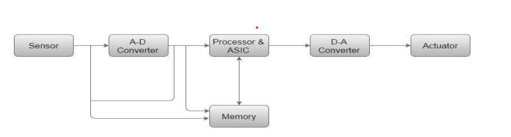

Here is the **exam-oriented solution** for Question 1(a) designed to get you full marks, followed by a **Neplish explainer** to help you understand the core concepts easily.

---

### **📝 Exam Solution: Question 1(a)**

**1. Define an Embedded System.**
An Embedded System is a combination of computer hardware and software designed to perform a **specific function** within a larger system. Unlike personal computers, embedded systems are often constrained by power, memory, and processing speed.

**2. Difference between Embedded Systems and General-Purpose Computing Systems:**

| Feature | Embedded System | General-Purpose System |
| :--- | :--- | :--- |
| **Purpose** | Dedicated to a specific task (e.g., washing clothes). | General-purpose (e.g., browsing, gaming, coding). |
| **Performance** | Optimized for power, size, and cost. | Optimized for high speed and processing power. |
| **OS** | Runs on RTOS (Real-Time OS) or bare metal. | Runs on GPOS (Windows, Linux, macOS). |
| **Resources** | Limited memory (KB/MB) and CPU. | Large memory (GB/TB) and powerful CPU. |
| **Example** | Microwave, ABS, Digital Camera. | Laptop, Server, Desktop PC. |

**3. Three Applications with Examples:**
1.  **Automotive:** **Anti-lock Braking System (ABS)** – Monitors wheel speed and controls braking pressure to prevent skidding.
2.  **Consumer Electronics:** **Smart Washing Machine** – Senses load weight and controls the water cycle automatically.
3.  **Medical:** **Pacemaker** – Implanted device that monitors heart rate and generates electrical pulses to regulate the heartbeat.

**4. Components of Embedded System (Block Diagram):**

*(Draw a simple block diagram like this in the exam)*:

`Input Sensors  --->  [ CPU + Memory ]  --->  Output Actuators`

*   **Processor (CPU):** The brain (Microcontroller/Microprocessor) that executes instructions.
*   **Memory:**
    *   **ROM/Flash:** Stores the code (Program memory).
    *   **RAM:** Stores temporary data (Data memory).
*   **Input Devices (Sensors):** Converts physical signals to electrical signals (e.g., Temperature sensor, Keypad).
*   **Output Devices (Actuators):** Performs actions (e.g., Motor, LCD Display, Buzzer).
*   **Communication Ports:** Interfaces like UART, USB, I2C to talk to other devices.

**5. Prove that ATM (or CCTV/ABS) is an Embedded System:**
Taking **ATM** as an example:
1.  **Dedicated Function:** An ATM is designed **only** for banking transactions (cash withdrawal, balance check), not for general use like playing games.
2.  **Hardware/Software Integration:** It uses specific hardware (Card reader, Cash dispenser) controlled by software.
3.  **Reliability:** It must run 24/7 without failure.
**Conclusion:** Since the ATM performs a dedicated task using integrated hardware and software under specific constraints, it is an **Embedded System**.

---

### **💡 Neplish Explainer (Core Concept Bujhne Tarika)**

**Concept:**
Embedded System vaneko simple bhasa ma **"Euta specific kaam garna banako computer"** ho.

**Kasari Samjhine? (Comparison):**
*   **General Purpose (Laptop):** Timle laptop ma game khelna sakxau, movie herna sakxau, assignment lekhna sakxau. Yo "General" vayo.
*   **Embedded System (Washing Machine):** Washing machine le lugaa dhune bahek aru kei garna sakdaina. Tyo **"Dedicated"** vayo. Tei vara tyo Embedded System ho.

**Key Points for Exam:**
1.  **Definition:** "Dedicated function" vanne word miss nagarnu. Hardware ra Software mileko hunxa.
2.  **Block Diagram:** Exam ma figure banauna na-birsine. Simple xa:
    *   Left ma **Sensors** (Input linxa).
    *   Beech ma **Microcontroller/CPU** (Decision linxa/Sochxa).
    *   Right ma **Actuators** (Kaam garxa/Output dinxa).
3.  **Proof Question:** Exam ma "Prove that ATM is ES" vanyo vane ghabraune haina. Bas yeti vannu paryo:
    *   "Yesle yeuta matra kaam garxa." (Dedicated)
    *   "Yesma hardware ra software dubai xa."
    *   "Yo specific environment ma matra chalxa."
    *   Therefore, it is an Embedded System.

**Simple Analogy:**
Hamilai sochana (Think):
*   **CPU** = Hamro Brain (Dimag).
*   **Sensors** = Hamro Aakha, Kaan (Input line medium).
*   **Actuators** = Hamro Haat, Khutta (Kaam garne medium).
*   **Memory** = Hamro memory (Kura store garne thau).

Yeti concept clear vayo vane 7 marks easy auxa!