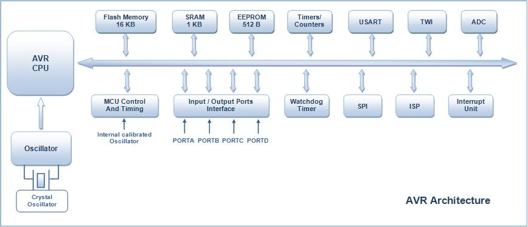

Here is the **exam-oriented solution** for Question 2(a) designed to get you full marks, followed by the **Neplish explainer** to make the core concepts crystal clear.

---

### **📝 Exam Solution: Question 2(a) - AVR (ATmega16/32) Architecture and Components [8 Marks]**

#### **1. Key Features of AVR (ATmega16/32) Architecture**
The AVR architecture (specifically ATmega16 and ATmega32) is based on the Advanced RISC (Reduced Instruction Set Computer) design. Its key features include:
*   **Harvard Architecture:** Separate memory spaces and buses for Program (Code) and Data, allowing simultaneous access and faster execution.
*   **High Performance:** Executes most instructions in a single clock cycle, achieving up to 16 MIPS at 16 MHz.
*   **Memory Configuration:** 
    *   16KB/32KB of In-System Programmable Flash (for code).
    *   1KB/2KB of SRAM (for temporary data).
    *   512B/1024B of EEPROM (for non-volatile data storage).
*   **Rich Peripherals:** Built-in Timers, 10-bit ADC, USART, SPI, I2C (TWI), and PWM channels.
*   **Operating Voltage:** Typically operates between 2.7V to 5.5V.

#### **2. AVR Architecture Block Diagram**
*(Draw this simplified block diagram in your exam to show the connections)*

```text
       +---------------------------------------------------+
       |                  AVR Microcontroller              |
       |                                                   |
       |  +-------------+       +-----------------------+  |
       |  | Program     |=====> | Instruction Register  |  |
       |  | Flash (ROM) |       | & Decoder             |  |
       |  +-------------+       +-----------+-----------+  |
       |        ^                           |              |
       |        |                           v              |
       |  +-----+-------+       +-----------------------+  |
       |  | Program     |       |   Control Lines       |  |
       |  | Counter (PC)|       +-----------------------+  |
       |  +-------------+                   |              |
       |                                    v              |
       |                        +-----------------------+  |
       |  +-------------+       | 32 General Purpose    |  |
       |  | SRAM /      | <===> | Registers (R0 - R31)  |  |
       |  | EEPROM      |       +-----------+-----------+  |
       |  +-------------+                   |              |
       |                                    v              |
       |  +-------------+       +-----------------------+  |
       |  | I/O Ports   | <===> |         ALU           |  |
       |  +-------------+       +-----------------------+  |
       +---------------------------------------------------+
```

#### **3. Role of Specific Components in AVR**

*   **General-Purpose Registers (GPRs):**
    *   **Role:** The AVR features 32 x 8-bit General Purpose Registers (R0 to R31) that are directly connected to the ALU. 
    *   They act as high-speed temporary storage locations for data and operands during mathematical and logical operations. Six of these registers (R26 to R31) can be combined to form three 16-bit address pointers (X, Y, and Z registers) for indirect memory addressing.
    
*   **ALU (Arithmetic Logic Unit):**
    *   **Role:** The ALU is the computational core of the microcontroller. 
    *   It performs arithmetic operations (Addition, Subtraction) and logical operations (AND, OR, XOR, Bit-shifts) directly between the 32 General Purpose Registers. After an operation, the ALU updates the Status Register (SREG) with flags like Zero, Carry, or Negative.

*   **Program Counter (PC):**
    *   **Role:** The PC is a special register that keeps track of the execution flow.
    *   It holds the memory address of the **next instruction** to be fetched from the Flash memory. After an instruction is fetched, the PC automatically increments. If a jump, call, or interrupt occurs, the PC is updated with the new target address.

*   **Watchdog Timer (WDT):**
    *   **Role:** The WDT is a safety mechanism designed to prevent the system from freezing or entering infinite loops due to software bugs or hardware glitches.
    *   It is clocked by a separate on-chip oscillator. The software must continuously reset the WDT (using the `WDR` instruction). If the software hangs and fails to reset it before it overflows, the WDT generates a system reset, rebooting the microcontroller to a safe state.

---

### **💡 Neplish Explainer (Core Concept Bujhne Tarika)**

**Concept:** 
Yo question le "ATmega16/32" bhitra k k huncha ra main parts le k k kaam garcha bhanera sodheko ho. 

**Kasari Samjhine? (Point-by-Point):**

1.  **Key Features (AVR ko khasiyat):**
    *   **RISC:** Thorai tara fast instructions haru huncha. Dherai jaso kaam 1 clock cycle ma sakcha.
    *   **Harvard Architecture:** Bato (bus) chutta-chuttai huncha. Code lyaune bato euta, data lyaune bato arko. Yesle garda fast huncha (ekai choti code ra data padhna milcha).

2.  **Figure (Chitra banauda yaad rakhne kura):**
    *   Flash memory bata code aauxa -> Decoder ma jancha.
    *   ALU (calculator) sanga directly 32 ota registers (GPR) jodeko huncha.
    *   SRAM ra I/O ports data bus sanga jodeko huncha.

3.  **Roles (Kaam haru):**
    *   **General Purpose Registers (32 ota dabba):** R0 dekhi R31 samma 32 ota 8-bit ko temporary storage box ho. ALU le calculation garda yehi box bata data lincha ra yehi rakhcha. Yo ekdam fast huncha. X, Y, Z pointer ko kura lekhna nabirsine.
    *   **ALU (Calculator):** Yesle math ko kaam garne (jod, ghatau) ra logic ko kaam garne (AND, OR) garcha. Kaam sakepachi Status register ma "Zero aayo ki carry aayo" bhanera flag set garcha.
    *   **Program Counter (Guide/Neta):** Yeslai tha huncha aba kun line ko code execute garne palo ho bhanera. Euta code sakiyesi yesle aafai address badauncha (increment garcha) ra arko code kholcha.
    *   **Watchdog Timer (Ghar ko Kukur):** Jasari ghar ma kukur le anath manxe aayo bhane bhukcha, tesari nai microontroller hang bhayo (code adkiyo) bhane yo Watchdog Timer le bhukcha (mathi bata system lai `RESET` handincha). Code le yeslai time-time ma "kukur lai khana diyeko jastai" reset garirakhnu parcha, natra yesle microontroller lai restart gardincha.

Yeti kura bujhera, mathiko English point haru majjale lekhyou bhane **8 marks pakka!** Figure chai clean block diagram banaunu exam ma.